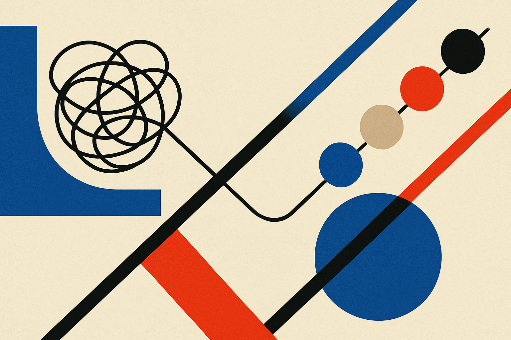
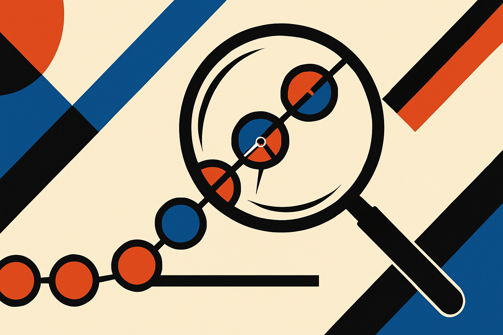

Test makers have a boring, expensive problem. Before a question goes on an exam, someone needs to know how hard it is. Get that wrong and the test is unfair, mis-scaled, or useless for sorting. The usual fix is pilot testing: put the item in front of hundreds of real students, watch how many get it wrong, calibrate. That works. It also costs money and time, and it cannot tell you *why* an item is hard.

A new paper, posted to arXiv under both cs.AI and cs.CL, takes a different swing. The authors introduce Epi2Diff (short for Episode to Difficulty) and make a claim worth sitting with: a reasoning model's own struggle, properly structured, predicts human difficulty. Not the text of the question. The shape of the model working through it.

## The bet: difficulty is a process, not a property

Most difficulty prediction treats an item as a bag of text features. You embed the question, maybe the answer choices, feed it to a model, and ask it to guess the difficulty. The authors argue this misses the point. Difficulty, they say, is "an observable consequence of the problem-solving burden an item induces." In plain terms: a question is hard because solving it requires more work, more backtracking, more dead ends. So measure the work.

Large Reasoning Models give you a window into that work for free. When a model like a reasoning-tuned LLM solves a problem, it emits a long chain of thought: it plans, it tries an approach, it catches an error, it restarts, it verifies. That trace is raw process evidence. The trouble is that a raw trace is a mess. It is thousands of tokens of half-formed thinking, and "longer trace equals harder problem" is too crude to be useful.

So Epi2Diff does the structuring step. It chops the trace into what the authors call cognitive episodes: functional problem-solving states. Think planning, attempting, checking, revising. Each segment of the trace gets labeled by what cognitive job it is doing. Once you have that, you can describe a solve not as "2,400 tokens" but as a sequence of states with dynamics: how much effort went where, how many times the model bounced between attempting and revising, how the work was allocated across the problem.

## Why episodes beat token count

The headline result is the part I keep coming back to. Across four real-world human difficulty datasets, Epi2Diff beat strong baselines, including fine-tuned small language models, LLM in-context learning, and supervised LLM fine-tuning. On SAT-derived classification benchmarks it posted an 8.1 percent average relative gain over the supervised fine-tuning baseline. That is a real margin in a field where text-feature methods have been the default.

But the analysis underneath is what makes it interesting rather than just another leaderboard nudge. Harder items, the authors found, did not simply produce longer responses. They produced *different* dynamics: more effortful, more iterative, more implementation-centered. The model spent more time in the messy middle, attempting and revising, rather than cruising to an answer. That distinction matters. If difficulty were just trace length, you would not need episodes at all. You could count tokens. The fact that episode structure adds predictive power says the shape of the struggle carries information that raw length does not.

This is the kind of finding that feels obvious in hindsight and was not obvious enough for anyone to ship it before. A student staring at a hard physics problem does not just take longer. They false-start, abandon an approach, sketch, recompute. Epi2Diff is essentially saying: the model does the same dance, and the choreography of that dance maps onto how humans will fare.

## The interpretability angle is the real prize

I care less about the 8.1 percent than about what the method gives you for free: an explanation. A black-box difficulty predictor tells you an item is hard. Epi2Diff tells you it is hard because solving it demands repeated revision and heavy implementation work, versus, say, a single conceptual leap. For test designers, that is actionable. You can see whether a question is hard for the reason you intended, or hard because it is badly worded and induces flailing that has nothing to do with the construct you want to measure.

That second case is the quiet value here. A lot of "hard" questions are hard by accident. They are ambiguous, or they bury the actual challenge in parsing. Episode dynamics could surface that: an item that triggers a lot of early-stage planning churn before any real attempt might be hard to *read*, not hard to *solve*. I would want to see the authors push on this directly, because it is a more useful signal than a difficulty score alone.

## Where I would hold the skepticism

Two cautions. First, this rests on a strong assumption: that a reasoning model's struggle correlates with human struggle. The paper shows the correlation predicts difficulty across four datasets, which is solid evidence. But the failure modes are predictable. Models and humans find different things hard. A problem that is trivial for a human with spatial intuition might send a text-only model into long iterative loops, and vice versa. The 8.1 percent gain says the correlation is strong enough to be useful, not that it is clean. I would want per-domain breakdowns before trusting it on, say, geometry or anything with diagrams.

Second, episode labeling is itself a model-driven step, and the paper's results are only as good as that segmentation. If the episode classifier is noisy or biased toward certain trace patterns, the whole pipeline inherits that. The authors call the features "compact" and "interpretable," which is encouraging, but interpretable to whom, validated how, is the question I would press in review.

The honest read: this is one paper, on arXiv, not yet a deployed standard. The method is clever and the result is real, but generalization beyond these four datasets and beyond text-native items is unproven.

A builder in assessment tech should treat Epi2Diff as a pre-screen, not a replacement for pilot testing. Run candidate items through a reasoning model, capture the trace, and use episode dynamics to triage: flag items where the model's struggle pattern looks anomalous, where heavy early planning suggests a wording problem rather than a difficulty problem. That cuts the volume you send to expensive human calibration. The catch most readers will miss is the assumption hiding in the method: you are betting your item bank on the claim that a model struggles like your students do. Validate that on your own population before you trust the score, especially for any item type involving images, diagrams, or domain intuition where model and human difficulty diverge most.
