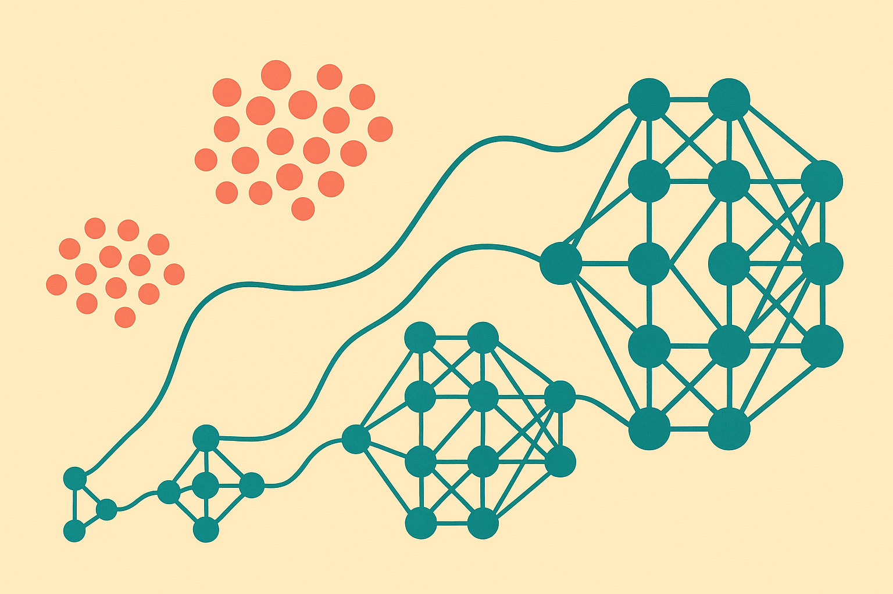

Scaling laws are useful because they compress a messy training process into a curve. Add data, add parameters, lower loss. Nice.

The catch is that real training runs do not live on one curve. They move through regimes. A new arXiv preprint cross-listed in cs.AI and cs.LG makes that point in a deliberately constrained setting: an $\ell_2$-regularized quadratic two-layer network, finite samples, structured data, and empirical test error minimization. Not a frontier LLM. Not a production recipe. Still useful.

The authors explicitly characterize generalization error as a function of sample count, model width, and regularization. Their main result is a phase diagram. As the number of trainable parameters changes, the system enters distinct scaling regimes. The power laws are not universal constants. They depend on the spectral structure of the target.

That last part matters. “More parameters” is not a scalar improvement. It is a bet that the model width matches something about the task and the data distribution.

## The missing variable is structure

A lot of scaling-law talk treats data as volume. Tokens. Images. Rows. Hours. That abstraction is useful at big-picture planning level, but it hides the thing you actually train on: structured signal plus noise.

In the quadratic network setup, the authors can see how generalization depends on the target’s spectrum. If the target has signal concentrated in a few dominant directions, the model-data curve behaves differently than if the signal is spread out. Same number of samples. Same nominal width. Different regime.

That is the part I would carry into applied work. Dataset size alone is a weak proxy. If your customer-support dataset contains 10 million near-duplicate tickets, it is not equivalent to 10 million examples covering new intents, edge cases, languages, and policies. If your medical imaging set has clean variation in one dimension but weak coverage elsewhere, your model can look like it is scaling until it hits the missing structure.

## Interpolation is a transition, not a finish line

The authors also characterize transitions between regimes, including the onset of interpolation. That is where the model can fit the training data. In casual model-building language, that often sounds like success. In scaling-law language, it is just a boundary.

Crossing that boundary can change how generalization behaves. Sometimes more width helps. Sometimes the benefit depends heavily on regularization and data structure. Sometimes you are paying for parameters that mainly memorize what your dataset made easy to memorize.

This is why I am skeptical of training plans that extrapolate from three small runs and call the answer done. A smooth-looking early curve can hide a regime change. A model that improves predictably at low width may flatten, jump, or become more sensitive once it crosses into interpolation. The arXiv result is theoretical, but the warning is practical: the curve you measured may not be the curve you are about to enter.

## Toy theory, real planning value

No one should read this result as a direct law for GPT-scale training. Quadratic two-layer networks are chosen because they are analyzable. That is the point. The authors trade realism for visibility. In return, we get a clean view of how width, sample count, regularization, and target structure interact.

For builders, the useful move is not to copy the math. It is to stop treating “model size” and “data size” as independent sliders. Run scaling experiments across both. Keep regularization in the grid. Slice evaluation by data structure, not just aggregate accuracy. If performance improves on common cases but stalls on rare spectral corners of the task, bigger may just be hiding a coverage problem.

Practitioner’s take: before buying a larger training run, build a small phase diagram of your own. Train several widths across several dataset sizes, evaluate on slices that reflect real task structure, and look for regime changes near memorization. The catch most teams miss is that the next best dollar may be new coverage, not more examples, and definitely not automatically more parameters.
