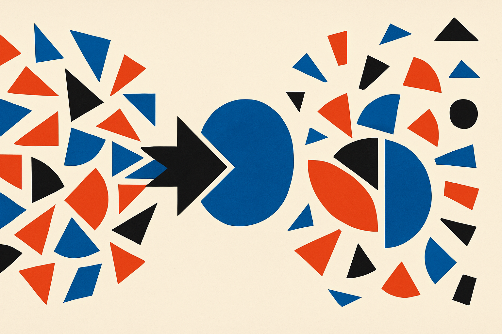

Sparse autoencoders have become one of the cleaner tools for mechanistic interpretability. Train an SAE on model activations, get a sparse set of latents, inspect which ones fire, and maybe you get something like “Python syntax,” “French text,” or “refusal style.”

That is the promise.

The C2R paper, cross-listed on arXiv in cs.AI and cs.LG, points at a less tidy reality: when SAE dictionaries get large, the features can stop behaving like stable units. The authors call out two failure modes, feature splitting and feature absorption. Both sound academic. Both matter if you are using SAEs as evidence rather than as vibes.

## The problem is not just noisy labels

Feature splitting happens when one coherent concept gets fragmented across multiple latents. Instead of one feature reliably tracking the thing you care about, several similar latents take turns representing pieces of it.

Feature absorption is almost the mirror-image problem. A general feature starts carrying arbitrary exceptions. The latent still looks meaningful, but now it has weird carve-outs baked into it. That makes interventions risky. You may think you are turning down one behavior, while also changing a hidden exception you did not notice.

C2R’s authors argue these problems come from inconsistent latent assignment across samples. Standard SAE training is mostly happy if each individual sample is reconstructed well and sparsely. But across a batch, the same underlying semantic feature can get routed through different, directionally similar latents. The model’s reconstruction loss may not care. An interpreter should.

That distinction is important. Reconstruction fidelity is not the same thing as interpretability. You can rebuild the activation vector while still giving humans a scrambled coordinate system.

## C2R adds pressure for shared meaning

C2R stands for Cross-sample Consistency Regularization. The core move is simple enough: during SAE training, penalize co-activation among directionally similar latents. If two latents point in similar directions and keep lighting up together, C2R nudges the system away from that redundancy.

The intended result is that each semantic feature is represented by a more unified latent across the batch. Less splitting. Less absorption. Same reconstruction quality, according to the paper’s reported evaluations.

That last part is the key claim. Regularizers are easy to add. Useful regularizers are the ones that improve the thing you care about without quietly breaking another thing you need. Here, the authors report that C2R mitigates both failure modes while preserving reconstruction fidelity. The code is also available, which matters for a method like this because the details will decide whether it is a clean improvement or a finicky training trick.

There is a caveat. The two supplied sources are the same manuscript in two arXiv categories, not independent confirmation. So I would treat this as a promising research result, not settled practice. The next useful evidence would be replication across model families, SAE sizes, activation sites, and downstream interpretability tasks where humans actually make decisions based on the latents.

## Interpretability needs stable handles

The broader lesson is bigger than C2R. Interpretability tools are not automatically useful because they produce named objects. They become useful when those objects are stable enough to support claims and interventions.

SAEs are attractive because they give us handles. But if the handles move depending on the sample, or if several handles secretly control the same thing, then the interface is lying by omission. C2R is an attempt to make the handle assignment less arbitrary.

That fits a pattern I expect to see more often: interpretability methods shifting from “can we find a feature?” to “can we trust this feature across contexts?” The second question is harder and more operational. It is also the one that matters if teams want to use SAEs for debugging refusals, auditing capabilities, finding deception-like circuits, or building safer model edits.

For builders, the practical move is not to swap in C2R and declare victory. Train a baseline SAE and a C2R SAE on the same activation set, then compare feature splitting, feature absorption, reconstruction loss, and actual intervention behavior on held-out prompts. The catch most readers miss: prettier latents are not enough. The feature has to stay coherent when you use it, not just when you inspect it.
