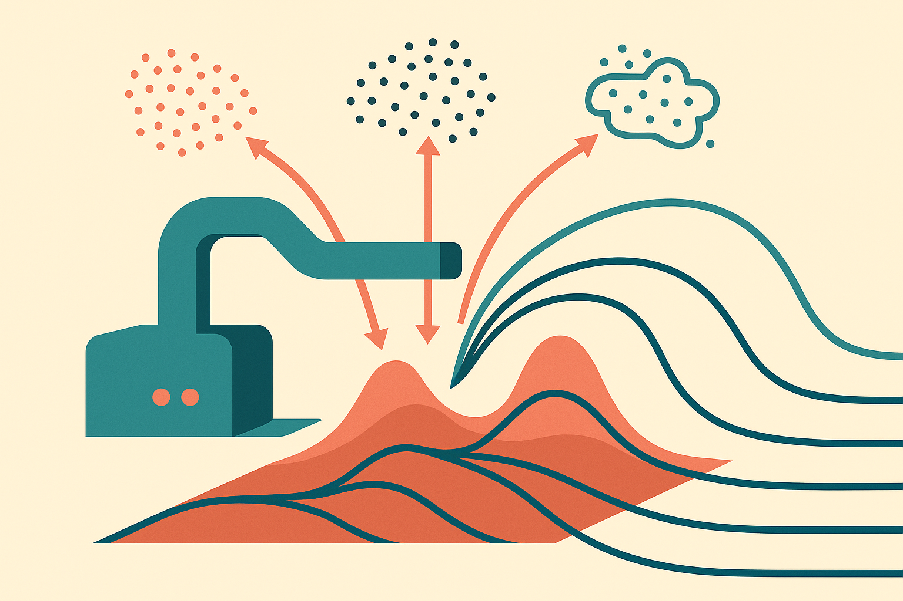

Hugging Face highlighted DiScoFormer as “one transformer for density and score, across distributions.” That is a compact claim, but it points at a real fault line in modern generative modeling.

Most applied ML teams do not think about density estimation every day. They think about recommendations, anomaly detection, simulation, synthetic data, uncertainty, and agents that need to reason under incomplete information. Under the hood, many of those problems reduce to two questions: how likely is this sample, and which direction moves it toward more likely data?

Density answers the first. Score answers the second. DiScoFormer’s pitch is that a single transformer can learn both, not for one fixed dataset, but across distributions.

That matters if it holds up outside the lab setting. It would shift some statistical work from bespoke modeling to amortized modeling. Train one model over many distributional tasks, then ask it to estimate the shape of a new one.

## Density is the map, score is the gradient

A density model tells you where mass is. A score model tells you the local direction of change in log probability. Score functions are central to diffusion models because sampling is not just about knowing what looks likely, it is about moving noise step by step toward data.

Traditionally, these can be separate modeling jobs. Density estimation has its own toolchain. Score matching has another. In practice, builders often pick the machinery that fits the product need, then accept the tradeoffs: maybe you get likelihoods, maybe you get good samples, maybe you get tractable inference, maybe you get speed.

DiScoFormer is interesting because it frames density and score as two views of the same learned object. A transformer takes in information about a distribution and produces estimates that can support both probability evaluation and directional movement.

The useful analogy is not “one model to rule them all.” It is closer to a statistical compiler. If you have seen enough distributions during training, maybe you can infer the working parts of a new distribution without building a custom estimator from scratch.

## The practical bet is reuse, not magic generality

The strong version of this idea is seductive: train across many distributions, then generalize broadly. I would be careful there. The title-level claim does not tell us the distribution families, dimensionality, compute cost, data requirements, or how performance compares with specialized estimators. Those details decide whether this is a research curiosity or a building block.

But the direction fits a larger pattern. Foundation models have been eating repeated setup work. Code models reduce boilerplate implementation. Vision-language models reduce task-specific perception plumbing. A model like DiScoFormer aims at repeated statistical estimation.

That could be valuable in places where teams currently run lots of small, related modeling jobs. Think simulation calibration, scientific ML, probabilistic forecasting, anomaly scoring, uncertainty-aware decision systems, or synthetic data pipelines. Not because a transformer makes probability theory go away. Because the same estimator might be reused across many nearby problems.

The catch is distribution shift. “Across distributions” can mean a carefully designed training universe, not arbitrary reality. A model that handles many toy distributions may still fail on sparse, high-dimensional, messy operational data. A builder should ask what families it saw, what inputs define the target distribution, how uncertainty is exposed, and what happens when the estimator is confidently wrong.

Another catch: density is harder to use than people think. A high likelihood does not always mean “normal” in the human sense. Known issues like typicality and out-of-distribution behavior still apply. If DiScoFormer gives you density and score, you still need evaluation tied to the decision you are making.

My practitioner's take: treat this as a signal to watch, not something to rebuild your stack around yet. If you work on diffusion, anomaly detection, simulation, or probabilistic workflows, try to map where you maintain separate density and score estimators today. That is the testbed. The missed catch is that reuse only pays when your tasks share structure. Without that, a general estimator is just another model with a nicer abstraction.
