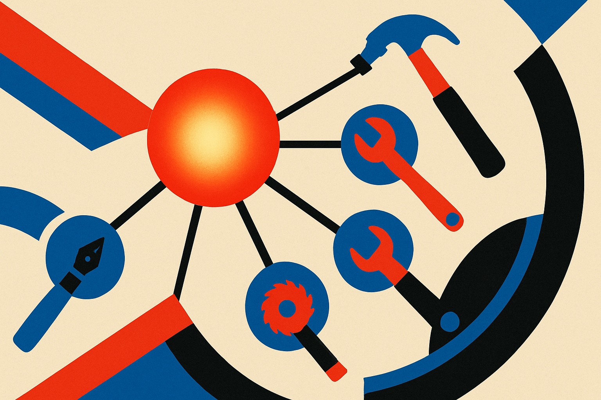

Hugging Face’s headline claim, that specialization is inevitable, is the right frame. Not because general models are going away. They are not. The best frontier systems will still set the ceiling for reasoning, coding, multimodal work, and general instruction following.

But production AI does not care about elegance. It cares about cost, latency, reliability, privacy, control, and boring edge cases. That is where specialization keeps winning.

A general model is a great default when you do not know the task yet. Once the task repeats, the pressure changes. You start asking sharper questions. Does this support ticket need a frontier model? Does this invoice parser need broad world knowledge? Does this medical coding assistant need more creativity, or tighter behavior inside a narrow policy box?

The answer, more often than vendors admit, is narrower.

## The general model becomes the planner, not the whole system

The first wave of AI apps treated one large model as the product. Prompt goes in. Answer comes out. That was useful for prototypes, demos, and internal tools.

The next wave looks more like a stack. A frontier model may plan, critique, or handle weird cases. Smaller models classify, extract, rewrite, search, rank, moderate, or call tools. Retrieval narrows the context. Rules handle compliance. Evaluators catch drift. Humans step in at known failure points.

That is not less AI. It is more honest engineering.

Specialization also changes the evaluation problem. A general benchmark tells you something about model capability. A task eval tells you whether your refunds bot follows your refund policy, whether your contract reviewer catches the clauses your lawyers care about, or whether your sales assistant stops inventing discount terms.

This is where open model ecosystems matter. Llama, Qwen, Mistral, Gemma, and other open-weight families gave teams more room to tune, distill, host, and inspect systems for specific jobs. Hugging Face sits close to that world, so its specialization argument is not just philosophical. It reflects what builders do when they need repeatable behavior instead of a polished chat demo.

## Specialization is also a cost argument

A frontier model can be the best choice and still be the wrong default.

If a workflow runs thousands or millions of times, the unit economics start speaking loudly. A smaller tuned model that is “good enough” can beat a larger model if it answers faster, costs less, and fails in predictable ways. Predictable failure is underrated. You can route it. You can test it. You can design around it.

The catch is that specialization has its own bill. Fine-tuning is not magic. Domain data is messy. Labels are political. Eval sets get stale. A narrow model can become brittle when the business changes. A routing system can quietly turn into a pile of conditionals nobody wants to maintain.

So the right question is not “general or specialized?” It is “where does the general model stop earning its keep?”

That line moves. A new frontier model may collapse three specialized steps into one call. A better small model may make a frontier call wasteful. A policy change may require tighter control. A privacy constraint may force local inference. The architecture should expect that churn.

The practical pattern I like: start general, measure the repeated work, then specialize the hot paths. Keep the frontier model for ambiguity, synthesis, and exception handling. Move high-volume, well-defined tasks into smaller models, retrieval, deterministic code, or human review. The mistake is treating specialization as a purity test. It is a budgeting tool, a reliability tool, and a product design tool.

For builders, I would try this on one workflow this week: log every model call, group calls by task, then pick the most repetitive expensive step. Build a narrow eval for it before touching the model. Only then test a smaller model, a fine-tune, or a rules-plus-retrieval path. The catch most teams miss: specialization without evals is just vibes with lower latency.
