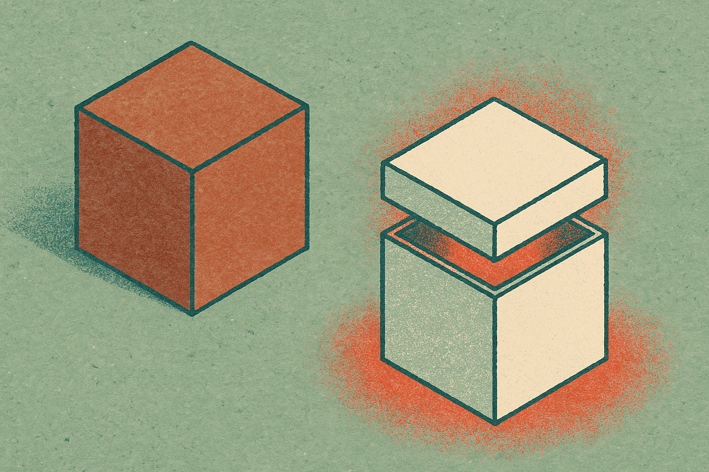
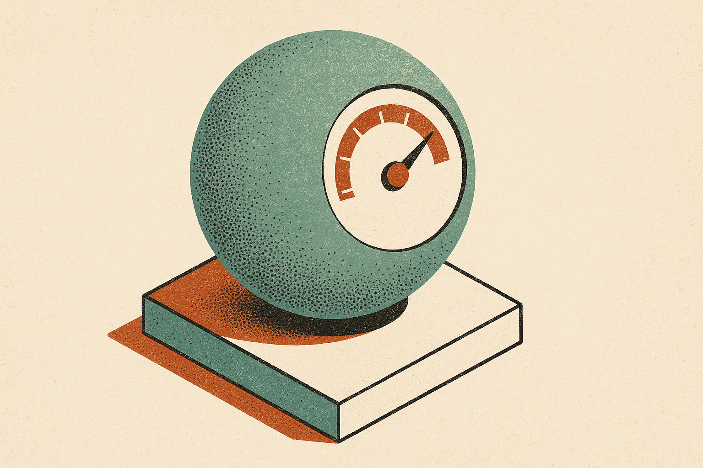

Most retrieval stacks treat the length of an embedding vector as noise. You normalize the vectors, compute cosine similarity, and move on. That is the default in nearly every vector database and every off-the-shelf embedding model trained with a contrastive loss. The magnitude gets discarded by design.

A new paper on arXiv, posted to both cs.AI and cs.LG under the title "Optimization Dynamics Imprint Semantic Specificity in Contrastive Embedding Norms," argues that the thing you throw away is not noise. The authors claim embedding norms correlate with real semantic properties: concept specificity, token frequency, and human uncertainty. And they offer a formal reason why, derived from the optimization dynamics of training rather than after-the-fact observation.

If that holds, it changes how I think about a layer most builders treat as a solved black box.

## What the paper actually claims

The setup is familiar. Contrastive embedding models are trained with scale-invariant losses. Scale-invariant means the loss does not care how long the vector is, only its direction. Pair that with cosine similarity at inference time, and magnitude is mathematically irrelevant. So the conventional wisdom says: there is no information in the norm, throw it out.

The empirical wrinkle, which people have noticed before in scattered observations, is that norms are not uniform across tokens or concepts. Rare tokens, specific concepts, and items where humans disagree tend to land at different magnitudes than common, generic, or unambiguous ones. That was treated as a curiosity. A heuristic at best.

The contribution here is theory. The authors analyze the optimization dynamics and derive an analytic formula showing that embedding length encodes this information as a byproduct of training. The signal is not injected on purpose. It emerges because of how gradient updates accumulate over the course of training. A token that appears constantly gets pushed in many directions and settles differently than a token seen rarely in a narrow context.

That distinction matters. An empirical correlation is fragile. It might be an artifact of one dataset or one model family. A derivation from training dynamics is a much stronger claim: it predicts the effect should show up wherever the same loss structure is used. That is the part worth taking seriously, and also the part that needs independent replication before anyone reorganizes their pipeline around it.

## Why builders ignored magnitude in the first place

There is a good reason cosine similarity won. It is stable, cheap, and forgiving. Normalizing away magnitude removes a degree of freedom that, in a lot of models, really was junk: artifacts of layer norm, scaling quirks, numerical drift. For years the safe move was to strip it out and never look back. Every tutorial reinforced that. Every vector DB indexed normalized vectors.

So the muscle memory across the field is to assume the norm is meaningless. The paper does not say cosine similarity is wrong. It says the magnitude you set aside happens to carry a second channel of information that you have been blind to. Direction tells you what a vector is about. Magnitude, per this work, tells you something about how confident or specific the model is.

That is a different framing than "use dot product instead of cosine." It is closer to: you have a free uncertainty estimate sitting in your index that nobody is reading.

## The "free calibration" angle is the interesting part

The authors go further than explanation. They argue these norm signals can act as free calibration tools in specific models and retrieval tasks. Free, because you already computed the embedding. You do not need a separate calibration model, a temperature-scaling pass, or human labels. The information is already in the vector you stored.

Think about where calibration is expensive today. Knowing when a retrieval result is shaky. Knowing when a query is so generic that the top hit is barely better than the tenth. Knowing when a concept is specific enough that a near-miss is probably wrong. Teams build heuristics for all of this: score thresholds, reranking, ensemble checks. If the embedding norm genuinely tracks specificity and uncertainty, some of that scaffolding might be replaceable with a single number you are currently discarding.

I want to be careful here. "Can serve as" is doing a lot of work in that sentence. The paper provides a grounded explanation for an observed effect. It does not, from what is in the abstract, promise that norm-based calibration beats existing methods on production benchmarks. The honest read is: there is a real signal, it has a theoretical basis, and it is plausibly useful. Whether it is useful enough to change your stack is an empirical question the abstract does not settle.

## Where I'd push back, and what I'd want to see

A few things keep me cautious. First, the claim spans different kinds of properties: concept specificity, token frequency, and human uncertainty. Those are related but not identical, and a clean theory that covers all three would need to show the norm is not just proxying for raw frequency. Frequency is the easy one to explain. Uncertainty is the interesting one.

Second, "in specific models and retrieval tasks" is a hedge. The effect may be strong in some architectures and washed out in others, especially models with aggressive normalization baked deep into the stack. The strength of a dynamics-based derivation is that it should generalize. The test of it is whether independent groups reproduce the norm-semantic correlation across model families, not just the one the authors studied.

Third, there is a practical gap between "the signal exists" and "you can use it without footguns." Norms also pick up genuine artifacts. Disentangling the meaningful component from the junk is exactly the hard part, and the abstract gestures at an analytic formula rather than a turnkey method.

None of this is a knock. It is a genuinely useful result if it survives contact with other people's data. The framing alone, that magnitude is a second channel rather than discardable noise, is the kind of reframe that makes you look at your own embeddings differently.

A builder can test this cheaply this week. Pull the unnormalized embeddings you already have. Do not normalize. Compute the L2 norm of each stored vector and the norm of incoming queries. Then bucket your retrieval results by query norm and check whether low-norm queries (generic, ambiguous) have flatter score distributions and worse top-1 accuracy than high-norm ones. If they do, you have a free confidence signal: route low-norm queries to a reranker or a clarification step, trust high-norm queries to go straight through. The catch most readers will miss: this only works if your pipeline kept the magnitude before indexing. Most vector stores normalize on insert, which means the signal this paper is excited about was deleted before you ever had a chance to read it. Check your ingestion config first.
