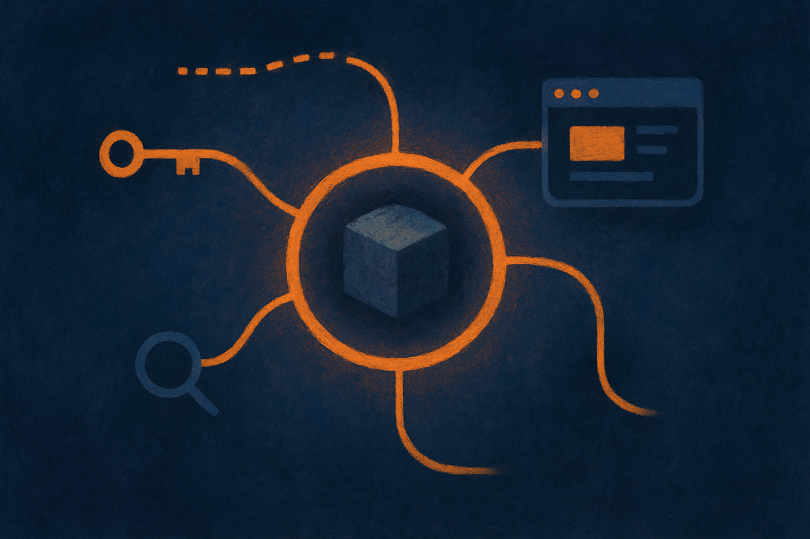

Anthropic shipped two Python SDK releases on June 30. The obvious headline is v0.114.0 adding support for `claude-sonnet-5`. That matters, but only in the narrow sense that developers can now call the new model through the official Python client.

The less flashy release is v0.115.0. That one adds support for Managed Agents event delta streaming, agent overrides, reverse pagination, vault credential injection scoping, and agent and deployment webhook events.

That is a mouthful. It is also the more interesting signal.

## Sonnet 5 support is a door, not a verdict

SDK support for `claude-sonnet-5` tells us Anthropic is getting the client ready for the new model. It does not tell us whether Sonnet 5 is meaningfully better at coding, planning, tool use, long-context recall, or cost control. The release note does not include benchmarks, pricing, latency, context length, safety changes, or migration guidance.

So I would not read too much into the model line by itself.

For builders, the practical move is simple: isolate model selection behind config, add `claude-sonnet-5` to a controlled eval run, and compare it against the model you already use on your own tasks. Not vibes. Real workloads. Failed tool calls, weird edge cases, malformed outputs, refusal behavior, cost per completed job, and latency under your normal concurrency.

New model availability is the start of the test, not the result.

## The managed-agent changes are the real product signal

The v0.115.0 release reads like Anthropic is filling in the control plane around agents. That is where most production agent work either becomes usable or falls apart.

Event delta streaming means an application can receive partial agent activity as it happens, not just wait for a final answer. That matters for user trust and observability. If an agent is searching, calling tools, retrying, or getting stuck, the product can show progress or intervene.

Agent overrides point to a world where teams need per-run or per-deployment behavior changes without cloning the whole agent setup. Reverse pagination sounds boring until you are trying to inspect historical runs, debug a regression, or build an admin console that does not crumble after a few weeks of usage.

Vault credential injection scoping is especially worth watching. Agents with tools need credentials. Credentials need boundaries. A system that can inject secrets too broadly is a security incident waiting for a calendar invite. Scoping is the kind of detail that separates a demo agent from something a company might let touch real systems.

Webhook events for agents and deployments are another production marker. If agents are going to be long-running or operationally meaningful, other systems need to know when things happen. Runs finish. Deployments change. Failures occur. Humans get paged. Queues move.

## The tiny path bug says the same thing

Anthropic also fixed an `agent_toolset` issue in v0.114.0: absolute paths are now allowed when they resolve inside the workdir. That is not glamorous. It is exactly the kind of thing developers hit while wiring agents into real file systems and sandboxes.

These details are where agent platforms earn trust. Not with a bigger prompt window or another polished launch video, but with repeatable behavior around files, credentials, events, overrides, and logs.

My read: Anthropic is not just preparing the SDK for a new Claude model. It is making the Python client a better surface for managed agent operations. That suggests the center of gravity is shifting from “call a model” to “run and supervise an agent with state, permissions, events, and deployment lifecycle.”

If you are building on Anthropic, do not start by rewriting your app around Managed Agents. Start smaller. Add Sonnet 5 to your eval harness. Then pick one operational pain point, streaming visibility, credential boundaries, or deployment event handling, and test the new SDK there. The catch most teams miss: agent quality is not just model quality. It is the plumbing around the model when something half-works, stalls, or touches a system it should not.
