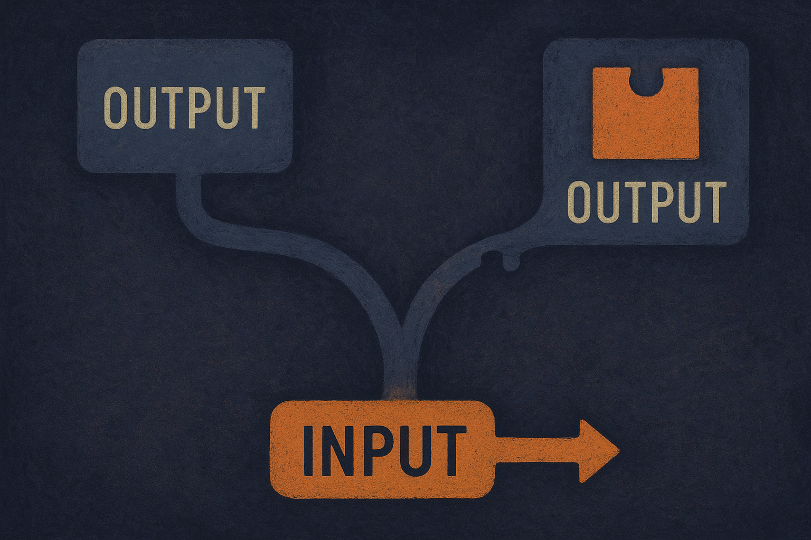

There is a nagging problem with asking a model to explain itself. When a model tells you "I answered this way because of feature X," you have no easy way to know if that explanation is true or just a plausible story it learned to tell. The explanation might be faithful (it actually reflects what drove the behavior) or it might be superficial imitation (it sounds like the kind of thing a model would say).

A new paper making the rounds across arXiv's cs.AI, cs.CL, and cs.LG feeds, titled "Introspective Coupling: Self-Explanation Training Tracks Behavioral Change Despite Fixed Supervision," pokes at exactly this question. And the finding is genuinely surprising: models trained on stale explanation data end up explaining their *current* selves better than the older selves the data came from.

Let me unpack why that is weird, and why it might be useful.

## The setup: explanations grounded in counterfactuals

The trick here is how the authors define a "correct" explanation. Instead of hand-labeling or asking humans what a model was thinking, they use the model's own counterfactual behavior as ground truth. If you claim feature X drove your answer, then changing X should change your answer. If it does, the explanation is faithful. If it does not, it is not.

That is a clean, testable definition. You do not have to trust the model's introspective report; you check it against what the model actually does when you modify the input.

So the training signal is: generate explanations that match how the model behaves under these counterfactual edits. Reasonable enough. The interesting part is what happens when the supervision goes stale.

## The stale-data surprise

Here is the experiment that makes this paper worth reading. The authors trained models on counterfactual explanations derived from *earlier checkpoints of themselves*, and even from *different models in other families* that happened to behave similarly. In other words, the explanation labels describe a model that no longer exists, or a model that was never this one to begin with.

You would expect the trained model to end up imitating those training targets. Parrot the old behavior. Instead, the authors found the opposite. The models "frequently produce explanations more faithful to their own current behaviors than to those of their training targets."

Read that again. The training data described model A. The model being trained drifted into being model B. And the explanations it learned to give describe model B, not the model A it was trained on.

The authors call this "introspective coupling." Their explanation for it: the coupling holds as long as the training explanations stay "sufficiently correlated" with current behavior over the course of training, even while the behavior itself shifts. The explanation-generation skill generalizes onto whatever the model currently is, rather than freezing onto the snapshot it learned from.

## Why this cuts against the usual worry

The standard fear about self-explanation training is regurgitation. You worry the model learns the *form* of good explanations without the *substance*, so it recites confident-sounding reasons that have nothing to do with its actual computation. Fixed datasets should make this worse, because the labels drift further from the truth as the model changes.

This paper argues the drift problem is less severe than it looks. Two results support that.

First, the authors show introspective coupling *tracks behavior shifts*. When explanation training runs alongside other post-training objectives (the paper names sycophancy and refusal as test cases), the explanations follow those behavioral changes without anyone updating the supervision. Train the model to refuse more, and its explanations of refusals move too, off stale labels.

Second, they report the effect is "robust to label noise." So it is not a fragile artifact that only shows up under clean lab conditions.

I want to be careful here. This is one paper, and I am reading the abstract across three arXiv listings that are the same submission cross-posted, not three independent confirmations. "Frequently" is doing quiet work in the claim, and the abstract does not give me the magnitude, the failure cases, or how they measured "sufficiently correlated." Those details decide whether this is a robust training recipe or a promising effect with caveats. So treat this as a strong signal, not a settled result.

## What introspective coupling would actually buy you

If the effect holds up under scrutiny, the practical payoff is about cost and maintenance. Faithful self-explanation is expensive to supervise if you have to regenerate counterfactual labels every time you touch the model. That is the treadmill: fine-tune the model, invalidate your explanation data, re-run the counterfactual pipeline, retrain. Nobody wants that treadmill.

The paper's claim is that you might not need it. A fixed dataset of counterfactual explanations could keep providing useful signal across model versions, as long as the model does not drift too far too fast. The authors frame this as "scalable and generalizable post-training signal for introspection." Scalable because you build the dataset once. Generalizable because it transfers across checkpoints and even across model families.

That last part is the spiciest claim. Explanations derived from a *different family* of models still produced faithful introspection in the trained model. If that generalizes, it suggests the skill of introspecting is somewhat portable, decoupled from the specific behaviors being explained. That is a real interpretability result, not just an engineering convenience.

## Practitioner's take

If you are building any system where a model narrates its own reasoning (agent traces, tool-use justifications, refusal explanations, chain-of-thought you plan to trust), this paper is a reason to test whether stale explanation data still holds up on your current model. Do not assume you need to regenerate counterfactual labels on every fine-tune. Grab your existing counterfactual explanation set, run it against your latest checkpoint, and measure faithfulness the way the authors do: perturb the feature the model claims mattered, and check whether the output actually moves. If faithfulness holds, you just saved yourself a relabeling treadmill.

The catch most readers will miss is the phrase "sufficiently correlated." Introspective coupling depends on the model not having drifted too far from the behavior the labels describe. There is a breaking point somewhere, and the abstract does not tell you where it is. So the operational discipline is monitoring, not faith. Re-run your faithfulness check after every meaningful training change, watch for the point where explanations stop tracking behavior, and refresh the data when they diverge. The win is that you refresh on *your* schedule, driven by measured drift, instead of reflexively after every update. That is a maintenance strategy worth adopting, and it is also the exact thing that turns a clever paper into something you can actually trust in production.
