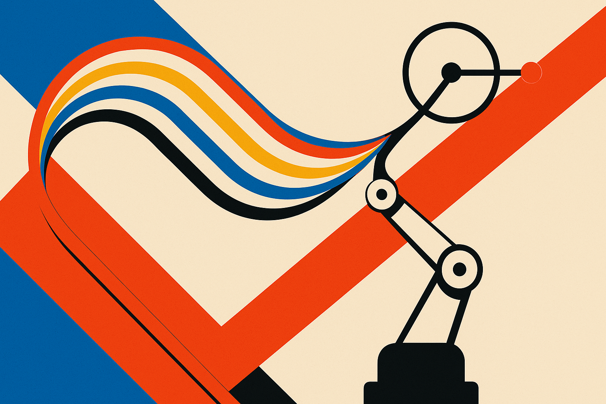

Robot reward design has the same smell as a lot of applied AI work: the hard part is not getting a model to optimize, it is getting the target into a shape that matches what people actually mean.

The Freeform Preference Learning paper, posted to arXiv in both cs.AI and cs.LG, attacks that bottleneck in robot manipulation. The setup is simple and useful. Instead of asking a human annotator which of two robot trajectories is “better” overall, FPL lets the annotator define natural-language axes like speed, safety, placement quality, or carefulness. Then the human gives pairwise preferences along those specific axes.

That matters because “better” is usually a bundle of conflicts. A robot can move fast and be sloppy. It can be careful and slow. It can place an object correctly while scraping the table on the way. Binary preference learning compresses all of that into one vote, then asks the reward model to infer the tradeoff. Sometimes it can. Often it just learns the annotator’s confusion.

## The trick is not language, it is decomposition

FPL uses those human-named axes to train a language-conditioned reward model. The input is a trajectory plus a preference label. The output is an axis-specific reward. That reward model then trains a reward-conditioned policy that can optimize across multiple dimensions.

The language part is easy to overhype. This is not “chat with your robot and it understands values.” The more grounded claim is better: natural language gives humans a cheap way to create task-specific reward channels without writing formal reward functions or hand-segmenting a long task into subtasks.

That is a big deal for long-horizon manipulation, where sparse success labels are terrible teachers. If the only signal is “success” at the end, the robot learns very little from all the near-misses. FPL reportedly learns dense progress signals without explicit subtask segmentation. That is the part I find most interesting. The paper is using human judgment to carve the reward space into gradients the robot can actually train on.

## The result is performance plus steering

Across four real-world and two simulated long-horizon manipulation tasks, the authors report a 38 percentage point improvement over sparse-reward and binary-preference methods. That is large enough to pay attention to, assuming the benchmark tasks are representative and the annotation workflow is not too expensive.

The second result may matter more for builders: the policy can be steered at test time toward different behaviors without retraining. If a user wants more careful behavior, they can weight that axis. If they want speed, they can push the policy that way.

That changes the product shape. A robot trained on one monolithic “good” reward tends to ship as one behavior. A robot trained on named dimensions can expose controls. Not a magic ethics slider, but practical operational knobs: slower near fragile items, faster for low-risk moves, stricter placement when alignment matters.

The authors also claim compositional behavior not present in the data. I would treat that as promising, not settled. Composition is one of those words that can hide a lot. The important question is whether the learned axes hold up under distribution shift: new objects, new layouts, new failure modes, new users who mean slightly different things by “careful.”

## The annotation interface is the real research object

What I like here is that FPL moves attention from reward engineering to preference interface design. The human is not asked to be a reward programmer. They are asked to name what they care about and compare examples within that frame.

That is closer to how teams already review work. A warehouse operator does not say, “trajectory A has higher scalar utility.” They say, “that one is too rough,” or “that placement is better,” or “it took too long.” FPL turns those comments into training structure.

The catch is consistency. If annotators define axes freely, you need to manage synonyms, overlapping concepts, and conflicts. “Careful,” “safe,” and “gentle” may not mean the same thing. Or they may mean almost the same thing until one task makes them diverge. The paper’s approach points in the right direction, but the production version will need serious tooling around axis creation, review, merging, and audit.

Practitioner's Take: If I were building a robotics workflow today, I would test this idea before trying to handcraft a bigger reward function. Pick one long-horizon task, record failed and partial trajectories, then ask operators to label comparisons along three to five concrete axes. Train separate evaluators first, even before full policy training. The catch most readers miss: the win is not “natural language rewards.” The win is making human tradeoffs explicit enough that the system can optimize them separately.
