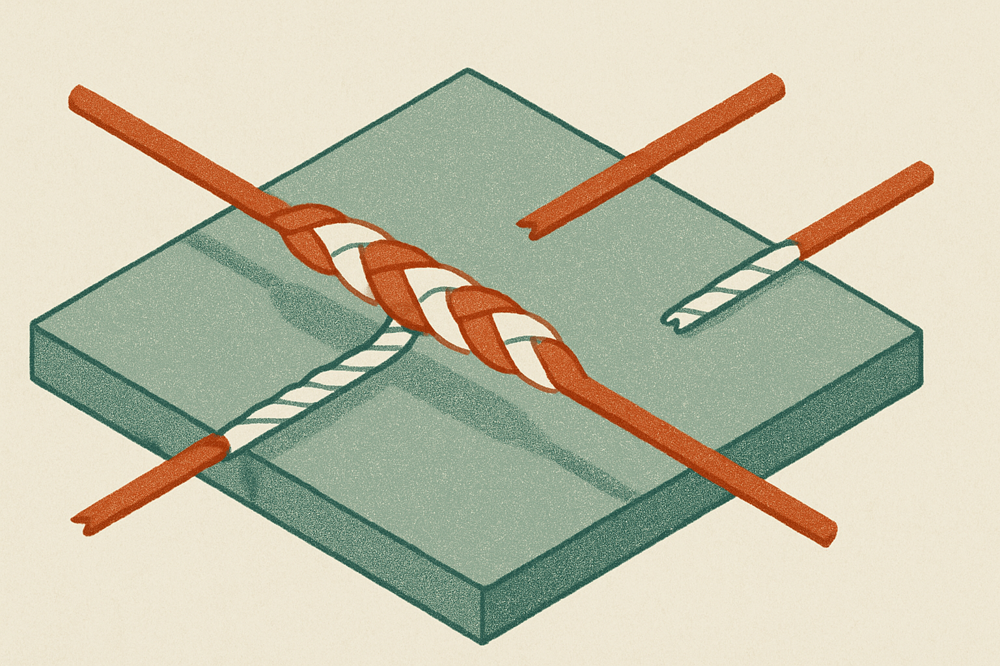

Every token a Transformer produces is doing double duty. It has to predict the next word, and it has to leave behind something useful for the tokens that come after it. Same forward pass. Same hidden state. Two jobs.

A paper making the rounds on arXiv, "The State-Prediction Separation Hypothesis" (posted across cs.AI, cs.CL, and cs.LG), says that overloading is a mistake. The authors argue that the prediction job and the state-storage job pull in different directions, and that a Transformer forced to do both in one stream is quietly worse at each. Split them into two streams, they claim, and you get better data efficiency, better compute efficiency, and a 2 to 3 percentage point average bump on downstream tasks.

That is a bigger claim than it sounds. Let me unpack why.

## The overloaded stream

Think about what a hidden state at position 5 is being asked to do. First, it needs to be a good springboard for predicting token 6. That is the loss you actually train on. Second, it needs to carry information forward so that when the model gets to token 40, the attention mechanism can look back and find something worth reading.

Those are not the same objective. A representation tuned to nail the very next token might throw away context that only pays off thirty tokens later. A representation tuned to be a rich memory might be a fuzzy predictor right now. The standard Transformer resolves this tension by not resolving it. One stream, one set of gradients, and the optimizer finds some compromise.

The authors call the two roles "prediction" and "state," and their hypothesis is that the compromise costs you. Disentangle them and each function gets to specialize.

## What "two streams" buys, and what it does not

The design is a Transformer variant with two computation streams instead of one. The abstract does not spell out the plumbing, and that matters, so I will flag it: without the full method section, we are trusting the results more than the mechanism. But the shape of the idea is clear enough. One stream is optimized to predict, the other to store and pass along state, and they interact rather than collapsing into a single vector that has to be everything at once.

The reported payoff comes in three forms. Better validation loss, so the model fits the data better for a given amount of compute. Better data efficiency, so it learns more per token seen. And 2 to 3 points on downstream tasks on average. That last number is the one people will quote, and it is the one I would pressure most.

Two to three points on downstream benchmarks is a real gap at the same parameter count. It is not a rounding error. But "on average" hides the distribution. Averages can be carried by a couple of tasks where the inductive bias happens to line up, while the rest barely move. The abstract does not break this down. If you are evaluating this seriously, that per-task spread is the first thing to ask for.

## The part that makes me take it seriously

Here is what pushes this above the usual "we added a module and loss went down" paper: the authors say they ran extensive analysis to rule out confounders and to show a "fundamental difference in the gradients" their design produces.

That is the right instinct. The obvious objection to any two-stream architecture is that you just added parameters or capacity, and of course more capacity helps. If that were the whole story, this would be a boring result dressed up in a hypothesis. Claiming a distinct gradient signature is a claim that something structural changed, not just something bigger. The two streams are learning genuinely different things, and you can see it in how the gradients flow.

I cannot verify that from an abstract. Nobody can. But it is the correct thing to have tested, and the fact that they foreground it rather than the headline benchmark number is a small point in their favor. Architecture papers live and die on whether the effect survives a fair capacity-matched comparison. Most do not survive. This one at least claims to have tried.

## Where this sits in the bigger picture

The interesting thing about this hypothesis is that it is not really about a new gadget. It is a claim about what Transformers have been doing wrong the whole time. If prediction and state truly conflict, that is a property of the architecture, not of any one model. It would apply from a 100M parameter toy up to the frontier.

Which is exactly why I want to see it replicated before I believe the ceiling holds. The pretraining experiments here span "various scales," per the authors, but arXiv abstracts are generous with that phrase. Small-scale wins that evaporate at scale are the single most common failure mode in architecture research. The history of "beats the standard Transformer" results is mostly a history of things that stopped beating it once someone trained a real model. Attention variants, activation tweaks, normalization schemes. A graveyard of 2-point wins.

So I hold this at arm's length with genuine interest. The hypothesis is clean, the framing is honest, and the gradient analysis is the kind of evidence that would actually distinguish signal from capacity. What is missing is the scale curve and the per-task breakdown, and until those are public the 2 to 3 points is a promise, not a fact.

Practitioner's take: you are not going to swap your production Transformer for a two-stream variant next week, and you should not want to. What you can do is treat this as a diagnostic lens. If you train or fine-tune small models, look at whether your representations seem torn between short-horizon prediction and long-horizon memory, because that tension is exactly what this paper says you are paying for. Watch for the code release and, more importantly, watch for an independent replication at a scale you care about, plus the per-task numbers behind that average. The catch most readers will miss: a 2 to 3 point average on downstream tasks tells you almost nothing until you know whether it is spread evenly or driven by two lucky benchmarks. Ask for the distribution before you rewrite your architecture.
