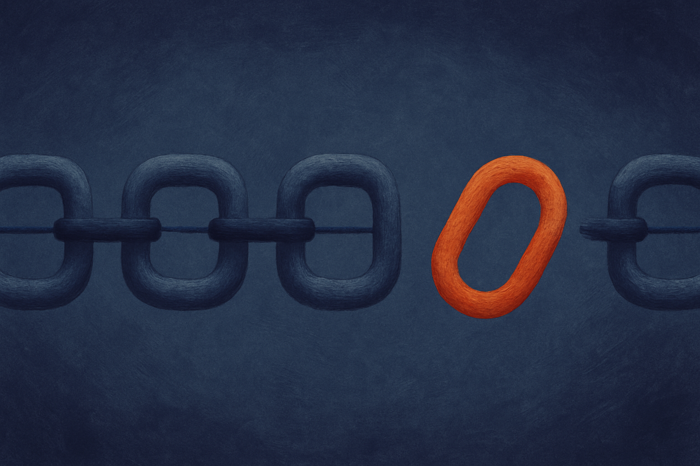
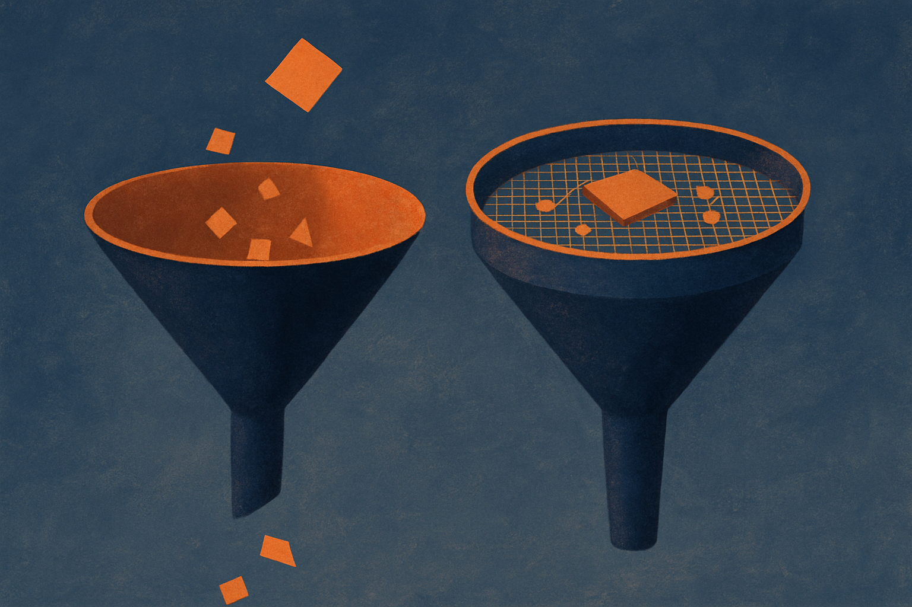

Here is the trust problem in one sentence. When a model hands you an answer with a paragraph of reasoning, you cannot tell whether the reasoning earned the answer or decorated it.

Two tools exist today and both disappoint. Formal proof assistants give you certainty but only work on problems you can fully formalize, which is a thin slice of what people actually ask. LLM judges give you coverage, they will score anything, but the score is a number with no receipt. You get "0.82 confidence" and no way to challenge it after the fact. Worse, the judge is an LLM, so it inherits the same coherence failures as the thing it is judging.

A paper called Theoria, posted across cs.AI, cs.CL, and cs.LG, takes a different route. Instead of scoring an answer or formalizing it, it rewrites the answer into a chain of typed state transitions where every single step has to be licensed by an explicit justification: a citation, a computation, or a fact given in the problem. Then it audits each transition on its own.

## The one idea that does the work

The core move is an invariant the authors call completeness of change. Every difference between two consecutive reasoning states must be accounted for by a stated justification. If something changes in the state that no citation, computation, or given fact explains, that change is an unlicensed mutation. It fails.

This sounds pedantic. It is the whole trick.

Think about how models actually cheat at reasoning. They rarely make a loud arithmetic error. They smuggle. A premise appears out of nowhere in step four, does the heavy lifting, and the conclusion follows cleanly from there. If you read the proof holistically it looks fine, because each sentence connects to the next. The lie is not in any sentence. It is in the gap between two of them.

Completeness of change turns that gap into an object. A hidden premise cannot pass silently anymore because it shows up as state that changed without a license. You are no longer asking "does this argument feel right." You are asking "can every delta between states be traced to something explicit." That is a mechanical question, and mechanical questions are auditable.

## What the numbers actually say

On HLE-Verified Gold, 185 text-only expert problems, Theoria certifies 105 of them at 91.4 percent strict precision, with a Wilson 95 percent confidence interval of 84.5 to 95.4. On GPQA Diamond, 65 problems, certified precision hits 97.1 percent.

Read those two facts together and you see the shape of the thing. It certifies 105 out of 185. It does not certify the other 80. That is not a bug the authors are hiding, it is the design. Theoria only stamps what it can fully account for. Coverage is the price of the receipt.

The adversarial results are where I got interested. The authors built 95 poisoned proofs across 15 domains, proofs engineered to look right while being wrong, and compared their structured approach against holistic LLM judging. Structured judges caught 94.7 percent. Holistic judging caught 83.2 percent. That 11.5 point gap has a p-value of 0.0017, so it is not noise.

But the average hides the real story. The gap concentrates exactly where the theory predicts it should. On hidden premises, structured catches 90.6 percent versus 62.5 for holistic, a 28 point difference. On fabricated citations, 100 percent versus 90. And on the error types where the formal analysis predicts no advantage, plain arithmetic mistakes and misapplied theorems, the two approaches are identical.

That last part is what makes me trust the paper. A weaker result would show the fancy method winning everywhere, which usually means you are measuring your own cleverness at building examples. This one wins only where its mechanism has a reason to win and ties everywhere else. The theory made a falsifiable prediction and the data matched it.

## The part everyone will miss

Theoria and holistic LLM judges catch different problems. The Jaccard overlap between what each method fails on runs 0.14 to 0.36. In plain terms: when Theoria misses something, the holistic judge often catches it, and the reverse.

That is not a weakness to paper over. It is the most useful finding here. The two methods are complementary, not competitive. Structured verification is precise on structural lies. Holistic judging has coverage and picks up things a rigid rewrite cannot express. The honest architecture is both, not one replacing the other.

I want to push on the coverage number because that is the catch. Certifying 105 of 185 sounds like a partial win, and it is. In a production setting you would route the certified 105 straight through and the uncertified 80 to a human or a second method. The value is not that Theoria answers everything. The value is that it draws a clean line between "I can prove this is sound" and "I cannot," and it never bluffs across that line. Most verification systems bluff constantly. They return a confidence score for problems they have no business scoring.

## Why this matters beyond math problems

Strip away the benchmarks and the real product here is a proof trace a human can read and challenge line by line. Not a score. A record. Every certified answer comes with a step-by-step account where any single step can be contested.

That changes what verification is for. Right now, when an agent does something wrong, you find out downstream and reconstruct what happened by hand. A trace with completeness-of-change means the failure has an address. You can point at the exact transition where an unlicensed mutation slipped in. Debugging reasoning stops being archaeology.

The obvious limit: this was tested on text-only expert problems in domains where citations, computations, and given facts are clean categories. A lot of real agent work is messier. Multi-step tool use, ambiguous goals, judgment calls that do not decompose into typed transitions. Whether the rewrite step holds up outside crisp problem distributions is an open question the paper does not answer, and I would not assume it does.

If you are building agent verification, the immediate move is not to adopt Theoria wholesale, since there is no released system to adopt yet. It is to steal the completeness-of-change idea and add it to whatever judging you already run. Force the model to rewrite its answer as a sequence of states, then check that every change between states names its justification. Route what passes cleanly to auto-accept, send unlicensed mutations to review, and keep your existing LLM judge on the pile Theoria cannot express, because the failure sets barely overlap. The catch most people will miss: the point is not to verify more of your outputs. It is to know precisely which ones you cannot verify, and to stop pretending a confidence score is an answer.
