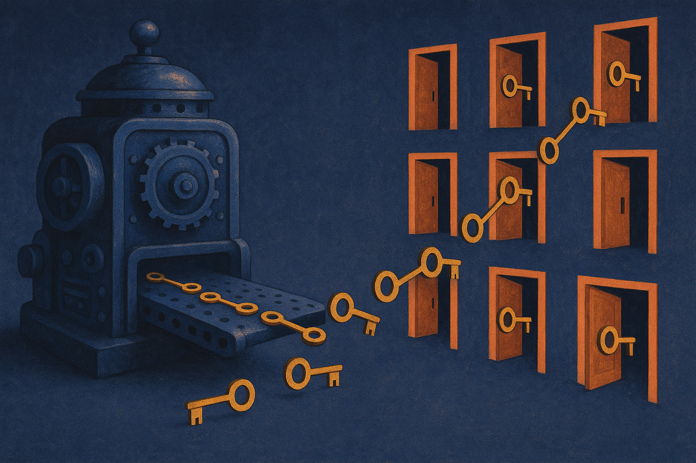

There is a whole class of programming problems nobody writes clean code for anymore. Deciding which log line matters. Fixing JSON that a flaky upstream service mangled. Ranking search results by what the user probably meant. You can't express these as neat rules, so the default move in 2026 is to wrap them in an LLM API call and move on.

That works, and it also quietly taxes you. Every invocation is a network round trip, a per-token bill, a dependency on someone else's uptime, and a black box you can't reproduce next quarter. A new paper called Program-as-Weights (PAW), posted across the cs.AI, cs.CL, and cs.LG sections of arXiv, proposes a different bargain. Instead of calling a big model once per input, you call it once per function, and it hands you a small artifact that runs the function offline forever after.

## The core reframe: compiler, not oracle

The interesting idea here is not the numbers, it's the shift in role. The authors describe reframing the foundation model "from a per-input problem solver into a tool builder." That distinction is the whole paper.

In the usual setup, GPT-class models are oracles. You bring a question, they answer, and the intelligence lives at inference time, paid for on every call. PAW moves the intelligence to compile time. You write a natural-language spec ("flag log lines that indicate a security-relevant failure"), a 4B compiler reads it, and it emits a parameter-efficient adapter: a small set of weights that plug into a frozen, lightweight interpreter model. The adapter *is* the compiled program. After that, running the function is just running a tiny model locally.

If you've written LoRA adapters before, the mechanism will feel familiar: freeze a base model, train a small low-rank delta for a specific behavior. What's new is treating that adapter as the *output of a compilation step* driven by a spec, rather than something you fine-tune by hand on a curated dataset. The 4B model does the fine-tuning-equivalent for you, in one shot, from a description.

## The numbers, and where I'd put an asterisk

The headline claim is genuinely striking. A 0.6B Qwen3 interpreter running a PAW-compiled program matches direct prompting of Qwen3-32B on their benchmark, while using roughly one fiftieth of the inference memory and running at 30 tokens per second on a MacBook M3.

Let me separate what's solid from what needs scrutiny.

Solid: 0.6B versus 32B is a real gap in class, and a ~50x memory reduction is roughly what you'd expect from that parameter ratio. Running at conversational speed on a laptop, fully offline, is the kind of thing that changes what you're willing to build. No API key, no rate limit, no data leaving the machine.

The asterisk: "matches performance" is measured on FuzzyBench, a 10M-example dataset the same authors built and released alongside the paper. That's not a knock, releasing the benchmark is the right thing to do, but a compiler evaluated on the distribution it was trained to serve is playing a home game. The honest question is how a PAW adapter holds up on a fuzzy function that looks nothing like anything in FuzzyBench. The paper's framing is about everyday tasks (logs, JSON, ranking), and those are well represented. Novel or adversarial specs are the open risk, and the abstract doesn't tell us how gracefully quality degrades there.

Second asterisk: matching Qwen3-32B is not matching a frontier model. Qwen3-32B is a capable open weight model, but the tasks that survive being compressed into a 0.6B adapter are, by construction, the tasks a mid-size model already handles. This is not a claim that you can compile GPT-5-level reasoning into 600 million parameters. It's a claim that a large, expensive-at-inference model was overkill for a bounded fuzzy function, which is a much more believable claim.

## Why this matters more than another small-model result

We get "small model matches big model" papers constantly. What makes PAW worth a flagship note is the *unit of reuse*.

Distillation gives you one smaller general model. Prompt engineering gives you a better call that still costs per call. PAW gives you a per-function artifact. Compile once, and every subsequent application of that function is cheap and offline. The cost curve inverts: expensive up front, then flat and near-zero forever.

That inversion is what makes it interesting for anyone shipping software at scale. If you're calling an LLM API a million times a day to classify log lines, you're paying a million times a day for a decision that never really changes. PAW says: pay once to compile the classifier, then run it on your own hardware at 30 tokens a second, forever. The economics of that are obvious the moment your volume is high and your task is stable.

The catch, and the sources are quiet on this, is versioning. A compiled adapter is a frozen snapshot of a spec. When the meaning of "important log line" drifts (new services, new attack patterns), you recompile. That's actually a *feature* for reproducibility, the whole point is that the artifact doesn't silently change under you, but it means you now own an artifact lifecycle: store it, version it, know which spec produced which weights, and re-run compilation when the world moves. That's ops work an API call hides from you.

## Where the paradigm gets tested

The bet PAW is making is that a meaningful fraction of "we just use an LLM for this" tasks are actually stable, bounded functions dressed up as open-ended intelligence. I think that bet is largely right. Most of the fuzzy calls in a production system are doing the same modest job over and over, and paying frontier prices for it.

Where it gets tested is at the edges: functions whose correct behavior genuinely depends on broad world knowledge, long context, or reasoning chains that a 0.6B interpreter can't hold. The paper wisely scopes itself to compact fuzzy functions. The failure mode to watch is scope creep, someone trying to compile a task that really does need the big model, getting a plausible-looking adapter, and shipping quiet quality regressions they don't notice because the artifact runs happily offline.

Ken's practitioner take: if you run a high-volume fuzzy classifier or normalizer behind an LLM API right now, this is the paper to prototype against. Pull the FuzzyBench release, pick your single most-called, most-stable prompt (log triage and JSON repair are the ideal first candidates), and try compiling it into an adapter you can run locally. Measure two things the abstract can't tell you: quality on *your* real traffic, not the benchmark, and the tail behavior on inputs your spec didn't anticipate. Keep the big-model API as a fallback for low-confidence cases, so you get cheap-and-offline for the 95% that's easy and full firepower for the 5% that isn't. The trap most readers will miss is treating the compiled adapter as fire-and-forget. It's a versioned artifact tied to a spec, and the day your definition of "important" changes is the day you recompile. Build that recompile step into your pipeline from the start, not after the drift bites you.
