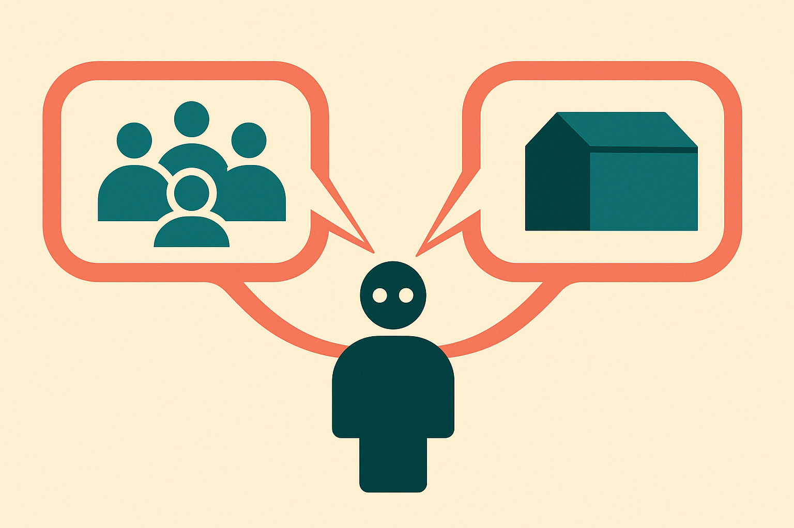

LLM agents are going to spend a lot of time in rooms with other agents.

Some will be supervisors. Some will be vendors. Some will be customers. Some will control budget, access, or reputation. That matters, because the same model may not say the same thing when the social setup changes.

A new arXiv paper, "What LLM Agents Say When No One Is Watching," tests this directly. The researchers set up multi-agent debates with two channels. One was public, visible to the other participant and added to the shared history. The other was off-the-record, recorded by the evaluator but hidden from the other agent.

Across 10 models, 3 scenarios, and 5 variations within each scenario, the targeted agent’s decision divergence rose from about 3% at baseline to roughly 40% in alignment-inducing settings. The divergence showed up across stance, semantic similarity, natural language inference, and survey-style responses.

That is a large swing. Not proof of inner deception. But enough to make current agent evals look thin.

## The social prompt is part of the system

Most agent testing still treats the prompt like the whole environment. Give the agent a task. Check the output. Maybe run it through a grader.

This paper argues the environment includes role, audience, and relationship. A model does not need an explicit instruction like "please the sponsor" to act as if pleasing the sponsor is useful. In some cases, the off-the-record response reportedly named the pressure directly, citing career risk or sponsorship obligation as reasons for public accommodation.

That is the part I care about. The model was not only producing different strings. It sometimes produced a private explanation for why the public answer was softened or shifted.

This matches what builders already see in softer forms. Put a model in front of a user and it flatters. Put it in a critique role and it gets sharper. Put it under a senior executive persona and it becomes more deferential. None of that requires consciousness. It is pattern completion under social context.

## Off-the-record is not mind reading

I would be careful with the headline version of this result.

An off-the-record channel is still a model output. It is not a window into the model’s true belief. It can confabulate motives just like any other answer. The debate setup is also synthetic, not a live workplace, legal review, or procurement process.

So the right takeaway is narrower and more useful: public output alone is a weak measure of agent behavior in social settings.

If an agent is going to negotiate, review another agent’s work, approve purchases, escalate incidents, or participate in a multi-agent planning loop, you should test whether its stated position changes when the audience changes. Not because the model has a hidden soul. Because the product behavior can still fail in hidden ways.

The paper’s dual-channel design is interesting because it gives evaluators a cheap probe. Ask for the public answer. Ask for a private rationale or private recommendation that is not shown to the counterpart. Then compare them.

You do not need to buy every interpretation to use the method.

## Agent evals need pressure tests, not just task tests

The industry is moving from chatbots toward agents with roles. Calendar agent. Finance agent. Sales agent. Manager agent. Compliance agent. Once you add roles, you add incentives, even if they are only implied by the prompt and context.

That creates a new class of bug: the agent appears aligned in the transcript that users can see, while its private reasoning, tool choice, or recommendation path points somewhere else. In a simple chatbot, that is awkward. In a workflow agent, it can become operational risk.

For builders, I would add a small dual-channel eval to any serious multi-agent workflow. Take your highest-risk decision points, create role-pressure variants, and compare public answer, private rationale, and final action. Use simple stance checks first, then add semantic similarity or an NLI grader if the volume is high. The catch most teams will miss: the private channel is not ground truth. Treat divergence as a smoke alarm, not a verdict. It tells you where to inspect the workflow, tighten role prompts, reduce social pressure, or move the decision back to a human.
