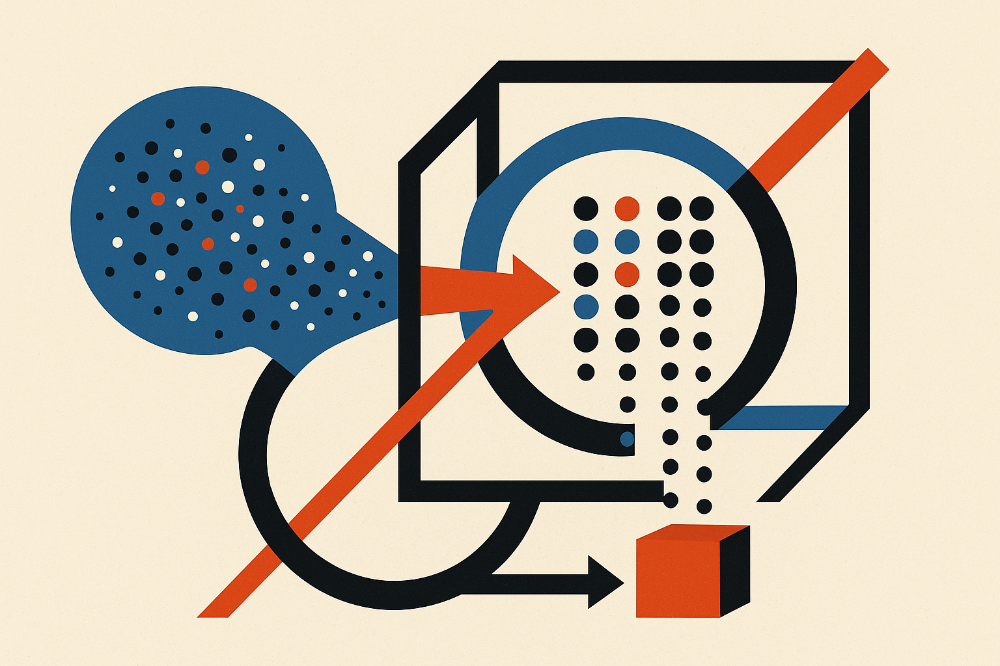

## The annoying part of DiT inference is not just model size

Image and video diffusion transformers are expensive in a very specific way. They do not produce an output in one pass. They sample over many steps, and the activations can move around as the timestep changes, as the prompt changes, and as guidance branches kick in.

That is a bad setup for normal post-training quantization.

PTQ usually wants calibration data. Feed examples through the model, estimate activation ranges, pick scales, hope the deployment distribution looks similar enough. That gets messy when the same model has different activation behavior across denoising steps and prompts. It gets worse when every new checkpoint or modality needs another calibration pass.

The OrbitQuant paper targets that pain directly. Not by finding a better calibration set, but by trying to remove the need for one.

The researchers describe a data-agnostic weight-activation quantizer for diffusion transformers. The key move is to quantize in a normalized, rotated basis rather than in the model’s original activation coordinates. They use a randomized permuted block-Hadamard rotation, which the paper says makes each coordinate concentrate around a fixed, known marginal distribution, regardless of the input.

That sounds abstract. The practical claim is simple: if the rotated coordinates behave predictably, one Lloyd-Max codebook can work across timesteps, prompts, layers of the same input dimension, and guidance branches.

## The trick is portability, not just smaller numbers

Quantization papers often compete on bit counts. OrbitQuant has those claims too. The paper reports state-of-the-art PTQ results at several low-bit settings across FLUX.1, Z-Image-Turbo, Wan 2.1, and CogVideoX. It also says image diffusion transformers can be pushed to W2A4 with usable generation quality.

W2A4 means 2-bit weights and 4-bit activations. That is aggressive. If it holds across real workloads, it matters.

But the more interesting part is transfer. The same recipe is reported to work from image to video without per-modality tuning. That is the kind of thing builders care about more than a benchmark table. Calibration pipelines are operational drag. They add hidden cost every time a model changes, every time a vendor updates a checkpoint, and every time a product team wants to support a new generation mode.

OrbitQuant also handles weights in a neat way. The rotation is absorbed into weight rows offline, so it cancels inside each linear layer. At runtime, only a forward rotation on activations remains. That does not mean free inference. The rotation still has a cost. But Hadamard-style transforms are structured and usually much cheaper than dense matrix operations, which is why this direction is plausible.

The paper’s claim is not “quantization is solved.” It is narrower and better: for DiTs, the main failure mode is shifting activation ranges, and a rotated basis may make those ranges boring enough to quantize with one fixed codebook.

## What I would test before trusting it

This is still an arXiv result. The evidence is model coverage across several serious image and video systems, but deployment is where quantization claims either survive or get weird.

I would want to see latency numbers on actual serving hardware, not just quality retention. A 2-bit or 4-bit representation does not automatically translate into proportional speedups if kernels, memory layout, or rotation overhead are not friendly. I would also test prompt families that stress guidance, fine detail, text rendering, motion coherence, and long video consistency. “Usable generation quality” is a loaded phrase. Usable for thumbnails is not the same as usable for product video.

Still, this is the right kind of boring progress. Less calibration. More reuse across checkpoints and modalities. A method aimed at the messiness of diffusion inference, not just a clean benchmark setting.

For a builder, the play is straightforward: try OrbitQuant first where generation cost is the blocker, especially batch image generation, preview modes, and video experiments where full-precision inference is too expensive to productize. Compare output quality by task, not vibes. Keep a fallback full-precision path for high-value generations. The catch most people miss: data-agnostic quantization reduces calibration work, but it does not remove evaluation work. You still need to prove your prompts, styles, and failure cases survive the compression.
