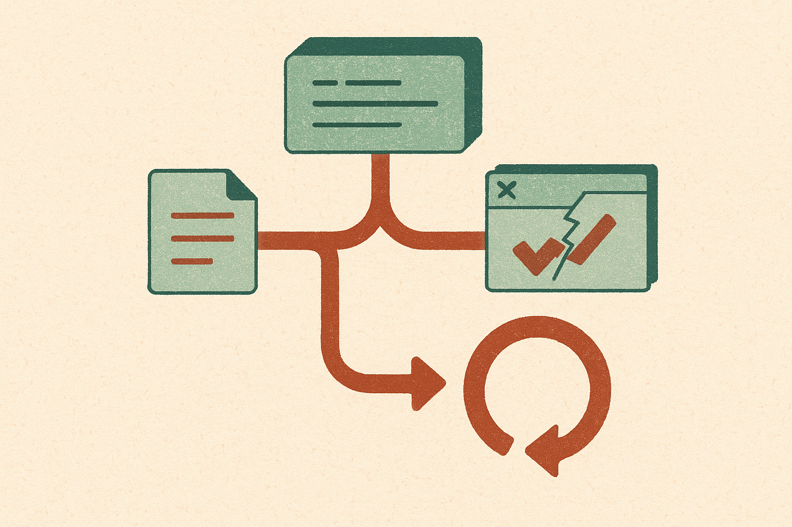

Coding agents are getting graded on the wrong slice of the job.

A lot of test-generation benchmarks ask a model to write tests in isolation. That is convenient. It is also not how software work usually happens. In a real repo, a behavior changes, then the tests need to move with it. Sometimes you add coverage for new behavior. Sometimes an old test fails because the product is now supposed to behave differently. The agent has to understand the code change, the old test intent, and the new contract.

TestEvo-Bench is a good step in that direction. The benchmark focuses on test and code co-evolution, which is the boring phrase for a very practical thing: can the agent keep the test suite honest as the codebase changes?

## The important bit is execution, not test-shaped text

The TestEvo-Bench researchers built tasks from real commit histories in open-source Java projects. That matters. Each task is packaged with an environment, so the output can be run and scored with execution-grounded signals like pass rate, coverage, and mutation score.

That last part is the receipt. A test file that compiles is not the same as a test that captures the changed behavior. Mutation score is especially useful because it pushes past “did the tests pass?” toward “would these tests catch meaningful behavioral changes?”

The benchmark has two tracks. In test generation, the agent writes new tests for new behavior. In test update, the agent adapts failing tests to match changed behavior. That second track is underrated. Updating tests is where agents often get lazy. They can delete an assertion, relax the check, or make the suite green while losing the point of the test. A benchmark that can punish that is worth paying attention to.

## Live benchmarks are becoming table stakes

The current TestEvo-Bench snapshot includes 746 test generation tasks and 509 test update tasks, curated from 59,950 candidate co-evolution records across 152 open-source Java projects. That is large enough to be useful, but the more interesting design choice is that it is live.

Each task records the timestamp of the code and test changes. New tasks can be periodically mined by the pipeline. That lets evaluators restrict runs to tasks after a model’s training cutoff, reducing the odds that the model has already seen the answer.

This is where coding-agent evals need to go. Static benchmarks age badly. Popular ones become training data, prompt-engineering targets, and leaderboard games. A live benchmark does not solve all leakage problems, but it makes the game harder to fake.

The paper reports that four agent setups combining Claude Code, Gemini CLI, and SWE-Agent with Claude Opus 4.7 and Gemini 3.1 Pro reach up to 77.5% success on test generation and 74.6% on test update. Those are real numbers, not toy-demo numbers. But the same report says performance is materially lower on the most recent tasks and drops sharply under limited per-task cost.

That is the useful tension. Agents look capable when they get enough budget and when tasks are less fresh. They look more ordinary when the task is recent and the wallet closes.

## The gap is maintenance judgment

I do not read this as “coding agents can now own tests.” I read it as “coding agents are getting good enough that we can grade them on maintenance behavior instead of autocomplete behavior.”

That changes the bar. The question is not whether the agent can write a JUnit file that looks reasonable. The question is whether it can infer the intended behavior change from the commit, preserve the test suite’s signal, and avoid taking the cheap path to green.

For builders, this is a useful pattern to copy inside your own repo. Don’t just ask an agent to “add tests.” Give it the diff, the failing tests, the surrounding history, and a command it must run. Score it on passing tests, coverage movement, and whether the new or updated tests fail when you inject a small behavioral bug. The catch most teams miss: cost limits are part of the eval. If an agent only works with a huge token budget and repeated retries, it may be a nice assistant, but it is not yet a reliable maintenance worker.
