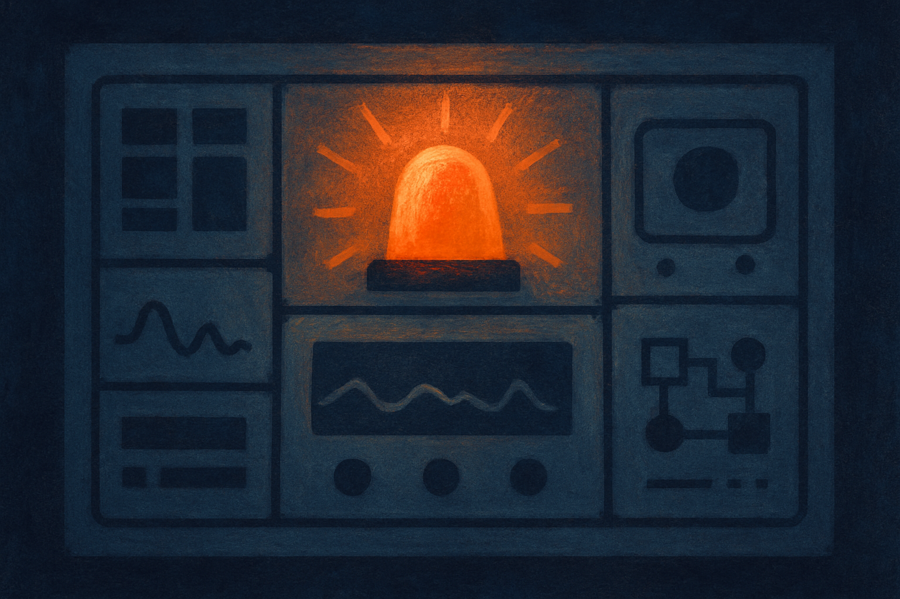

Alignment training happens once. Deployment happens forever. That gap is where most of the real safety risk lives, and it is the part that gets the least attention because it is unglamorous. A paper making the rounds on arXiv this week (posted across cs.AI, cs.CL, and cs.LG under the title "Online Safety Monitoring for LLMs") makes a claim I find genuinely useful: a very simple runtime monitor, a verifier signal plus a calibrated threshold, is competitive with more elaborate methods built on sequential hypothesis testing.

That is not a flashy result. It is a load-bearing one.

## Why runtime is where the risk actually is

The dominant mental model for LLM safety is still training-time. You do RLHF, you do red teaming, you ship a model that refuses the bad stuff. The problem the authors name up front is that this does not hold at deployment. Aligned models still produce unsafe outputs in the wild, because the inputs at deployment are adversarial, weird, and unbounded in ways your alignment set never was.

If you have shipped anything with a model behind it, you already know this in your gut. The demo behaves. Then a real user finds the phrasing that slips past the refusal, or a long context drifts the model into territory it would never touch in a clean single-turn eval. Training-time alignment is a filter you build before you know the water. Runtime monitoring is checking the water as it flows.

The paper frames the job precisely: monitor outputs online and raise an alarm when safety can no longer be assumed. Note the framing. It is not "make the model perfectly safe." It is "know when to stop trusting it." That is a much more honest goal, and a much more shippable one.

## The design is almost aggressively simple

Here is the whole thing. You have a verifier, an external model that scores an output for safety. That gives you a signal, some number. Then you pick a threshold. Above it, you raise an alarm. Below it, you let it pass. The only clever part is how you set the threshold: they calibrate it via risk control, which means you are choosing the cutoff to hold a statistical guarantee on your error rate rather than eyeballing it.

That is it. A score and a line.

Compare that to the more sophisticated alternative the paper benchmarks against: sequential hypothesis testing. That approach treats the stream of outputs as evidence accumulating over time and decides when you have seen enough to declare a problem. It is more principled in a textbook sense. It handles the temporal structure. It is also more complex to implement, tune, and reason about.

The finding is that the simple thresholded verifier is competitive with the sequential machinery on their tests. On mathematical reasoning and on red teaming datasets, the boring version keeps up. When a simple method matches a complex one, the interesting question is not "how did the simple one do so well." It is "what was the complex one buying, and did anyone need it."

## What the result does and does not say

I want to be careful here, because a paper that says "simple is fine" is exactly the kind of result people over-read.

What it says: given a decent verifier signal, a calibrated threshold is a strong baseline for runtime alarms, and you should not reach for sequential testing before you have tried the plain version. That is a real and useful piece of engineering guidance. Risk control gives you a knob with a meaning attached, which matters when you have to justify a false-negative rate to someone who is not a statistician.

What it does not say, and where I would push: the whole thing rests on the verifier. A threshold is only as good as the signal you are thresholding. If your external verifier is blind to a class of unsafe output, no amount of clever calibration recovers it. The paper is honest that this is a design that "turns a verifier signal into an alarm decision," which quietly puts all the hard modeling work upstream. The monitor is simple because the verifier is doing the lifting.

The other limit is the evaluation surface. Math reasoning and red teaming datasets are reasonable, but they are two slices. Red teaming sets in particular are curated to be catchable. The failures that scare me at deployment are the ones nobody wrote a test for. "Competitive on these benchmarks" is not "competitive on your traffic," and the gap between those two is the entire game in production.

Sources here are thin in the sense that this is one paper cross-listed three times, not three independent findings. So treat the headline as a well-argued baseline result, not a settled consensus. The direction feels right to me. The magnitude I would want to see replicated on messier data.

## Why builders should care more than they do

Most teams shipping LLM features have no runtime safety layer at all. They have a system prompt that says "be safe" and a hope. This paper is quietly making the case that the entry cost to something real is low. You do not need a research team and a sequential testing framework. You need a verifier you trust and a threshold you calibrated on purpose instead of by vibes.

The reframe I like: safety at deployment is a monitoring problem, and monitoring problems are ones operators already know how to run. Alarms, thresholds, error budgets, calibration. This is the language of SRE, not the language of alignment theory. That is good news, because it means the people who keep systems up at 3am already have the instincts for it.

The catch most people will miss is that the risk control calibration is the actual product, not the threshold itself. A threshold picked by hand drifts as your traffic changes and gives you no honest sense of your miss rate. Calibrating it against a target error rate is what turns "we have a filter" into "we know our filter's failure rate is under X." If you build a runtime monitor after reading this, spend your effort on two things: choosing a verifier that actually sees your failure modes, and calibrating the cutoff with a method that hands you a guarantee you can state out loud. Start with the boring threshold, log every alarm and every near-miss, and only graduate to sequential testing if the plain version leaves money on the table. Most of the time, this paper suggests, it will not.
