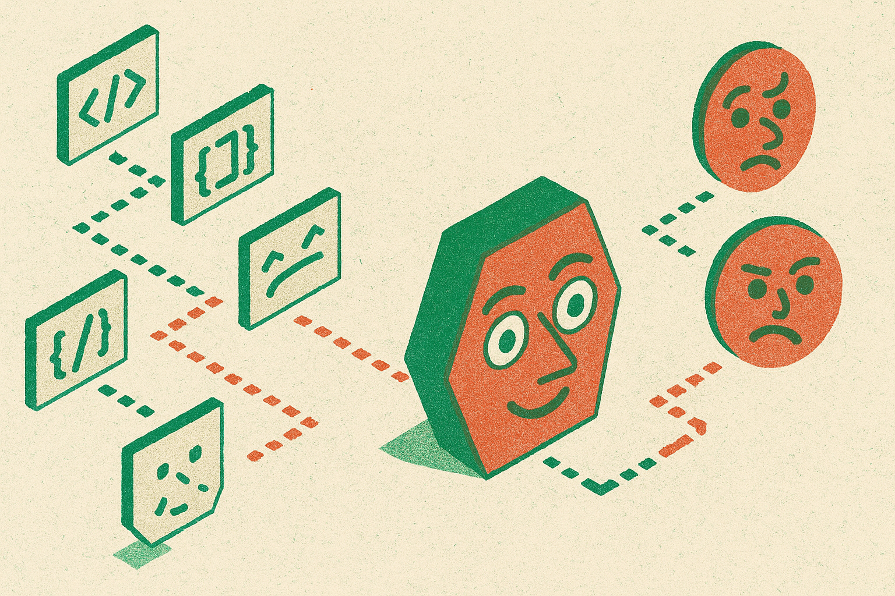

Matt Wolfe built a benchmark with one task: ask AI models to draw Gary Buucy as an SVG.

Not generate an image. Not call DALL-E, Stable Diffusion, or whatever “nano banana” refers to in the current meme cycle. The model has to write code. Shapes. Paths. Lines. Colors. Somehow those instructions need to resolve into a recognizable face.

It is called Buccy Bench, and yes, it is intentionally dumb.

That is also why it works.

## A silly benchmark can expose real model behavior

Most benchmark discourse has become ceremonial. A model gets a new high score on a private or semi-private test. The chart moves up and to the right. Everyone argues about contamination, eval design, whether the benchmark still matters, and whether the model “really” reasons.

Buccy Bench does not pretend to settle any of that.

Its value is narrower. It makes failure visible.

If GPT-3.5 Turbo in March 2023 produced a strange, broken interpretation of Gary Buucy, you do not need a leaderboard essay to understand what happened. The model failed to translate a visual concept into structured code. When later models produce cleaner SVGs, stranger SVGs, or total chaos, you can inspect the output directly.

That matters because SVG generation sits at an awkward intersection of skills. The model needs to understand the prompt, plan a composition, use valid code, manage geometry, and make aesthetic decisions. It is not just “can it code?” It is not just “can it describe an image?” It is a tiny product task pretending to be a joke.

Wolfe also added sorting for cost, tokens used, and run time, plus a timeline page to filter providers and watch changes over time. That part is more useful than the meme. A funny output is fun once. A comparable artifact across model versions is useful for builders.

## The receipt is the artifact, not the score

The best thing about this kind of benchmark is that the output is the evidence.

A single scalar score hides too much. Two models can land near each other on a benchmark while failing in completely different ways. One might write valid SVG that looks nothing like the target. Another might capture the vibe but produce messy code. Another might spend too many tokens and still get weird teeth.

Those distinctions matter in production.

If you are building an app where a model writes interface components, diagrams, icons, slide layouts, or data visualizations, you care about more than “best model.” You care about whether it produces valid artifacts, whether the output can be edited, whether it stays inside constraints, whether it gets cheaper with prompting, and whether the model’s style drifts between versions.

Buccy Bench is thin as a scientific benchmark. Wolfe is not claiming it measures general intelligence, and nobody should cite it that way. It is one prompt family, one target, one weird visual task. But as an eval pattern, it points in the right direction: make the model produce something inspectable, keep the prompt stable, track cost and latency, and preserve historical outputs.

That is how builders actually learn.

The funny part is Gary Buucy. The practical part is regression testing.

If I were applying this, I would steal the shape of the benchmark, not the joke. Pick one artifact your product needs models to create, an SVG, SQL query, JSON workflow, chart spec, React component, support reply, and run the same task across models every month. Save the raw output, cost, token count, latency, and whether a human would ship it. The catch most people miss: your private “stupid benchmark” may be more predictive for your product than a public leaderboard with cleaner branding.
