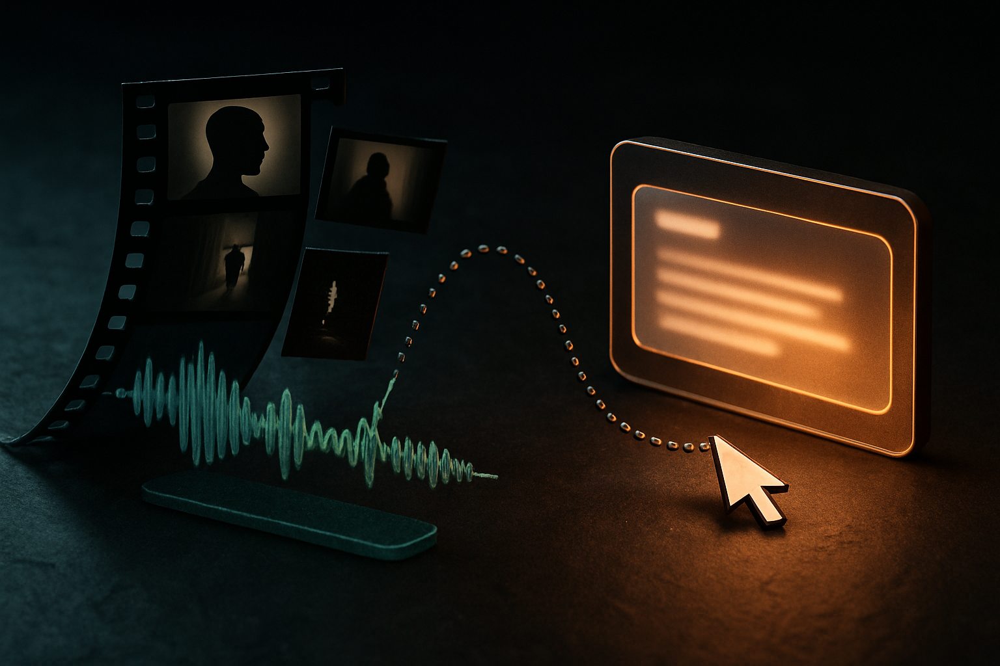

## The claim is bigger than the evidence

Hacker News surfaced a project called Claude-real-video with the tagline “any LLM can watch a video.” That is a strong claim. Based on the provided material, we do not have benchmark results, failure cases, model comparisons, latency numbers, or the implementation details needed to judge it as a product.

Still, the phrasing is useful because it names a shift that keeps showing up in applied AI: “watching video” does not always require a model that natively reasons over continuous video.

A lot of practical video understanding can be reframed as translation into model-readable context. Sample frames. Extract audio. Transcribe speech. Detect scene changes. Maybe pull OCR from screens. Then feed those artifacts into a language model that is already good at summarizing, comparing, classifying, and answering questions.

That is not the same as human watching. It is closer to a clerk reading a bundle of notes and still images. Often good enough. Sometimes dangerously incomplete.

## Video becomes context engineering

The interesting part is not Claude specifically. It is the adapter pattern.

If a system can turn a video into a sequence of compact observations, then the LLM does not need to ingest every pixel at 30 frames per second. It needs the right slices. The hard product question becomes: which slices?

A cooking video may need key frames, ingredient mentions, and timing. A support recording may need screen OCR, clicks, narration, and error messages. A sports clip may need motion and spatial continuity, which is where frame sampling starts to break down. A medical scan or security feed has an even higher bar, because missed detail can matter.

This is why “any LLM can watch a video” is both mostly true and not quite true. Any capable LLM can reason over a representation of a video. The quality depends on what the wrapper preserves, what it throws away, and whether the model knows what it did not see.

That last part matters. A good video agent should be able to say, “I only sampled one frame every few seconds,” or “the audio was unavailable,” or “the relevant action happened between sampled frames.” Without that, the interface feels magical while the system is quietly guessing.

## The near-term products are boring, useful, and uneven

The first good uses will not look like general video intelligence. They will look like workflow glue.

Teams will use systems like this to summarize meetings, inspect tutorials, index internal training videos, pull action items from screen recordings, compare product demos, and find the moment where something changed. Builders will wire video input into existing RAG, ticketing, QA, and documentation systems.

The failures will also be familiar. Long videos will overflow context unless aggressively compressed. Visual details will get lost. Audio transcripts will dominate the answer even when the visual scene contradicts them. Models will overstate confidence because the prompt says “watch this,” not “read a lossy extraction of this.”

That does not make the approach bad. It makes it a normal engineering tradeoff. Native video models may win on motion, temporal reasoning, and dense visual detail. Adapter-based systems may win on cost, debuggability, and portability across models.

For builders, I would start with one narrow job: “find the key moments in customer support screen recordings,” or “turn product walkthroughs into step-by-step docs.” Sample frames at scene changes, transcribe audio, capture OCR, and keep the intermediate artifacts visible for debugging. The catch most readers miss: the LLM is rarely the main product risk. The extraction layer is. If the video summary is wrong, first inspect what the model was actually shown.
