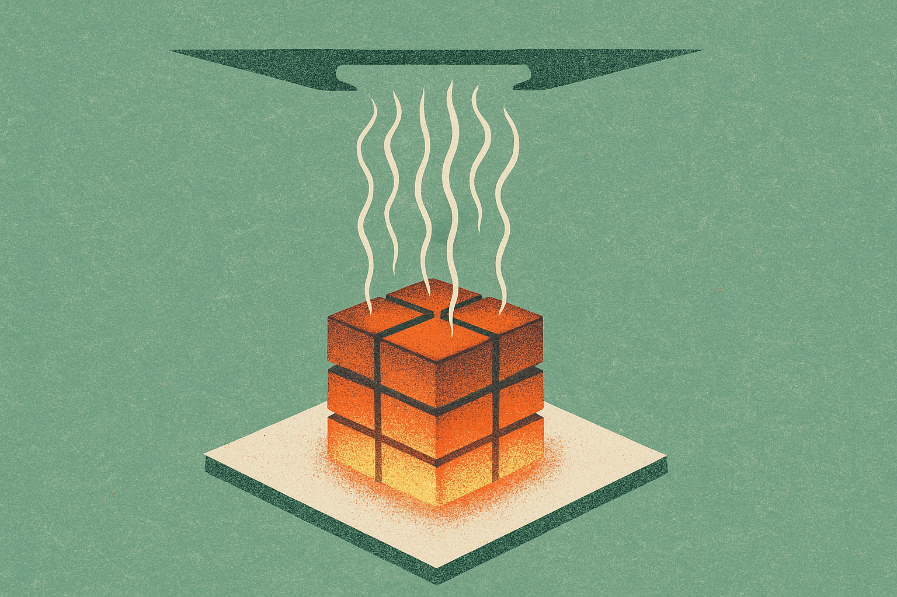
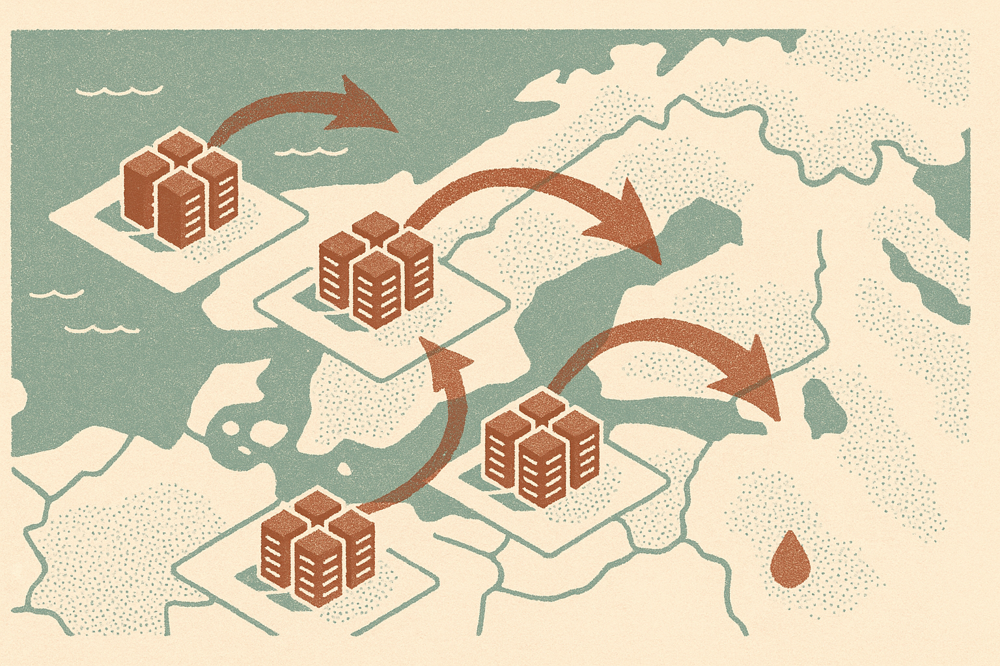
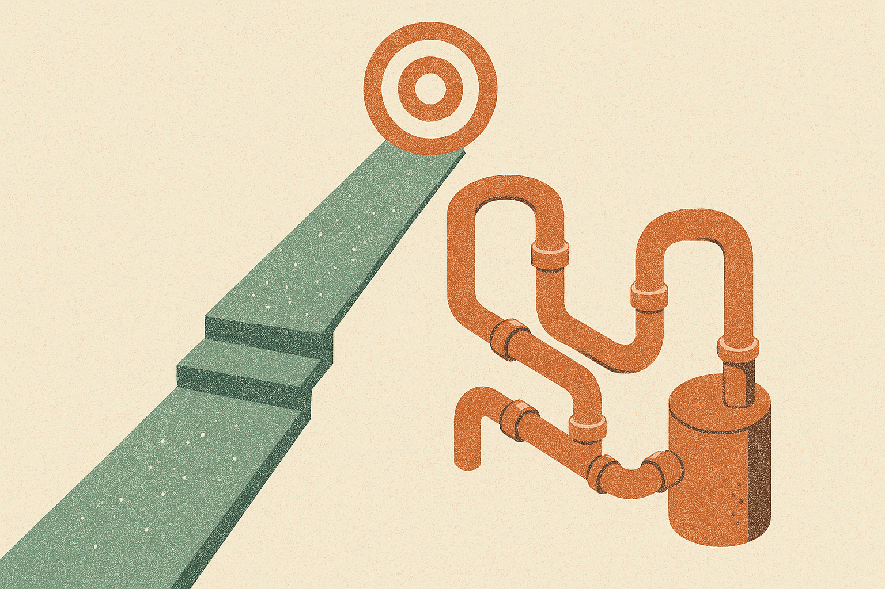

There's a line making the rounds from a Hacker News thread that stuck with me: the bottleneck might be the air in the room. It sounds like a throwaway comment. It's actually one of the more honest descriptions of where AI infrastructure is right now.

We spend most of our attention on the glamorous constraints. Chip supply. Model weights. Capital. But the thing physically limiting how much compute you can run in a given building is often more boring than any of that. It's whether you can get the heat out fast enough.

## The constraint moved down the stack

For years the AI scaling story was about the top of the stack. Bigger models, more parameters, more GPUs. The assumption underneath was that if you had the money and the chips, you could build the thing. Everything else was a solved problem.

That assumption is cracking. A modern GPU rack can pull more power than a small block of houses. Pack enough of them together and you're not running a server room anymore, you're running a furnace. The electricity going in comes out as heat, almost all of it, and that heat has to go somewhere. Traditional air cooling, blowing cold air across chips, starts to fall apart at these densities. The air literally can't carry the heat away fast enough.

That's the whole point of the phrase. The limiting factor isn't the silicon. It's the thermodynamics of the room the silicon sits in.

## Why this is different from the usual scaling worry

Most scaling bottlenecks are, eventually, financial. If chips are scarce, you pay more and wait. If capital is tight, you raise a bigger round. These are painful but familiar, and they resolve on a timeline you can plan around.

Heat is different because it's physics, and physics doesn't negotiate. A rack running at high density produces a fixed amount of heat for a given workload. You either move that heat or the hardware throttles, degrades, or fails. There's no premium you can pay to make a watt of waste heat disappear. You can only move it, and moving it costs energy, water, and space.

This is pushing the industry toward liquid cooling, where coolant runs directly to the chips instead of relying on air. It works, and it's increasingly standard for the densest deployments. But it's a heavier lift than swapping in more servers. You're plumbing a building. You're managing coolant loops, leak risk, and a whole new category of failure. The retrofit cost on existing datacenters, most of which were designed for air, is real.

So the constraint didn't just move down the stack. It moved into a domain where the fixes are slow, physical, and expensive in ways that a bigger check doesn't immediately solve.

## Where you build starts to matter more than what you build

Once heat is the binding constraint, geography stops being a detail. The cost and feasibility of a datacenter now depends heavily on the local climate, the availability of water, and the electrical grid it can draw from.

Cooler climates get cheaper cooling almost for free. Places with abundant water can run evaporative systems that hot, dry regions can't. And the grid matters twice over: once for the power the chips consume, and again for the power the cooling systems need on top of that. Cooling isn't a rounding error on the energy bill. It can be a large fraction of total consumption.

This is already reshaping where the big builds land. The industry logic used to be "put it near the users" for latency. For training runs and heavy batch workloads, latency matters less, and the new logic becomes "put it where you can cool it and power it." That's a different map, and it favors regions most of us weren't thinking about a few years ago.

There's a policy layer here too that doesn't get enough attention. Water usage from datacenters is becoming a local political issue in places facing drought. A build that pencils out on paper can stall on a permit fight over water rights. That's not a problem you solve with better GPUs.

## The honest version of the scaling story

I'm an optimist about where AI is going, but optimism means being clear about the actual constraints instead of the exciting ones. The scaling narrative sold to the public is about intelligence and algorithms. The scaling reality on the ground is increasingly about megawatts, coolant loops, and whether the local aquifer can handle another campus.

None of this stops AI. It shapes it. It determines who can build at frontier scale (the players who can secure power and cooling, not just chips), how fast they can do it (limited by construction and plumbing, not just fab output), and where it physically happens (colder, wetter, grid-rich regions). The companies quietly good at the boring physical stuff have an edge that's easy to underrate from the outside.

## Practitioner's take

If you're building on top of these systems, the near-term signal to watch isn't model announcements, it's capacity and pricing weirdness. When a provider throttles a region, quietly raises inference prices, or gives you worse availability in one datacenter than another, thermal and power constraints are often the reason underneath. Plan for capacity to be lumpy and geographically uneven rather than a smooth ramp.

The concrete move: don't hard-code your architecture to one region or one provider's cheapest tier. Build in the ability to shift workloads across regions and providers, and treat batch-heavy jobs (training, large evals, bulk inference) as things you can schedule where and when capacity is cheap, which increasingly means where it's cool. The catch most people miss is that "the cloud is infinite" was always a convenient fiction. The physical layer is finite, it's getting tighter, and the teams that design around that instead of assuming it away will spend less and break less when the next capacity crunch hits.
