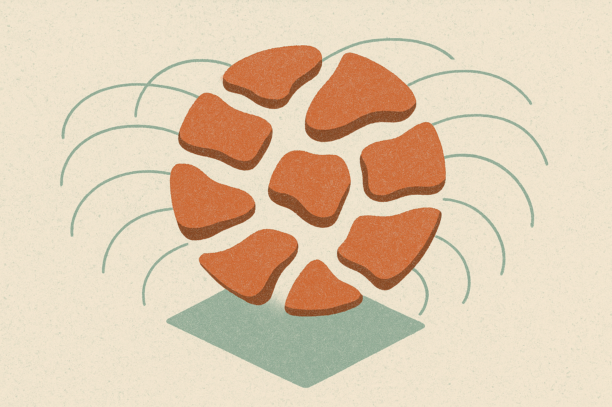

The interesting part of this deformable simulation result is not that it makes squishy dragons, cloth wrinkles, elastic ships, and collapsing card houses look cool.

That is the demo layer.

The real thing is the tradeoff it attacks: graphics simulation has long had fast methods that cheat, and accurate methods that are too slow for interactive use. Soft-body physics is brutal because each tiny point in a deforming object can affect many others. Push one region, and the error can travel. Split the work badly, and the object wobbles, slows down, or blows up.

Karoly Zsolnai-Feher at Two Minute Papers framed the new method as a way to finally split these simulations into parallel chunks without the usual instability. That matters because GPUs love parallel chunks. The catch has been that local fixes ignore global consequences. This method tries to predict those consequences ahead of time.

## The old problem was not speed, it was overshoot

The term to watch is overshoot.

Previous approaches could break a complex deformable object into smaller pieces, then solve those pieces separately. That sounds ideal for a GPU. But if each piece corrects itself without understanding how that correction affects the whole object, the solver can make the global state worse. A local improvement becomes a global mess.

The new method uses what the researchers call a “precomputed co-rotated local perturbation subspace.” Terrible phrase. Useful idea.

A small region gets a precomputed sense of how its movement, stretch, and pull will affect the larger object. So when the solver updates many regions in parallel, those updates are less blind. That is the difference between “we split the problem and hope” and “we split the problem with some knowledge of the coupling.”

This is also why the result feels relevant beyond computer graphics. A lot of AI product demos now assume interactive worlds, embodied agents, synthetic training environments, and real-time design tools. Those systems do not only need prettier pixels. They need physical feedback that is cheap enough to run while a user or agent is acting.

## The numbers are impressive, with a few caveats

The reported examples are not tiny. Zsolnai-Feher cited a dragon with 100,000 elements running in real time. He also highlighted five “barbarian ships” with about 2.5 million elements running at roughly 3 frames per second, plus a house-of-cards case at 30 frames per second with about 400,000 elements.

Compared with vertex block descent, or VBD, the reported speedup is about 30x to 170x in some cases. There is also the funny “infinite times faster” claim. That is not a time machine. It means VBD failed to converge on some cases, while the new method finished. Fair, but I would not treat that as a normal benchmark multiplier.

The important caveat is precomputation. The method can run fast during simulation because it has done useful work ahead of time. That is a good trade in many production settings, especially games, film tools, design software, robotics sandboxes, and generated environments where assets are prepared before interaction. It is less magical for fully arbitrary geometry changing every instant.

Still, this is the kind of research result I pay attention to. Not because it screams “AI,” but because it changes what interactive systems can afford to simulate. When the cost of plausible soft-body behavior drops, more builders will use it. Better tools often arrive as boring solver improvements before they show up as flashy products.

If you build with simulated worlds, do not read this as “accurate physics is solved.” Read it as a new budget option. Try it first where objects can be preprocessed, where stability matters more than perfect physical truth, and where users need feedback now rather than offline accuracy later. The catch most teams miss: real-time simulation is a product constraint, not a benchmark flex. The win is not the dragon. The win is letting someone poke the dragon and keep working.
