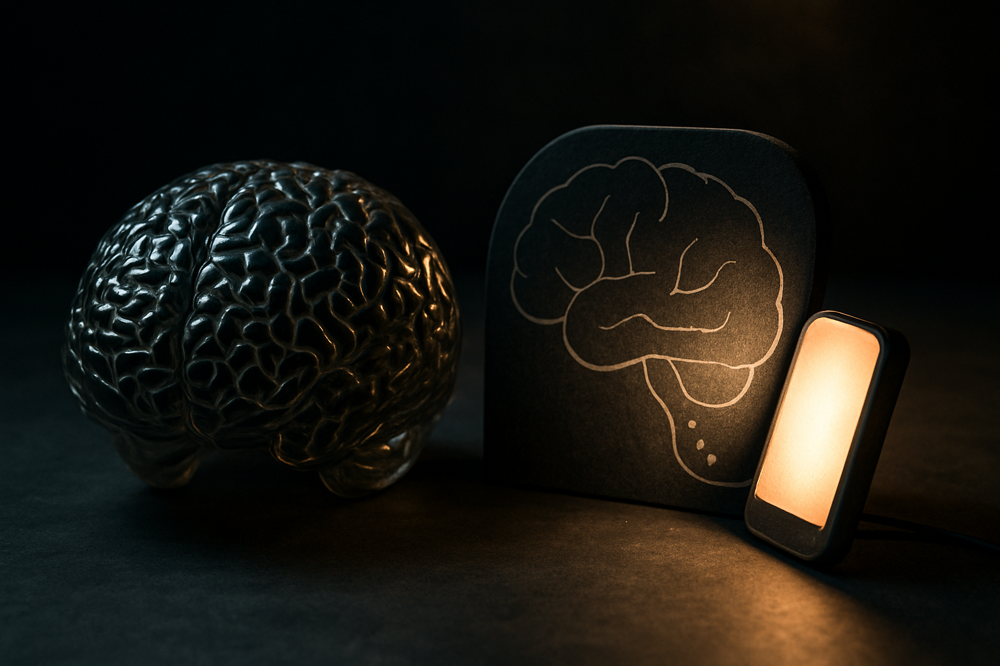
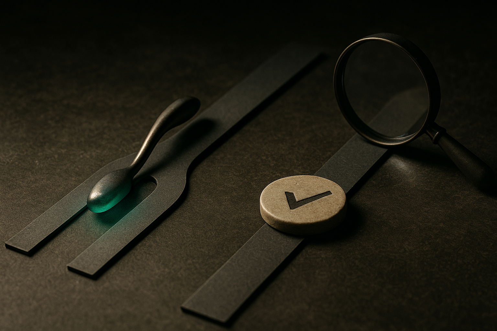

A story bounced around Hacker News with a title built to provoke: someone was barred from prompting ChatGPT during their chalk talk, and they called it discrimination. The framing is designed to make you pick a side fast. I want to slow it down, because underneath the bait is a question every teacher, hiring manager, and team lead is now facing without a good answer.

For anyone who hasn't sat through one: a chalk talk is a job-talk format, common in academic hiring, where a candidate stands at a whiteboard and works through their research vision live. No slides. No notes, usually. The whole point is to watch someone think in real time, field hard questions, and improvise. It's a stress test for the mind, not a presentation.

So the complaint isn't really about ChatGPT. It's about what a chalk talk is supposed to measure, and whether that thing still matters.

## The word "discrimination" is doing a lot of work here

Calling a no-AI rule discrimination is a rhetorical move, and I think it mostly fails. Discrimination usually means being treated worse for who you are: a protected class, a disability, an immutable trait. A rule that applies to every candidate equally ("no external tools during the live talk") isn't singling anyone out. Everyone walks up to the same blank board.

There's a narrow version of the argument that deserves respect, though. If someone has a genuine disability and uses an AI tool as an accommodation, the way a person might use a screen reader or extra time, then blocking it starts to look different. That's not a novelty complaint, that's an accessibility question, and institutions handle those through established processes. But that's not the frame the title chose. It went for the broad, spicy version, and the broad version doesn't hold.

What the provocative framing does accomplish is force the real question into the open. Why do we care whether someone can do this unassisted? If AI can help you reason through a research problem, isn't blocking it just nostalgia for a harder time?

## We keep confusing the test with the job

Here's the distinction I think the whole debate misses. There are two different things going on when you assess someone, and AI blurs them.

The first is capability screening: can this person actually do the work? The second is skill demonstration: show me the specific mental muscle I'm hiring for. A chalk talk is squarely the second kind. Nobody thinks the day-to-day job of a professor involves standing at a whiteboard with no computer. They'll have Google, papers, collaborators, and yes, probably an AI assistant. The chalk talk is deliberately artificial. It strips the tools away to see what's left.

That's not unfair. That's the design. A driving test makes you parallel park even though you'll rarely do it. A coding interview bans your usual autocomplete. The artificiality is the signal. When you remove the scaffolding, you learn something you can't learn any other way: whether the structure is actually in this person's head or borrowed from the tool.

The mistake on both sides is treating "AI helps in the real job" as if it settles what the test should allow. It doesn't. The test and the job were never the same thing, and pretending otherwise is how we end up certifying people who can't function when the network goes down.

## The skill that's actually being measured is disappearing

Now the uncomfortable part, and the reason this small story matters more than it looks.

The chalk talk measures a specific thing: can you hold a complex problem in working memory, restructure it under pressure, and defend it against a skeptical room. That's not a party trick. It's the thing that lets you catch when an AI-generated answer is subtly wrong, notice a gap in a proof, or know which question to ask next. It's the substrate that makes AI assistance useful instead of dangerous.

And it's exactly the skill that heavy AI use erodes if you're not careful. If every research problem gets outsourced to a prompt, the muscle that lets you evaluate the prompt's output atrophies. You end up in the worst spot: dependent on a tool you can no longer check.

This is why I don't think the no-AI rule is nostalgia. It's a bet that some internal capability still has to exist for the assisted version to be worth anything. The pilot still trains in the simulator with the autopilot off. Not because they'll fly manually every day, but because the day the autopilot fails is the day the whole thing rides on what's actually in their head.

## Where the line probably lands

I don't think "no AI ever" survives as a hiring norm. It's already unrealistic for take-home work, and it's going to look sillier every year. The durable answer is going to be layered: AI-open for the parts that mirror the real job, AI-closed for the parts that probe the underlying capability, and clear labeling of which is which so nobody gets ambushed.

The chalk talk, or something like it, survives that sorting as an AI-closed exercise. Not because AI is bad, but because the entire purpose is to see the unassisted mind. If you let the tool in, you've deleted the measurement and kept the ceremony.

The person who filed the complaint wanted the rule changed. I'd argue the opposite: the value of the exercise goes up as AI gets better, not down. The more the tool can do, the more it matters to know what you can do without it.

Practitioner's Take: If you assess people, whether hiring, teaching, or reviewing, stop asking "should we allow AI" as one question. Split it. For every task, decide whether you're screening capability (mirror the real job, AI on) or probing a foundation skill (strip the tools, AI off), then tell candidates upfront which mode each stage is. The catch most people miss: an AI-off exercise only stays defensible if you can articulate the specific human capability it isolates. If you can't name what you're measuring when the tool is gone, you don't have a principled rule, you have a vibe, and that's the case that actually deserves the "discrimination" complaint.
