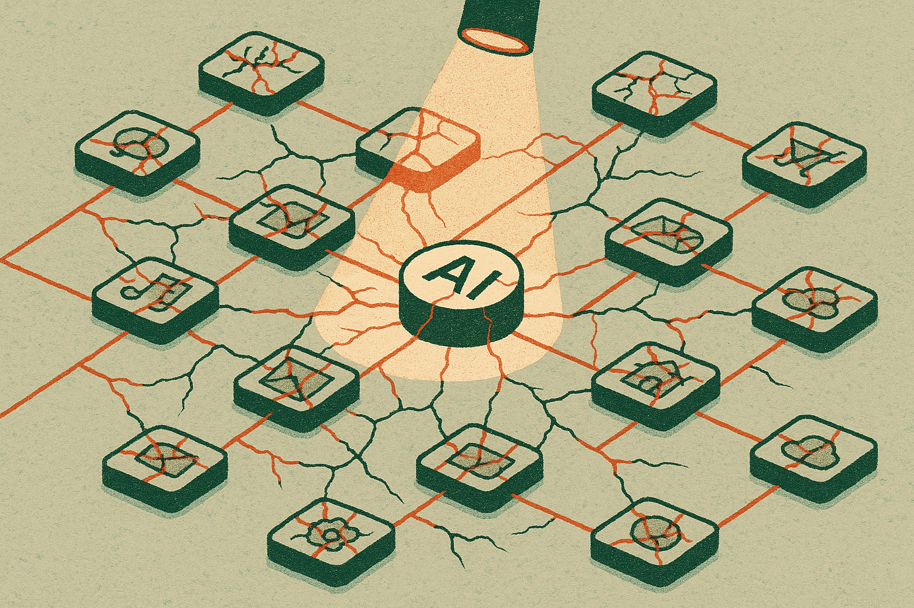

A Hacker News AI submission claims that new serious vulnerabilities spiked around the release of Claude Mythos Preview. That is not much evidence by itself. No counts, no severity rubric, no disclosure timeline, no affected systems, no clear split between model bugs and ecosystem bugs.

Still, the pattern is believable. Big AI releases attract testers, researchers, competitors, hobbyists, and attackers. Attention creates findings. Some are real. Some are duplicates. Some are old bugs that finally get named. Some are application-layer failures being pinned on the model because the model is the visible part.

That distinction matters.

## A launch is a security amplifier

Model launches do not just ship new capability. They change who is looking.

A preview model gets plugged into internal tools, demo apps, agent frameworks, browser extensions, Slack bots, customer support flows, code runners, and retrieval systems. Each integration adds its own attack surface. The model may be safer than the prior one and the total system can still become more fragile because the deployment footprint expands.

That is the part most public discussion misses. “Claude has vulnerabilities” and “apps built around Claude have vulnerabilities” are different claims. They can both matter, but they require different fixes.

For the model lab, the concern is training behavior, refusal boundaries, tool-use policy, data exfiltration paths, and jailbreak resistance. For the builder, the concern is auth, permissions, prompt injection, logging, retrieval filters, tool scopes, and what the agent is allowed to do after it produces a plausible answer.

A spike after release might mean the model introduced a new class of failure. It might also mean the release created a bug bounty rush. Or that teams rushed integrations into production because the demo was impressive.

## Correlation is not a verdict, but it is a signal

I would not treat a Hacker News headline as proof of causation. HN is useful as smoke. It is not the fire report.

The right question is not, “Did Claude Mythos Preview cause the spike?” The better question is, “What changed at release time that made serious findings appear?”

That answer usually has layers. New capabilities expose new workflows. New workflows create new tool calls. New tool calls require new permissions. New permissions create new failure modes. Then public attention compresses months of testing into a few days.

This is why AI security programs need release telemetry, not just red-team PDFs. Track vulnerability reports by affected component, exploit precondition, integration type, permission scope, and whether the issue reproduces across models. Keep model issues separate from wrapper issues. Keep jailbreaks separate from data access failures. Keep “annoying but contained” separate from “agent can act outside user intent.”

If those categories are missing, every post-launch security conversation turns into vibes.

The other practical point: preview releases invite unsafe expectations. Builders hear “preview” and think “try it.” Users hear “Claude” and think “trusted.” Security teams hear “new model” and think “new review queue.” Those are three different mental models colliding around the same product name.

For teams building on any new model release, treat the first two weeks as an active security window. Freeze permission expansion unless it is reviewed. Put new agents behind narrower scopes than you think they need. Log tool calls and retrieval hits. Add canaries for sensitive data paths. Re-run prompt injection tests against your real workflows, not toy prompts. The catch most readers miss: the riskiest change is often not the model. It is the new thing your product suddenly lets the model do.
