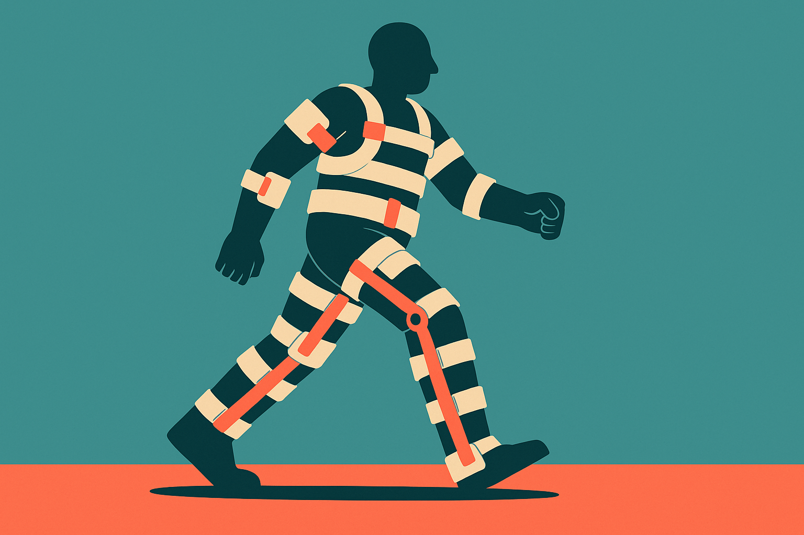
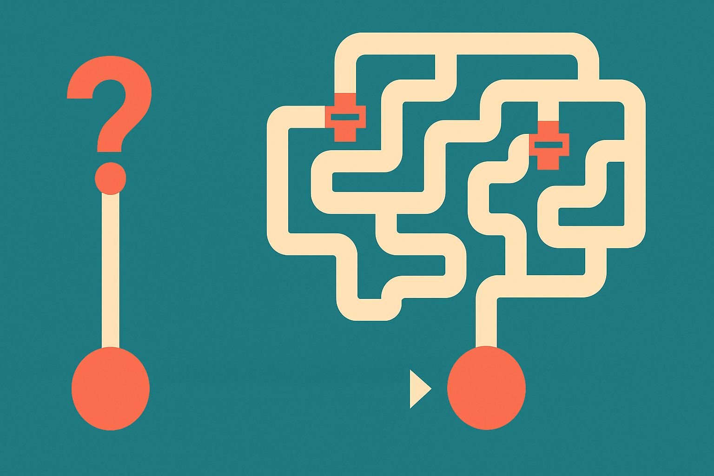
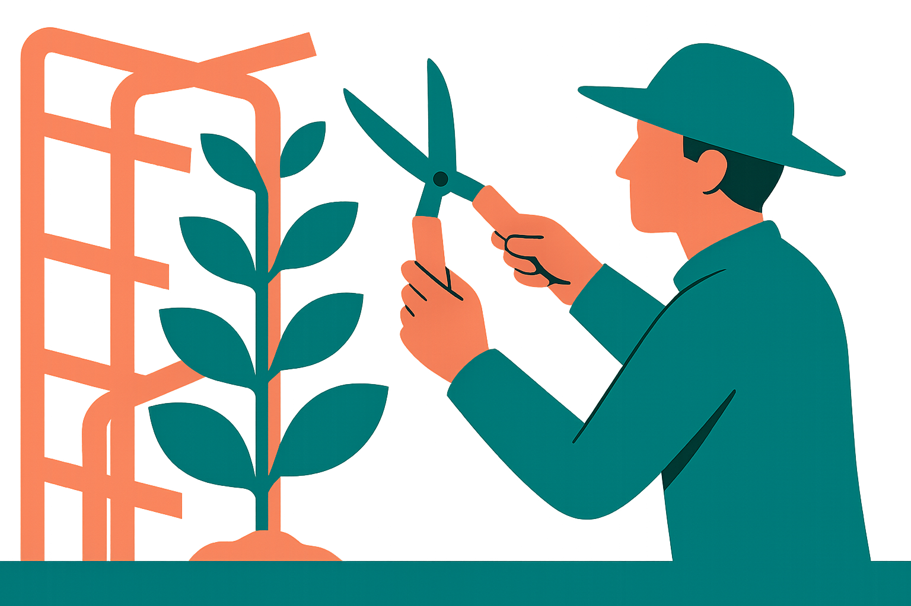

There's a pattern I keep running into, and a thread on Hacker News titled "Better Models: Worse Tools" put a name to it. The models keep getting better. The tools wrapped around them, somehow, keep getting worse. Not always. But often enough that it's worth stopping to ask why.

You upgrade the underlying model. You expect the product built on top of it to feel sharper. Instead it feels more cautious, more verbose, more likely to insist on a workflow you didn't want. The raw capability went up. The experience went sideways, or down.

## The scaffolding tax

Here's the mechanism I think is doing most of the work. When a model is weak, you compensate with scaffolding. Retry loops. Verbose prompts that spell out every edge case. Validators that check the output and re-ask when it's wrong. Chains that break one task into six steps because the model can't hold the whole thing in its head.

That scaffolding is rational when you build it. It's the difference between a demo and a product. But scaffolding is sticky. Once it's in the codebase, nobody rips it out. And when the next model arrives, one that could do the whole task in a single pass, the scaffolding is still there, chopping the task into six pieces, adding latency, and constraining a model that no longer needs the training wheels.

So the model got smarter and the tool got dumber, relative to what the model could do on its own. The HN framing is sharp because it separates the two: model capability and tool quality are different axes, and they don't move together automatically. A better model can sit inside a worse tool, and frequently does.

I've seen this in my own stack. I wrote a three step extraction pipeline for a model that couldn't reliably return structured output. Months later a newer model returned clean JSON on the first ask, every time. My pipeline kept splitting the work, kept validating, kept retrying on failures that no longer happened. It was slower and more expensive than just asking once. The tool was fighting the model.

## Guardrails that outlive the threat

The second mechanism is guardrails. Early on, weak models hallucinate, go off topic, produce garbage. So you clamp down. Restrict the output format. Add refusal logic. Narrow the allowed actions. Filter aggressively on the way out.

Then the model improves. The behavior you were guarding against mostly stops. But the guardrails stay, and now they're catching legitimate outputs. The model tries something clever and the wrapper rejects it as out of bounds. You've capped the ceiling to protect against a floor that no longer exists.

This is the part that annoys users most. They can tell the model underneath is capable, because they've used it raw in a chat window. Then they use it through a product and it feels lobotomized. The gap between raw capability and shipped capability is the tool tax, and it's growing precisely because raw capability is growing fast.

## Why product teams keep making this trade

It would be easy to call this laziness. It isn't. There are real reasons teams keep the scaffolding and the guardrails.

Consistency is one. A single pass from a great model is usually excellent and occasionally weird. Scaffolding trades a higher average for a tighter variance. For a lot of products, especially anything customer facing or regulated, predictable and slightly worse beats brilliant and occasionally embarrassing.

Fear of regression is another. Nobody gets fired for keeping the retry loop. They do get paged when the one-pass version fails at 2am. So the scaffolding stays as insurance, even when the premium is no longer worth it.

And there's the plain fact that removing code is scarier than adding it. Every layer was added to fix a specific bug. Ripping it out means trusting that the bug won't come back. That trust is hard to earn, so the layers accrete.

None of these reasons are wrong. But added together they produce a product that lags its own model by a full generation or more. The tool is optimized for a model that has already been retired.

## Re-baselining as a discipline

The fix isn't to strip all scaffolding. It's to treat scaffolding as debt that needs periodic review, not permanent infrastructure.

Every time you upgrade the model, re-run the tasks the scaffolding was built to handle, with the scaffolding off. Not in production. In an eval harness where you can measure it. See what the raw model does now. If it handles the case clean, retire that layer. If it still fails, keep the layer but note why, so the next upgrade you check again.

This sounds obvious and almost nobody does it. Upgrading the model is a config change, a one line diff. Re-auditing the scaffolding is a project. So teams take the easy win, bump the model, and leave the tool exactly as it was. The model improves. The tool doesn't. Over a couple of cycles the gap becomes visible to users, and that's when you get the "better model, worse tool" complaint.

The teams that avoid this treat capability as moving ground. They assume the model will keep getting better and they build the wrapper to get out of the way as that happens. Thinner prompts. Fewer forced steps. Guardrails scoped to actual failures they've measured recently, not failures they remember from a year ago.

There's a strategic angle too. If your product's value is mostly scaffolding, and the model keeps eating scaffolding, your moat is shrinking every release. The durable value moves toward the things the model can't do for itself: your data, your integrations, your understanding of the user's actual job. Betting your product on compensating for model weakness is betting against the trend line.

The practitioner move is a recurring calendar item, not a heroic refactor. Once a quarter, or whenever a major model lands, take your three ugliest scaffolding layers and test them off. Log the delta in cost, latency, and quality with the raw model. Retire what's no longer earning its keep. Keep a short doc of what each remaining layer defends against and the date you last verified it. The catch most people miss: the scaffolding that hurts you most is the stuff that still works. It's not broken, so no ticket gets filed, and it quietly caps your best model at last year's ceiling forever.
