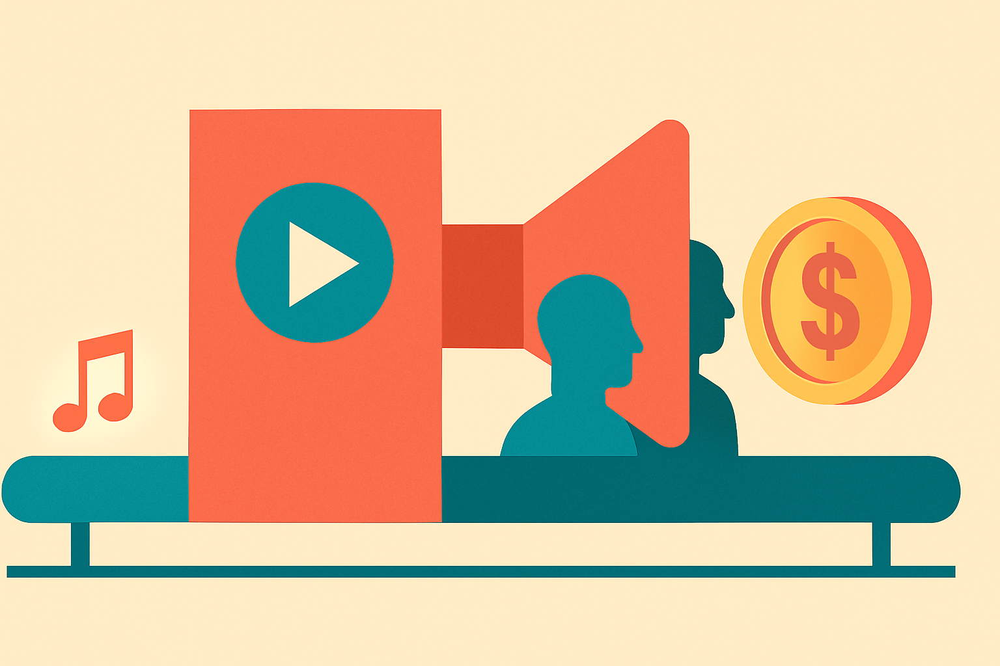

AI music side hustles sound cleaner than they are.

The pitch is simple: generate songs with Suno, package them for YouTube, let search and recommendations do the rest. The AI Grid shared a case study that is more useful because it is not huge. The channel reportedly made about $4,000 last year, roughly $5,000 over a passive period with no uploads, and $16,000 to $20,000 total before the operator pulled back.

That is not retirement money. It is also not nothing.

The interesting part is what actually created the value. It was not just pressing generate. The channel targeted a specific audience, roughly teens interested in modern video game franchises like Poppy Playtime, Gears of War, and Call of Duty. The songs were built around pop culture themes. The packaging looked closer to a real music channel than spam. The AI Grid says editors and custom animation were involved.

So the money came from a bundle: cheap music generation, niche selection, YouTube packaging, and enough production value to avoid feeling disposable.

## The song is the cheap part now

Suno changed the cost curve for making acceptable tracks. That matters. A solo operator can now test a niche without renting studio time or hiring a full music team.

But the case study also shows the trap. Once the music is cheap, everyone piles into the same playbook. The AI Grid said the space became too competitive to justify more spend. That tracks. If the core artifact is easy to make, distribution and taste become the moat. Not the model.

There is also a quality floor. The channel appears to have worked because it did not look like raw AI output dumped onto YouTube. It had edited videos. Some had custom animation. That raises watch time and trust, but it also turns a “passive income” channel into a production business.

That is the margin problem. AI compresses one cost, then exposes the others.

If a track costs pennies but the video costs hundreds, the bottleneck moved. If audience research takes weeks, the bottleneck moved again. If YouTube demonetizes the format, the whole model changes overnight.

## Platform risk is the business model

The AI Grid’s numbers are also a reminder that YouTube income is path-dependent. A few tracks “went viral,” then kept earning after uploads stopped. That is the good version of algorithmic distribution. The bad version is demonetization, copyright claims, reused-content reviews, or policy shifts around synthetic media and animation channels.

The operator said YouTube had been demonetizing animation channels, which pushed him to take the channel down. That claim is anecdotal, but the risk is real enough. Channels built on synthetic music, pop culture references, and animated visuals sit near several policy fault lines at once.

There is the IP question around game franchises and characters. There is the originality question when AI-generated songs start to sound similar across channels. There is the audience question if the content targets younger viewers. And there is the disclosure question as platforms get more serious about synthetic content labeling.

None of that means “do not build.” It means the spreadsheet needs more than RPM assumptions.

The wrong lesson is “AI music prints money.” The better lesson is “AI music makes testing cheaper, but monetization still depends on taste, packaging, rights, and platform trust.”

For builders, I would treat this as a niche validation workflow, not a passive-income machine. Pick one narrow audience, make 10 polished tracks, keep the visuals simple enough that costs do not eat the upside, and measure retention before scaling. Avoid borrowed characters or brand-heavy hooks unless you understand the rights risk. The catch most people miss: the defensible asset is not the generated song. It is the repeatable system for finding underserved listener intent and packaging it in a way YouTube wants to keep recommending.
