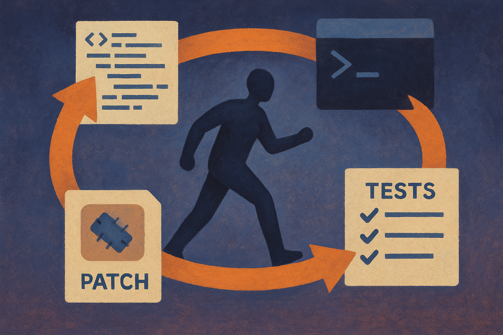

Haider posted that “GPT-5.6 Sol Ultra will be in Codex,” and Hacker News picked it up. That is the whole receipt so far.

No OpenAI announcement. No release notes. No benchmark table. No pricing. No API details. No definition of “Sol Ultra.” So the right posture is simple: treat it as a rumor, but not a random one. The specific placement, Codex, is the interesting part.

A bigger model in chat is easy to hype. A bigger model in a coding agent is easier to test. Code either runs or it does not. Patches compile or they do not. Tests pass or fail. Review diffs are visible. That makes Codex a more useful stage for a frontier model than a glossy demo prompt.

## The name is less important than the deployment surface

“GPT-5.6 Sol Ultra” sounds like model naming has fully turned into GPU-era car trim. Maybe it is a real internal name. Maybe it is public branding. Maybe it is a placeholder that will never ship under that label.

I would not build a plan around the name.

I would pay attention to the product surface. If OpenAI is putting its next stronger model into Codex first, that says something about where the company thinks high-value model work happens. Not just answering questions. Holding repo context. Editing many files. Running commands. Recovering from failed tests. Explaining diffs. Asking for permission before dangerous operations. Doing the boring loop.

That loop is where model quality compounds. A small improvement in reasoning or tool use can matter more in coding than in chat, because the agent gets feedback from the environment. It can inspect, change, run, inspect again. The work is grounded.

## Codex is a better lie detector than benchmarks

The benchmark problem is not that benchmarks are useless. It is that they get overread. A model can score well and still be annoying in a real repo. It can solve contest problems and still break a migration, miss a hidden dependency, or write a clever function that nobody wants to maintain.

Codex-style work exposes different failures. Does the model preserve style? Does it understand the project’s weird naming scheme? Does it stop when it should? Does it ask before deleting files? Does it leave a clean diff? Can it operate inside constraints without inventing an architecture astronaut plan?

Those are not glamorous questions. They are the ones builders care about.

If GPT-5.6, whatever that means, lands in Codex, the first useful evaluations will not be leaderboard screenshots. They will be messy repo trials. Take an old bug with a known fix. Take a small feature you have been avoiding. Take a flaky test. Give the agent bounded permissions and compare the output against a senior engineer’s expectations.

The difference between “impressive” and “useful” shows up fast.

## The catch is integration, not intelligence

The trap is assuming a stronger model automatically makes a better coding product. It helps. It is not enough.

Coding agents need context systems, tool permissions, sandboxing, review workflows, memory boundaries, and good failure UX. The model can be brilliant and still waste time if it cannot find the right files, run the right commands, or explain why it touched eight modules instead of two.

This is why Codex is the part to watch. If OpenAI ships a stronger model there, the question is not only “how smart is it?” The question is “what did the product let it do?” More autonomy is not always better. More targeted autonomy usually is.

Practitioner’s take: do not wait for the model name to settle. Set up a small internal coding-agent eval now: three real bugs, three small features, one refactor, all in repos you know well. Track time saved, review burden, test pass rate, and how often humans had to redirect the agent. If GPT-5.6 Sol Ultra shows up in Codex, swap it into the same harness. The catch most teams miss is that the eval should measure the whole workflow, not the model’s first answer.
