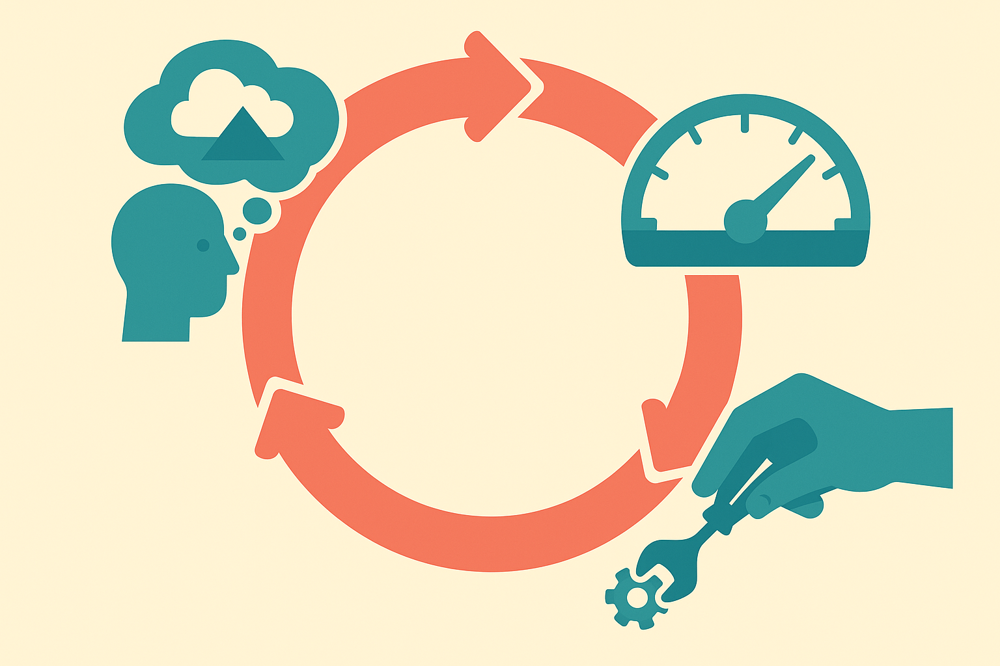
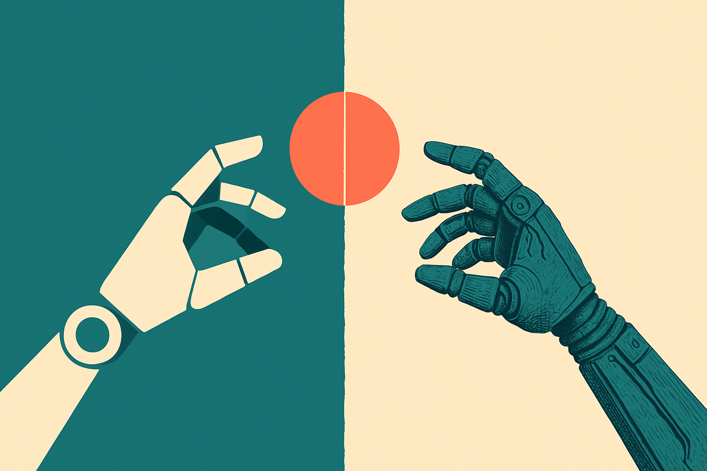

Hugging Face shipped LeRobot v0.6.0, and the framing they chose tells you where robotics tooling is heading: imagine, evaluate, improve. Not "train a bigger model." Not "collect more data." A loop.

That word choice matters more than any single feature in the release. For a couple of years the open robotics story has been about datasets and demos. Record a bunch of teleoperation episodes, train a policy, post a video of an arm folding a towel. Impressive once. Fragile in practice. What LeRobot is nudging toward is the boring engineering discipline that made web software reliable: a cycle you can run over and over, where each pass tells you something the last one didn't.

## What "imagine, evaluate, improve" actually means

Strip the tagline down and you get three stages that map to real work.

Imagine is simulation and rollout. You generate behavior in a simulated environment before you risk a physical robot. This is where a policy gets to fail cheaply.

Evaluate is the measurement layer. You need to know whether the policy is good, and "good" has to be a number, not a vibe from watching one clip. This is the stage most hobbyist robotics skips, and it's exactly why so many home-brew projects plateau.

Improve is the update: take what evaluation told you, adjust the policy, run again. Reinforcement learning lives here, but so does plain old data collection targeted at the failure cases you found.

The interesting claim buried in this structure is that the three stages belong in one framework. Historically they've been three different toolchains stitched together with glue code: a sim from one project, an eval harness someone wrote for a paper, a training loop from a third repo. If LeRobot genuinely unifies them, the value isn't any one stage. It's that the handoffs stop leaking.

## Why the loop beats the demo

Here's the honest tension in robot learning. A demo proves a policy can do a task once, under conditions the person filming controlled. A loop proves you can make the policy better on purpose. Those are completely different capabilities, and the field has been rich in the first and poor in the second.

Simulation is the enabler. If you can only evaluate on real hardware, you're bottlenecked by wall-clock time and broken servos. Every improvement cycle costs you an afternoon and maybe a stripped gear. Move evaluation into sim and you can run thousands of rollouts overnight, find where the policy breaks, and only touch the real robot when you have something worth testing.

The catch, and it's a big one, is the sim-to-real gap. A policy that scores beautifully in simulation can flop the moment it meets real friction, lighting, and sensor noise. Simulation makes the loop fast but not automatically trustworthy. The evaluate stage has to include real-world checks eventually, or you're just optimizing for a physics engine's idea of the world. Anyone who's shipped this knows the gap doesn't close by itself.

I read the v0.6.0 framing as Hugging Face acknowledging this. You don't build an "evaluate" stage into your headline unless you've watched enough policies look great and perform badly to know measurement is the hard part. The demo era rewarded the imagine stage. The loop era rewards evaluate.

## Where this fits in the open-robotics stack

LeRobot's bet has always been that robotics follows the trajectory of NLP and vision: open models, shared datasets, common tooling, a Hub to distribute it all. That worked for language because text is abundant and cheap to move around. Robotics is harder because the data is physical, the hardware is heterogeneous, and a policy trained on one arm doesn't cleanly transfer to another.

The imagine-evaluate-improve loop is a partial answer to that heterogeneity problem. If evaluation is standardized, you can compare policies across setups on something like even footing. If simulation is shared, you can benchmark without owning the exact robot someone else used. That's the same dynamic that made leaderboards useful in NLP, applied to a domain where "just run the benchmark" used to mean "buy the specific $20,000 arm first."

I want to be careful not to oversell a point release. v0.6.0 is an increment, not a revolution, and Hugging Face's own framing is a promise about workflow more than a proof that the workflow closes the sim-to-real gap. The features matter only if the loop actually turns for real users on real hardware. That's an empirical question the release notes can't settle.

## The part most people will miss

Everyone will focus on what new policies or environments shipped. The durable change is the mental model. Robotics tooling is starting to treat a robot policy like software you iterate, not a model you train once and enshrine. That reframing is quiet and it's the whole game.

The move from "I trained a policy" to "I run a loop" is the same move that separated hobbyist coding from engineering. Version control, tests, CI. Boring, and it's why software scaled. Robotics has been waiting for its version of that discipline, and a framework that makes evaluation a first-class stage is a real step toward it.

If you're a builder, here's how I'd actually use v0.6.0. Don't start by training. Start by wiring up the evaluate stage for a task you care about, with a metric you can defend, and run your existing policy through it. You'll learn more from one honest evaluation than from ten new demos. Then use simulation to iterate cheaply, but budget for a reality check on hardware early and often, because the sim score is a hypothesis, not a result. The trap is falling in love with the imagine stage, generating gorgeous rollouts, and never confronting the gap. The loop only pays off if you let evaluation hurt your feelings.
