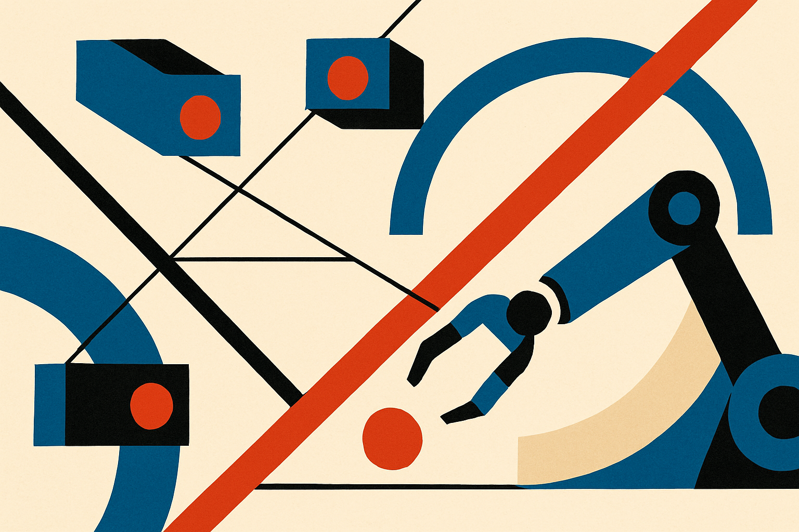

## The camera is a deployment problem, not a footnote

A lot of robot learning demos quietly assume the camera stays where training left it.

That is fine in a lab. It is brittle in the field. Someone remounts a camera. A rig gets bumped. A workstation changes. The robot is now seeing the same task from a different angle, and the policy has to act as if nothing happened.

CamVLA is aimed right at that gap. The researchers behind it argue that a vision-language-action policy should not need explicit camera extrinsics at deployment. It should infer enough camera geometry on its own.

That sounds small until you think about the operational burden. Camera calibration is one of those annoying taxes that does not show up in model cards. It shows up when a robot is moved from one bench to another, or when a product team wants the same policy to work across slightly different installs.

The usual answer is to provide the model with camera extrinsics, meaning the measured relationship between camera pose and robot base. CamVLA removes that requirement. It uses a single monocular RGB image and a task instruction. No depth. No fixed camera. No externally supplied calibration.

## Split the problem: what move, and from where

The important design choice is the split.

CamVLA predicts two things. First, a camera-centric end-effector action, expressed in the local camera frame. In plain language: given what the camera sees, how should the hand move relative to that view?

Second, it predicts a 6-DoF hand-eye matrix, which estimates the relationship between the camera and the robot base. Then a deterministic geometric transform composes those two outputs into the actual robot base-frame action.

That is the core bet. Don’t force one network output to entangle manipulation skill and camera pose. Separate “how should I move?” from “where am I looking from?”

I like this because it puts geometry back into the system without making the whole stack dependent on a manual geometry setup. It is not pure end-to-end faith. The model still has to estimate camera pose, but the final composition step is explicit.

CamVLA researchers reported better success rates across unseen viewpoints in both simulation and real-world robot data. They do not claim the camera stops mattering. They claim the policy can adapt when the camera changes, without being handed extrinsics.

That distinction matters. This is not “robots now generalize everywhere.” It is a narrower, more useful claim: a VLA policy can be trained to internalize enough camera-to-robot grounding that deployment does not collapse when the camera moves.

## The catch is visibility, not just calibration

Calibration-free does not mean perception-free.

If the gripper is hidden, the object is occluded, the lens changes heavily, or the scene falls outside training distribution, the model still has to guess. Single-view monocular RGB is convenient, but it is also information-poor. Depth-free deployment lowers hardware friction, but it also asks the model to infer spatial structure from pixels.

So the real question is not whether CamVLA beats a carefully calibrated system in a perfect setup. The interesting question is whether it beats the messy version of that system after a month in the field.

That is where this line of work feels practical. A slightly less precise model that survives camera shifts may be more valuable than a higher-performing one that depends on a fragile rig. Especially for service robots, warehouse stations, education kits, and research labs where the camera position is not sacred.

For builders, I would test this as a tolerance layer, not a miracle layer. Train or evaluate across intentional camera perturbations: height changes, side angles, small remounts, and accidental bumps. Compare against your calibrated baseline after breaking the calibration on purpose. The missed catch is that “free camera” only helps if the task remains visually grounded. If your deployment often loses sight of the hand-object relationship, add views, markers, depth, or constraints before asking the policy to hallucinate geometry from one image.
