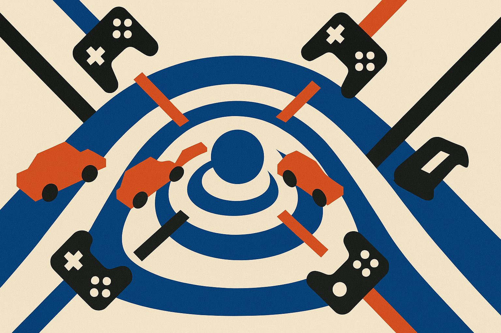

World models have had a single-player bias. That is fine if the task is driving down a road or controlling one robot arm. It gets shaky when several agents act at once and the scene changes because of all of them.

The Rocket League world-model team is aiming straight at that problem. Their 5-billion-parameter latent diffusion model generates four-player Rocket League matches in real time, conditioned on the action streams of multiple players. The key claim is not just “it makes plausible game video.” It is that the model can attribute scene changes to the right player while staying coherent under arbitrary action combinations.

That is the interesting part.

## Multiplayer makes prediction political

In a single-agent world model, other agents often get folded into “the environment.” They become moving scenery. In Rocket League, that shortcut breaks quickly. Four cars, one ball, walls, boosts, collisions, teammates, opponents. The ball’s next state may depend on three near-simultaneous touches and a car arriving upside down at supersonic speed.

The authors trained on 10,000 hours of gameplay from publicly available bots. That matters because this is not human internet video scraped into a vague simulator. It is action-conditioned data from an environment where inputs and outcomes can be aligned.

The model reportedly runs at 20 frames per second on a single Nvidia B200 GPU. That is real time, but not cheap real time. A B200 is the kind of hardware that makes the phrase “single GPU” sound friendlier than it is. Still, for a 5-billion-parameter diffusion model generating an interactive multiplayer scene, it is a meaningful marker.

## The claim to watch is stability, not prettiness

The authors say the model was trained only on short clips, yet distributional quality holds steady out to five minutes, the longest horizon they measured. They also report observing rollouts for hours with no sign of collapse.

I would separate those claims. Five minutes measured is strong. “Hours observed” is interesting, but thinner until the evaluation is formalized. Long-horizon world models often fail in ways that are easy to miss if you look only at visual quality: physics drift, hidden state weirdness, agents losing causal influence, objects becoming decor.

The team seems aware of that. They developed targeted evaluations aimed at physical understanding rather than visual appearance alone. That is the right direction. A model that renders a beautiful Rocket League clip but lets cars ghost through the ball is a video model. A model that respects action, contact, momentum, and multiplayer causality is closer to a simulator.

The title also points to representation autoencoders, which is not cosmetic. In these systems, the codec is part of the model’s physics. Compress away the wrong details and no amount of diffusion polish recovers them. The authors report studying the video codec, the generative objective, and the multiplayer conditioning scheme, which is exactly where I would expect the make-or-break choices to live.

## A narrow demo with broad implications

Rocket League is a great testbed because it is small enough to instrument and hard enough to punish shortcuts. It has continuous motion, tight timing, cooperation, competition, and frequent contact events. It is also still a game. The world is bounded. The rules are clean. The action space is known. The training data comes from bots, not messy people improvising in the physical world.

So I would not jump from this to “general-purpose world simulators are here.” They are not. But I would take it as a serious sign that interactive generative models are moving from passive video prediction toward controllable multi-agent environments.

The open dataset, training and inference codebase, and live demo are important if the release matches the claim. World models need shared testbeds badly. Otherwise everyone shows smooth clips and calls it understanding.

For builders, the practical move is to test world models where action attribution is unavoidable. Do not start with an open-ended 3D world and hope intelligence appears. Pick a constrained environment with logged actions, measurable physics, and multiple actors. Then evaluate whether interventions actually cause the right downstream changes. The catch most teams miss: visual fidelity can improve while controllability gets worse. If your agent cannot reliably tell who caused what, you do not have a world model. You have a very expensive dream machine.
