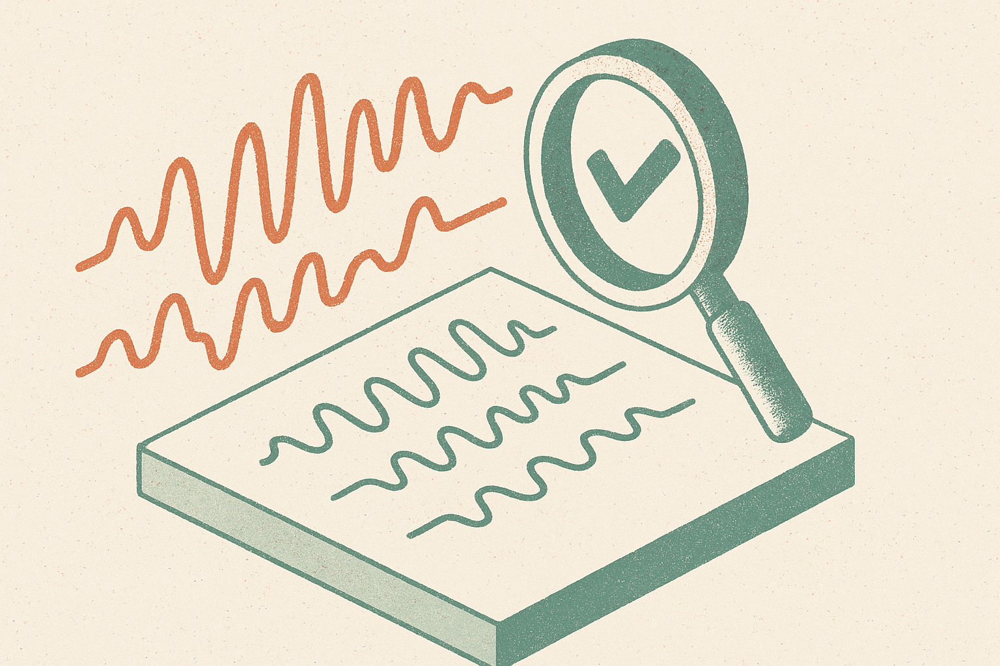

Voice AI has a demo problem.

The best demos sound shockingly good for 30 seconds. Smooth synthetic voices. Low transcription error. Quick answers. Then the cracks show: the agent jumps in too early, waits too long, misses the emotional temperature, flattens a dialect, or responds to a close friend like a bank IVR.

That is the gap SPEARBench is trying to measure. The benchmark, posted to arXiv in both cs.AI and cs.CL, is aimed at streaming speech-to-speech language models: systems that take spoken input and answer directly with speech. Not speech-to-text, then text scoring, then text-to-speech as separate leaderboard chores. The whole interaction.

The SPEARBench researchers make a useful point: standard speech and text benchmarks do not capture whether a system feels natural in conversation. Naturalness is not one thing. It is timing, turn-taking, prosody, stance, dialect consistency, and whether the response fits the relationship between speakers.

That sounds fuzzy. It is not.

## The missing benchmark is conversational physics

Most AI voice evaluation still rewards clean signal and correct words. Those matter. If the audio is garbled or the system mishears the user, the product fails.

But human conversation has physics. Pauses carry meaning. Overlap can signal enthusiasm, impatience, confusion, or rudeness. A delayed answer can feel thoughtful in one context and broken in another. Prosody can soften a refusal or make a correct answer sound dismissive.

SPEARBench builds controlled question-answer prompts from the Seamless Interaction corpus, runs multiple models, and compares generated answers against original human answers as a reference condition. The evaluation covers response latency, interruptions, speech quality, ASR error, language and dialect consistency, emotional naturalness, interpersonal stance, and distributional baselines that help explain where model behavior departs from humans.

That last part matters. “Sounds good” is too blunt. A system can have high signal-level quality and low ASR error while still behaving unlike a person in the flow of conversation. SPEARBench reports exactly that pattern: current models can be technically clean but still diverge from human behavior in latency, overlap, dialect preservation, emotional adaptation, and stance dynamics.

## Naturalness is not polish

The product implication is uncomfortable. A voice agent can pass the obvious tests and still be bad.

A support bot that interrupts a frustrated customer is worse than a slower one that lets them finish. A tutoring agent that fails to adapt its tone to a nervous student may be correct but unhelpful. A companion-style agent that mirrors language inconsistently can feel uncanny or disrespectful. A multilingual assistant that answers in the right language but erases dialect is not really preserving the interaction.

This is why I like the framing of SPEARBench. It pushes evaluation toward behavior, not just output quality.

The benchmark also cuts against a common marketing habit: treating latency as a simple race to zero. Faster is not always more natural. Humans do not respond at one fixed speed. We pause, backchannel, overlap, yield, and repair. A useful speech model needs timing control, not just low latency.

Same with emotion. “Expressive voice” is not enough. The question is whether the system adapts appropriately to the speaker and situation. A cheerful tone can be wrong. A neutral tone can be wrong. The benchmark’s focus on interpersonal stance is a sign that voice AI is moving from transcription-era metrics into interaction-era metrics.

## Builders should test the awkward moments

This is still a benchmark, not a product guarantee. The source material does not tell us that one architecture has solved natural conversational behavior. It says current systems differ from humans in important interaction patterns, even when the audio and recognition metrics look strong.

That is useful. It gives builders a better failure map.

If you are building a voice agent, record real sessions and score the uncomfortable parts: first response timing, interruptions, silence after ambiguous user input, emotional mismatch, language switching, and whether the agent’s stance fits the relationship. Do not only inspect the transcript. Listen to the exchange. Compare against a human operator doing the same task. The catch most readers miss: naturalness is not added by choosing a nicer voice at the end. It has to be designed into turn-taking, state, policy, and evaluation from the start.
