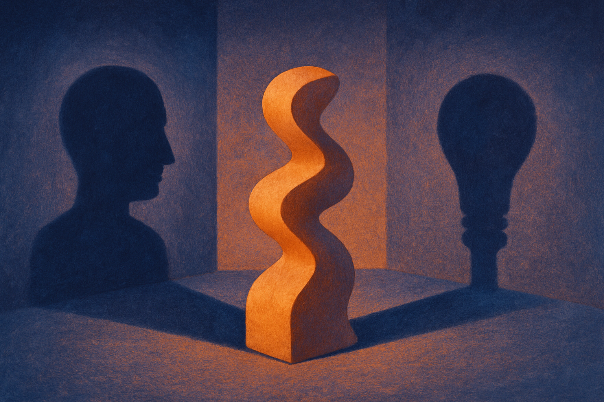
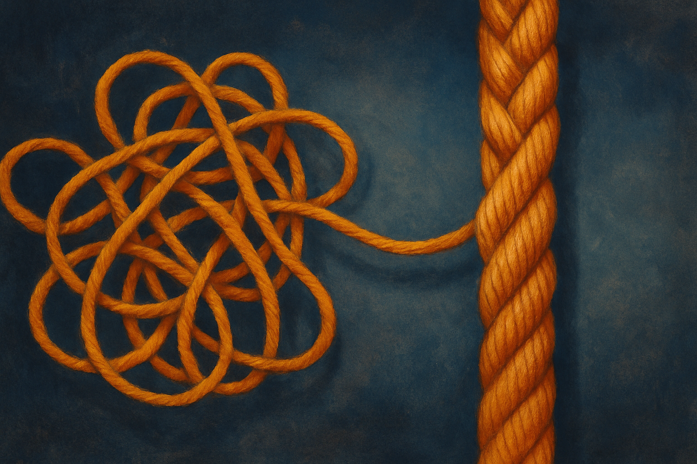

Discrete diffusion is having a moment. Text diffusion models keep showing up as an alternative to autoregressive generation, promising parallel decoding and a different set of tradeoffs. But under the hood there has been a quiet mess: different papers parameterize the same idea in different ways, call them different names, and nobody could say cleanly whether those choices were cosmetic or load-bearing.

A new paper titled "What Does a Discrete Diffusion Model Learn?" (posted across cs.AI, cs.CL, and cs.LG) makes a sharp claim. The three things people say a discrete diffusion model learns, a denoiser, a score ratio, or a bridge plug-in predictor, are not three different targets. They are one object written in three coordinate systems. And reading your network's output in the wrong coordinate system quietly changes the process you're training and sampling from.

That is a bigger deal than it sounds. Let me walk through why.

## One object, three coordinates

The core move is to work at the level of jump rates in a continuous-time Markov chain (CTMC). Instead of thinking in discrete noising steps, you model the process as a continuous flow where tokens jump between states at certain rates. The reverse process, the thing your model has to approximate, is also a set of jump rates.

The paper's argument is that the denoiser view (predict the clean token), the score view (predict a ratio of probabilities), and the cavity or bridge plug-in view (predict a conditional given the noisy state) all describe that same reverse jump rate. They give closed-form conversions among the three. So in principle you can train in one coordinate and read out in another.

The catch is that "in principle" hides a lot. A coordinate transform that is exact in math can behave very differently in a trained network, especially near initialization when the weights are effectively random. That gap between the clean identity and the messy training run is where most of the paper's practical payoff lives.

## The Oracle Distance theorem, and why the bound is actually an equality

Most diffusion training rests on an ELBO, an evidence lower bound. You minimize the negative ELBO because it upper-bounds the thing you actually care about. The word "bound" is doing quiet work there: it means there's slack, and you don't usually know how much.

The paper proves what they call the Oracle Distance theorem: the negative ELBO is not merely a bound, it is exactly equal to the data entropy plus the path KL from the true reverse process (the "oracle") to your learned one. That equality matters. It means the only thing you can improve by training is the KL term, because the data entropy is fixed. Drive the KL to zero and you land at the unique optimizer, which is the conditional expectation of the true reverse jump rate given the current noisy state.

There's a clean consequence. The irreducible cost, the part you can never train away, is the rate at which the forward noising process destroys information about the clean data. They write it as the negative time-derivative of the mutual information between the clean sequence and the noisy sequence. Integrate that and you get the data entropy. So every noising process, masked, uniform, whatever, shares the same best achievable negative ELBO. The floor is the same for everyone.

This reframes a debate that has been mostly empirical. People compare noising schedules by running experiments and looking at loss numbers. If the best achievable loss is identical across schedules, then the loss number alone was never telling you which noising process was "better." What differs is how hard it is to reach that floor, and how the coordinate choice shapes the path there.

## Why uniform diffusion breaks where masked diffusion doesn't

Here is the part builders should actually care about. The paper proves that for masked diffusion, the denoiser and the cavity (bridge plug-in) coincide. Same object, no divergence, pick whichever is convenient. That helps explain why masked diffusion has been comparatively well-behaved and popular in the text-diffusion literature.

For uniform diffusion, they do not coincide. And this is where the coordinate choice stops being cosmetic. The paper shows that a denoiser parameterization makes the uniform ELBO diverge at initialization, while the bridge plug-in stays finite.

Think about what that means in practice. You initialize a uniform diffusion model, you compute your loss, and depending purely on how you chose to read the network's output, the number is either finite or blowing up. Not because the model is worse. Because you're reading it in a coordinate where the object is ill-behaved right at the start of training. That's a footgun that would show up as "uniform diffusion is unstable" in someone's engineering notes, when the real story is a parameterization choice.

## The unification, and the honest limits

The framework recovers several existing methods as special cases: MDM, UDM, SEDD, and GIDD. Instead of treating those as competing recipes, the paper says each one optimizes a specific law, and it can tell you which coordinate each loss actually lives in. That's the kind of consolidation a field needs periodically. It turns a pile of tricks into a map.

Now the honest part. Every identity in the paper is verified numerically, but on an exactly solvable toy model, with no approximation. That is the right way to check math. It is also not the same as showing the effect at scale on real text with a large network, real optimizers, and finite precision. The claim that these are exact conversions is a claim about the ideal object. Whether the divergence-at-init result bites you at scale, or gets masked by warmup schedules and clipping, is an empirical question the paper doesn't fully answer. I'd want to see the calibration-at-initialization result reproduced in a real training loop before treating it as gospel.

There's also a reproducibility wrinkle worth flagging: I'm working from three arXiv postings of what appears to be the same paper across cs.AI, cs.CL, and cs.LG, with identical abstracts. Nothing suspicious there, cross-listing is normal, but it means there's a single source of truth here, not three independent confirmations.

If you're building or debugging a discrete diffusion model, the practical move is to stop treating denoiser, score, and cavity as interchangeable implementation details and start treating them as coordinate choices with numerical consequences. Before you conclude that uniform diffusion is unstable or that a schedule is bad, check which parameterization your loss lives in and compute it in the bridge plug-in coordinate as a sanity check, especially at initialization. Use the Oracle Distance equality to calibrate: if your negative ELBO at init doesn't match the predicted finite value, your bug is in the coordinate, not the model. The catch most readers will miss is that "same best achievable loss across noising processes" does not mean the processes are equally trainable. The floor is shared. The road to it is not. That's where all the real engineering still lives.
