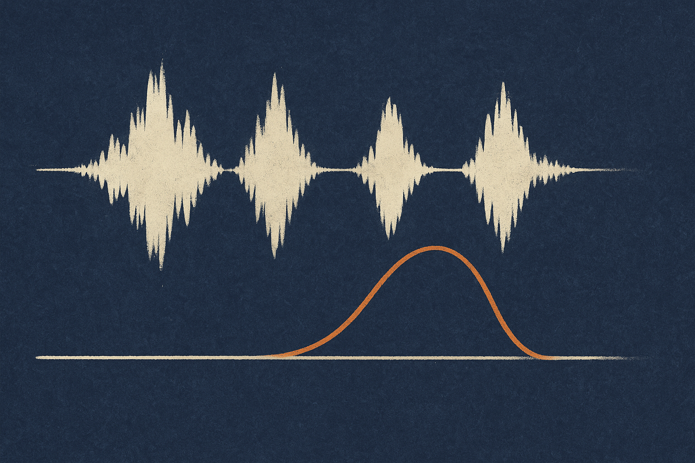

## Plausible words, wrong clock

Most ASR demos optimize for the visible thing: did the model get the words right?

The REDDIT paper points at a less glamorous failure mode that matters a lot in production. Modern autoregressive speech models can generate timestamps as tokens, so you get words and timing from the same decoder. Nice. No separate frame-level aligner. No extra timestamp cleanup step.

But across long non-speech spans, the decoded time axis can drift. The transcript can still read fine while the timestamps slide away from the actual audio. That is a nasty class of bug because humans may not notice it in a quick transcript review, but downstream systems absolutely will.

Think podcast chapters, call-center QA, legal review, meeting highlights, video subtitle placement, audio search, compliance workflows. If “this sentence happened at 18:42” is wrong by seconds, the transcript is no longer an index. It is a guess with paragraph breaks.

The REDDIT authors evaluated 15 timestamp-producing ASR and audio-language systems on their own gap and long-gap benchmarks. The core finding is simple: silence is not neutral. Long non-speech regions can push timestamp-generating decoders off their clock, even when language output remains plausible.

## The fix is interesting because it avoids the usual fine-tuning trap

The tempting move is straightforward: fine-tune the model on corrected timestamps.

The paper says that works for alignment, but can badly damage other ASR behavior. This is the part builders should care about. A narrow correction can create broad forgetting. In their Whisper-tiny experiments, ordinary supervised fine-tuning of the decoder pushed CV-en MER to 524.2%, while their REDDIT method preserved it at 41.3%.

That is not a small regression. That is “you fixed the timestamps and broke the transcriber.”

Their method, REplay-based Distribution eDITing, is a two-stage post-training setup. First, it edits timestamp targets under the model’s own replayed decoder context, while matching the frozen base model distribution on non-timestamp tokens. Then it runs a short edited-prefix refinement stage.

The supervision trick is also practical. They do not require human transcripts or human timestamp annotations. They combine VAD-trimmed speech spans with inserted non-speech gaps and known concatenation offsets. In other words, they manufacture the failure case with known timing, then train the model to stop lying about the clock.

On Whisper-tiny, the paper reports using 34.9 hours of targeted correction audio and updating only 1.6% of parameters. Long-gap mIoU rose from 38.7% to 95.0%. Mixed-gap out-of-domain AAS fell from 2752 ms to 223 ms.

That is the kind of result I pay attention to: narrow intervention, small parameter update, measurable behavior change, and an explicit check that the rest of the model did not get trashed.

## This is bigger than speech

The broader lesson is not “use this one method.” It is that generated structure can fail independently from generated content.

Timestamps are structure. So are citations, tool-call arguments, bounding boxes, JSON schemas, spreadsheet coordinates, medical codes, calendar times, and UI actions. The natural language around them can look reasonable while the structured part is quietly wrong.

That mismatch is where many AI products get brittle. Users forgive a typo. They do not forgive clicking the wrong clip, citing the wrong page, scheduling the wrong time, or filing a support ticket under the wrong customer.

REDDIT is also a reminder that evals need to isolate the thing you claim to depend on. Word error rate alone would not catch timestamp drift. A pretty transcript would hide the bug. The paper had to build gap-specific benchmarks because the normal scorecard was not asking the right question.

For builders, I would treat this as a pattern. If your product depends on model-generated metadata, create synthetic stress cases where the answer is known exactly. Add gaps, offsets, distractors, missing fields, repeated names, long pauses, stale context. Then try targeted editing or adapters before broad fine-tuning. The catch most teams miss: fixing the broken field is not enough. You need to prove the untouched behavior stayed untouched.
