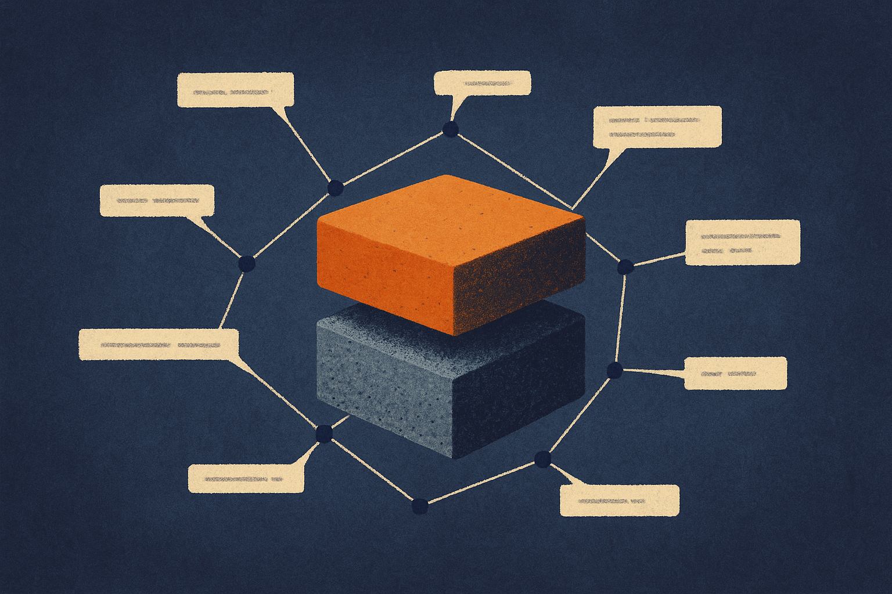

Unified 3D models have an awkward job. They need to make objects, understand objects, and talk about objects. A chair is not just “a chair.” It has a global silhouette, legs, back support, material cues, joinery, surface detail, and all the small geometry that makes it usable instead of blob-shaped.

The ELSA3D paper argues that most current unified 3D systems handle this badly. They flatten text tokens and 3D tokens into one long sequence, then ask self-attention to sort it out. That is the usual transformer bargain: make everything a token, mix aggressively, hope the model learns the structure.

For language and 3D geometry, that bargain looks expensive.

## Flat token soup is a bad fit for 3D

The core complaint in ELSA3D is not that self-attention fails. It is that flat self-attention treats different levels of 3D meaning too similarly. Coarse structure and fine geometry get collapsed into one shared representation. “A table with thin curved legs” needs both high-level semantic grounding and precise local shape evidence. Those are not the same operation.

ELSA3D’s answer is elastic semantic anchoring. The model represents geometry with a scale-aware octree tokenizer, which is a natural fit for 3D because space can be partitioned coarsely or finely depending on what matters. Then it adds Anchor Tokens, sparse cross-modal units that connect language to geometry at matched abstraction levels.

That sounds abstract, but the idea is simple: not every word should talk to every piece of geometry all the time. Some language belongs at the object level. Some belongs near a region. Some belongs down in the details.

A lightweight router decides which text tokens become anchors and which 3D scale they should interact with. The anchor selects semantic cues, pulls evidence from the relevant geometric scale, fuses the result, and writes it back into the unified representation.

This is the interesting part. The model is not just saving compute by pruning. It is making a claim about reasoning structure: cross-modal attention should be selective, scale-aware, and task-dependent.

## The benchmark claim is strong, but the pattern matters more

ELSA3D reports state-of-the-art results across image-to-3D generation, text-to-3D generation, and 3D captioning. It also claims to outperform the strongest unified baseline while roughly halving FLOPs and inference latency compared with a non-elastic version of the same model.

Those are meaningful claims, with the usual research-paper caveat. We need to see behavior outside benchmark settings, across messy prompts, odd object categories, production constraints, and real creator workflows. “State of the art” in 3D generation can still mean outputs that look good from one angle and fall apart under inspection.

Still, the efficiency result is the signal I care about. If a routing mechanism can improve accuracy while cutting compute, that is not just a nicer architecture. It is a practical direction for multimodal systems.

The broader lesson is that multimodal AI should not always mean bigger shared context windows and more dense attention. Sometimes the right move is to preserve modality-specific structure, then create sparse bridges where the task actually needs them.

For 3D, scale is obvious. For video, it might be scene, shot, frame, region, motion track. For documents, it might be section, table, cell, footnote. For code, repo, file, function, line. The useful abstraction is not “everything attends to everything.” It is “the model knows where to look, at what resolution, and why.”

## 3D models are moving toward operators, not toys

Text-to-3D still feels like a demo category to a lot of people. Type a prompt, get a mesh, rotate it, notice the weird back side. But papers like ELSA3D point toward a more serious layer: models that can generate and inspect 3D assets using language inside one backbone.

That matters for game assets, robotics simulation, AR, CAD-adjacent workflows, ecommerce visualization, and synthetic data. In those settings, captioning and generation are not separate features. You want a system that can create an object, describe what it made, revise specific parts, and understand whether the result matches the instruction.

ELSA3D is not proof that we have that system yet. It is evidence that architecture still matters. The next gains may not come only from more data and larger backbones. They may come from giving models better internal handles for the structure of the world.

Practitioner's take: if you are building with 3D AI today, watch for systems that expose scale-aware controls, not just prettier samples. Test prompts that mix global form with local constraints, like “wide lounge chair with braided arms and short cylindrical feet,” then inspect whether the model preserves both levels. The catch most readers miss: lower latency is only useful if the model also gives you editable structure after generation, because production work is mostly revision, not first drafts.
