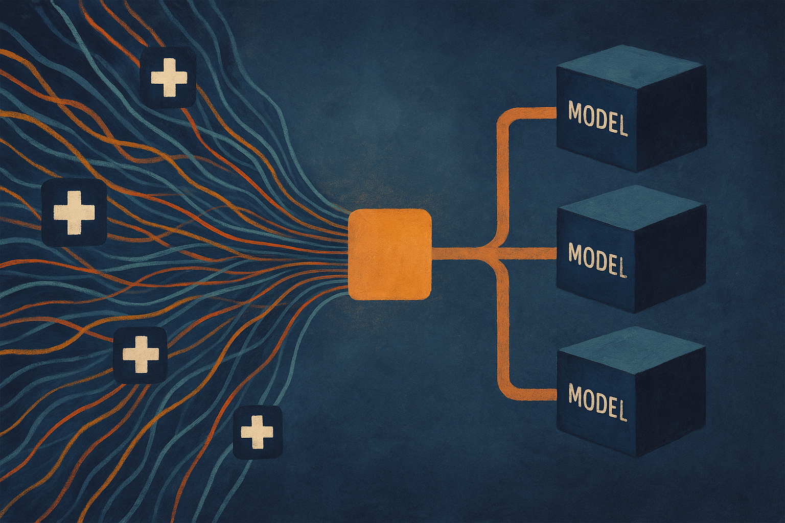

The interesting part of the Large Cancer Assistant paper is what it does *not* try to do.

It does not claim a new foundation model for oncology. It does not pitch one model that reads scans, labs, pathology, notes, and genomics, then hands down a treatment answer. Instead, the authors propose an orchestration layer around oncology models, with the model itself treated as a replaceable black box.

That sounds less glamorous. It is also closer to how clinical AI probably has to work.

Hospitals are not clean software environments. Data arrives late, missing, duplicated, transformed, or trapped in vendor systems. Cancer care is especially messy because the relevant signal spans imaging, pathology, staging, molecular testing, history, guidelines, and treatment context. A monolithic multimodal model may look elegant in a paper. In a hospital, it becomes a brittle integration project.

## The useful idea is the boundary

The LCA authors frame their architecture around “Algorithmic Impermeability,” meaning the routing and orchestration logic should stay independent from the underlying AI model. In plain terms: swap the model, keep the clinical workflow intact.

That is the right instinct.

They formalize LCA as a 7-tuple architecture and introduce an “Entry Theory” that uses Geometric Deep Learning to standardize multimodal patient data along structural and medical axes. The system then routes the case through a Cancer Switching Module and emits a Standardized Intermediate Payload, or SIP, before model execution.

The SIP is the part builders should pay attention to. It creates a hard boundary between messy hospital inputs and downstream model inference. The paper positions EMR interoperability as future work, but architecturally, the SIP is already the contract. It says: upstream systems can be chaotic, downstream models can change, but the payload in the middle has to be stable.

That is not unique to oncology. It is the same pattern showing up in serious agent systems, internal enterprise AI tools, and data-heavy workflows: separate ingestion, routing, inference, and action. When those are fused together, demos are easy and maintenance is awful.

## The proof is narrow, but the target is real

The reported proof of concept tested four technical scenarios. The authors say nominal execution had negligible orchestration overhead. They also report that routing stayed invariant during AI model swaps, which supports their impermeability claim. Under injected data anomalies, the framework generated targeted Supplementary Data Requests with 100% recall. Multi-protocol execution was also verified.

Those are useful engineering checks. They are not clinical validation.

A 100% recall rate on injected anomalies does not tell us whether the system catches the weird missing datum that matters in a real tumor board. “Negligible overhead” depends on the surrounding infrastructure, not just the orchestration code. And invariant routing during model swaps is necessary, but not sufficient. The harder question is whether the replacement model has the same assumptions about inputs, uncertainty, contraindications, and edge cases.

Still, I like the direction because it moves the conversation away from “which cancer model wins?” and toward “what system can safely host many imperfect models?”

That is a more practical frame. Oncology AI will not be one model. It will be a rotating set of models, rules, guideline engines, retrieval systems, trial matchers, and human review checkpoints. The orchestration layer is where safety, auditability, and operational sanity live.

## Clinical AI needs boring software discipline

The paper’s strongest contribution is architectural, not empirical. It argues for decoupling multimodal ingestion from feature inference. That is exactly the kind of boring software discipline clinical AI needs before anyone should expect scale.

The risk is vocabulary inflation. “Large Cancer Assistant,” “Entry Theory,” and “Algorithmic Impermeability” sound heavier than the core pattern requires. Strip the language down and the message is still strong: normalize inputs, route explicitly, isolate model execution, produce a stable intermediate payload, fail by asking for missing data instead of guessing.

That is good systems design.

The catch is governance. Once you make models swappable, someone has to own versioning, validation, regression tests, monitoring, and clinician-facing change management. A model-agnostic framework can make replacement easier. It can also make silent drift easier if the organization treats the model slot like a plugin marketplace.

Practitioner's Take: if you are building clinical or high-stakes AI, copy the boundary pattern before copying the medical specifics. Define the intermediate payload first. Make every model consume that contract. Add explicit missing-data requests instead of letting the model improvise. Then test model swaps, not just model accuracy. The catch most teams miss: orchestration is not neutral plumbing. It encodes clinical assumptions, and those assumptions need review as much as the model does.
