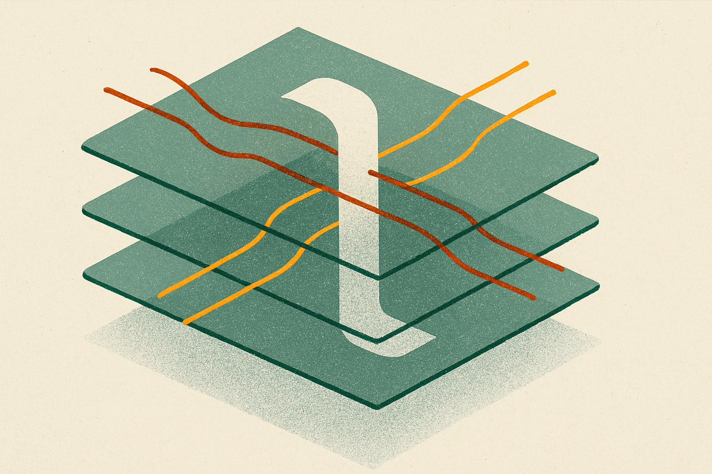

Long context is not free just because the model accepts 64K or 1M tokens. During inference, every generated token reads from the key-value cache built during prefill. That cache grows with context length, layer count, head count, and hidden size. At some point, the bottleneck is not the transformer math. It is memory capacity and memory bandwidth.

Two new arXiv papers, DepthWeave-KV and FreqDepthKV, attack the same pressure point: KV cache compression for long-context LLMs. The interesting part is not that they compress. We have seen a lot of that. The interesting part is that both reject uniform compression.

Their shared bet: attention does not need equal fidelity everywhere.

## The cache budget should follow the evidence

DepthWeave-KV factorizes key and value states across neighboring transformer layers using shared low-rank channel bases, then keeps token-specific residuals where attention is sensitive. In plain English: adjacent layers often carry related state, so do not store every layer’s cache as if it were fully independent. But do not flatten everything either. Some tokens are instructions. Some are retrieval anchors. Some carry the string match that matters for a needle task. Those tokens get more reconstruction rank through a token-conditional depth router.

FreqDepthKV makes a similar move through a different lens. It splits adjacent-layer KV states into shared low-frequency depth components and sparse high-frequency residuals. Then an online probe assigns attention heads to shared-depth, residual-depth, or exact-cache modes based on their effect on reconstruction-sensitive attention logits.

That is the important systems pattern. These methods are not asking the base model to relearn long context. They are adding an inference-time policy around what to preserve, what to share, and what to approximate.

## The numbers are promising, but read them as systems claims

DepthWeave-KV reports near-full-cache quality across LongBench, Needle-in-a-Haystack, L-Eval, long-form QA, and summarization, with up to 8.3x KV memory reduction and 72.8 tokens per second at 64K context. It also claims a fused CUDA implementation that combines basis lookup, residual dequantization, and attention projection to cut decode-time memory traffic.

FreqDepthKV reports close-to-full-KV results with a 32K-token prefill window: 58.3 Exact Match, 63.0 F1, 32.5 ROUGE-L, and 48.1 pass@1 across long-context QA, needle retrieval, summarization, and code generation. It also reports 70.4 tokens per second, 2.06 seconds time to first token, 6.2 GB peak KV memory, and a 3.9x effective compression ratio.

Those are useful receipts. They are also not the same experimental setup, based on the information here. DepthWeave’s headline includes 64K context and a larger compression ratio. FreqDepth gives more metric detail at 32K and a concrete peak memory figure. I would not rank them from the abstracts alone. I would treat them as converging evidence that adaptive cache compression is becoming more practical than blunt cache trimming.

The catch is retrieval. Long-context failures are often small and ugly. The model answers fluently while missing the one token that mattered. Both papers explicitly target this by preserving retrieval-critical or reconstruction-sensitive state. That is the right concern. It is also exactly where benchmark averages can hide pain.

## This is an inference product feature, not just a paper trick

If these approaches hold up, they belong in serving stacks as policy knobs. A hosted model could expose “full cache,” “adaptive compressed cache,” and “cheap long-context cache” modes. An agent runtime could pick a mode based on task type: exact retrieval, summarization, coding, chat, or bulk document scanning.

The online nature matters. Both methods adapt during inference without retraining the base model. That makes them easier to test against existing model deployments. The CUDA detail in DepthWeave-KV also matters because compression that saves memory but adds scattered decode overhead can lose in production. Cache tricks live or die in kernels, not just equations.

Practitioner’s take: if you run long-context inference, do not only ask which model has the biggest context window. Ask what the KV cache costs at your real prompt lengths, batch sizes, and latency targets. Try adaptive cache compression first on workloads with forgiving outputs, like summarization and document triage, then stress it on exact retrieval and code. The missed catch is evaluation: you need adversarial needles and task-specific regression sets, not just average benchmark scores.
