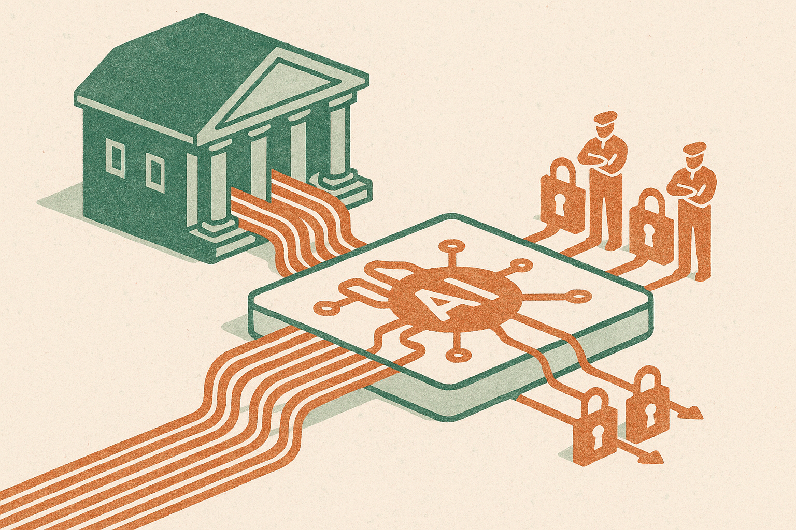

OpenAI says MUFG is using ChatGPT Enterprise to build an “AI-native” organization, improve internal workflows, and create AI-powered financial services at scale.

That sentence has all the usual enterprise AI ingredients. Big incumbent. Big model vendor. Internal productivity. Future customer-facing products. The phrase “AI-native” does a lot of work.

The useful read is narrower: MUFG is treating ChatGPT Enterprise as organizational infrastructure, not a side experiment. That is the shift worth watching.

## The chatbot is not the product

Most companies started with AI as an individual productivity tool. Draft an email. Summarize a meeting. Translate a memo. Generate a first pass at a spreadsheet formula. Useful, but easy to isolate.

A bank cannot stop there if it wants real gains. The hard part is not letting employees ask questions of a model. The hard part is routing the model into actual work without creating audit, privacy, security, compliance, and customer trust problems.

That means the interesting layer is not the chat window. It is the operating model around it: what data can be used, what outputs require review, what gets logged, who owns failure, where the model can act, and where it can only suggest.

OpenAI’s framing puts MUFG on the path from internal workflow help to AI-powered financial services. That path is not automatic. It is a controlled crawl from low-risk staff assistance into higher-risk customer workflows.

## “AI-native” needs receipts

I like the ambition, but “AI-native” is a squishy phrase. OpenAI did not provide adoption numbers, workflow-level impact, cost savings, error rates, customer product details, or governance specifics in the short announcement. So the claim is directional, not proven.

That matters because enterprise AI announcements often blur three different things.

One: access. Employees can use a secure AI tool.

Two: integration. AI is embedded into real systems, with permissions, context, and handoffs.

Three: redesign. The company changes how work is done because the model is now part of the process.

Only the third one deserves the “native” label.

For a financial institution, the gap between one and three is especially wide. Finance has sensitive data, strict controls, regulated communications, and high downside from hallucinated answers. A model that saves time in internal research is one thing. A model that helps shape a customer’s financial decision is another.

So the benchmark should not be, “Did MUFG deploy ChatGPT Enterprise?” It should be, “Which workflows changed, how were they measured, and what new controls made those changes safe enough to keep?”

## The pattern for incumbents

This is the enterprise AI pattern I expect to see more often: start with a vendor-grade AI environment, use it to normalize daily employee behavior, then identify workflows where the company has enough context and control to move from assistant to system component.

The model vendor gets distribution. The incumbent gets a safer on-ramp. Employees get familiar with AI inside approved boundaries. Product teams get a testbed for future customer services.

But the catch is cultural as much as technical. If AI stays trapped as a smarter search box, the company gets scattered time savings. If every team invents its own process, the company gets risk sprawl. The win comes from finding repeatable patterns, codifying them, and making them boring enough for a bank.

That is the real promise in MUFG’s move. Not magic. Plumbing.

For builders, the takeaway is simple: do not pitch “AI-native” as a vibe. Pick one workflow with clear inputs, review points, and measurable output quality. Put the model where it removes handoffs or reduces rework, not where it creates a new approval mess. The catch most teams miss is distribution inside the company. A working prototype is easy. Getting thousands of people to use it safely, in the right places, with the right data, is the job.
