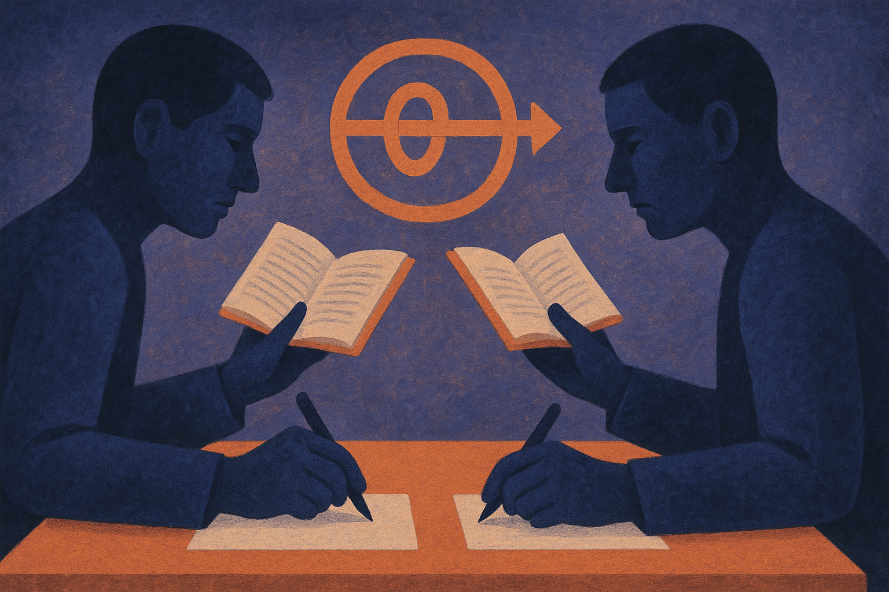
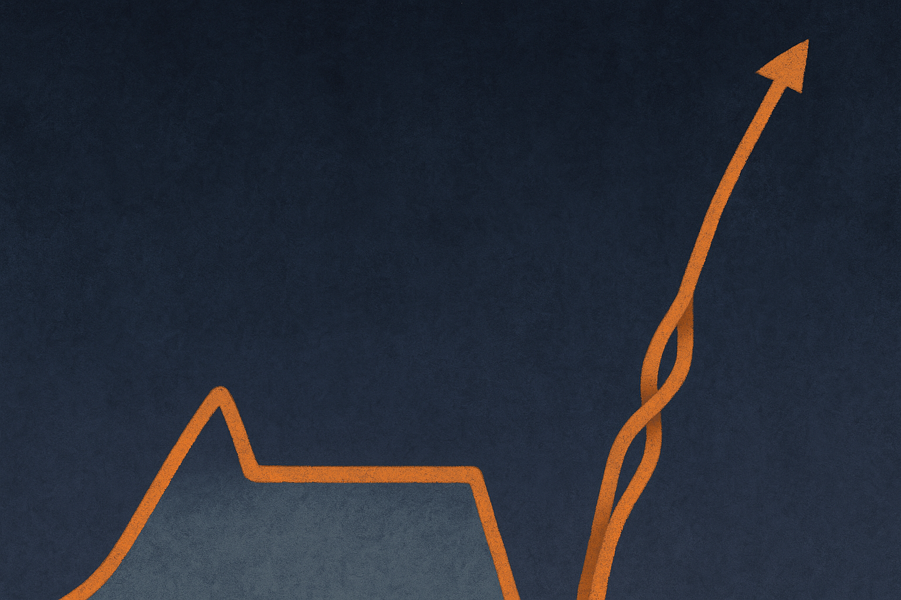

The dirty secret of reasoning models is that we never actually graded the reasoning. GRPO, the RL method behind most of today's thinking models, checks one thing: did the final answer match the verified label? The chain of thought in between gets no signal at all. It could be brilliant, it could be a lucky guess wrapped in nonsense, and the reward is identical either way.

On easy problems that mostly works out. On hard ones it backfires. When the answer is rarely correct, the gradient pushes toward whatever surface features correlate with occasional wins, and the most reliable one is length. The model learns to write more, not to think better. You have probably seen the symptom: a model that pads its scratchpad with restatements and dead ends because somewhere in training, longer traces paid off.

A new paper called Agon (posted across cs.AI, cs.CL, and cs.LG, same authors, same method) goes after this directly. Instead of inventing a reward model to score reasoning or hand-labeling good traces, it makes two models grade each other by competition.

## How the competition works

Two models, comparably strong and behaviorally different, both attempt the same problem. They alternate roles. In one pass, model A drafts a solution and model B reads that draft while producing its own answer. Each model is rewarded for out-solving the other. That is the whole trick.

The consequence is subtle and worth sitting with. To beat a rival that has already seen your work, a shallow-but-correct answer is not enough. If your draft leaks a wrong turn, the rival exploits it. If your draft contains a genuinely useful line of reasoning, the rival benefits from it and you lose the round anyway unless your own thinking holds up. So the pressure lands on the quality of the reasoning itself, not just the final token. The trace gets judged implicitly, with no process labels and no separately trained reward model to game.

This is the part I find genuinely clever. Reward models are the usual answer to "grade the process," and they are expensive to build and easy to hack. Agon sidesteps that by turning the grading into a game where the only way to score is to be harder to beat. No label for "good thinking" exists, so the method manufactures one from rivalry.

## Why a moving rival matters

Single-model RL has a ceiling problem. You are always training against a fixed environment: the same verifier, the same reward function. The model climbs until it plateaus.

Agon optimizes both models, so each one faces a rival that keeps getting stronger. It is the self-play dynamic that made AlphaGo work, ported into language reasoning. Your opponent today is not the opponent you had a thousand steps ago. The bar rises as you rise. That co-adaptation is something a static reward simply cannot provide, and it is probably the real source of the gains here rather than the grading trick alone.

The two requirements are modest and specific: the models need to be comparably strong and behaviorally different. Comparable strength keeps the competition meaningful (a mismatch collapses into one model just winning). Behavioral difference keeps it productive (two identical models have nothing to exploit in each other). That second condition is easy to overlook and, I suspect, load-bearing. If your pair converges to the same policy, the pressure evaporates.

## The numbers, and how much to trust them

On the hard split of DeepMath with Qwen3, Agon doubles GRPO's pass@1. The authors also compare against an untrained Mixture-of-Agents pass over the same base and report roughly eight times the gain. They claim the ordering replicates on competitive-programming code and across model families, naming Qwen3.5 and Gemma 4.

Doubling pass@1 on a hard split is a real result if it holds, and the cross-family replication is the detail that makes me take it seriously. A method that only works on one model is a quirk. A method that survives a family swap is a mechanism.

But hold the champagne. This is an arXiv preprint mirrored across three categories, not peer-reviewed, and every number I have comes from the authors themselves. "Doubles pass@1" is dramatic, and doubling from a low base on a deliberately hard split can be less impressive in absolute terms than it sounds. The Mixture-of-Agents baseline is described as untrained, which is a fair comparison for isolating the training contribution but a weak one if you want to know whether Agon beats a well-tuned ensemble. And competitive coding and contest math are exactly the domains where verifiable rewards are cleanest. The open question is whether implicit rival grading transfers to messier tasks where "who won" is not a clean binary.

## The inference story is the practical hook

Here is the part builders should actually care about. Agon deploys the way it trains. At inference you run a two-stage cascade: one model drafts, the other answers after reading the draft. You are not training a competition and then throwing half of it away. The pair you trained is the pair you ship.

That is a cleaner deal than most self-play research offers, where the training dynamic produces a single model and the opponent is scaffolding. Here the scaffolding is the product. The cost, obviously, is that you now run two forward passes in sequence for one answer. Whether that latency and compute trade is worth a pass@1 bump depends entirely on your task. For a coding agent chasing correctness on hard tickets, plausibly yes. For a chat product where latency is the whole game, probably not.

The authors close by saying the models currently talk in text and the next step is latent-space reasoning between them. That would cut the token overhead of the draft-then-read handoff, and it is the direction I would watch. It is also where the interpretability tradeoff bites: text handoffs you can read, latent handoffs you cannot.

If you want to try the idea without a training run, the deployable half is free to prototype: take two behaviorally different models you already have, comparable in strength, and wire a draft-then-answer cascade where the second model sees the first's full reasoning. You will not get the trained gains, but you will feel whether the "read the rival's work and do better" pattern helps on your actual problems. The catch most readers will miss is the "behaviorally different" requirement. If you cascade two checkpoints of the same model, or the same model twice, you are giving the second pass nothing new to react to, and you will conclude the whole approach does nothing. Pick two models that fail differently. That difference is the fuel.
