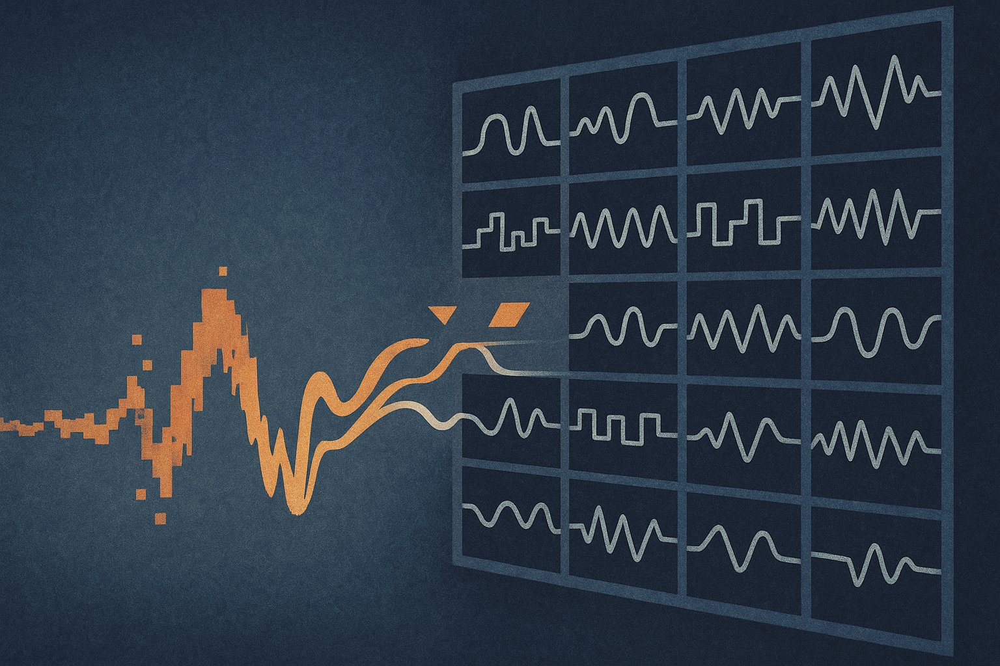

Most missing-data systems still assume the answer is nearby.

If a sensor drops out, a model looks left, looks right, and tries to infer the gap from local temporal context. That works when patterns are stable and correlations are strong. It gets shakier in the real world, where equipment changes modes, demand spikes, patients have rare events, and the most useful clue may have happened weeks or months ago.

The ALER-TI paper makes a simple bet: imputation should retrieve from memory.

Not language-model memory. Time series memory. Historical traces that may contain the same kind of pattern, even if the current sequence is damaged.

## The useful move is alignment, not just retrieval

Retrieval for time series sounds obvious until you hit the mismatch problem. The query is corrupted. The archive candidates are complete, or at least more complete. If you embed both directly, the model may compare apples to broken apples.

ALER-TI’s key mechanism is Latent Embedding Alignment, or LEA. The authors describe it as post-hoc masking in latent space. In plain terms, the system takes historical candidate embeddings and masks them to match the missingness pattern of the current corrupted query. That makes comparison fairer.

This matters because the system can precompute and cache embeddings for historical data. It does not need to re-encode the whole archive every time a new gap appears. The expensive memory can sit there, ready to search. Then a lightweight adaptation module lets ALER-TI plug into different imputation backbones.

That is the part I like. The paper is not arguing for one giant bespoke architecture. It is proposing a retrieval layer that can improve existing models when local context is not enough.

## RAG, but for patterns instead of facts

The analogy to RAG is imperfect, but useful.

In text systems, retrieval brings in external facts the model may not store reliably. In ALER-TI, retrieval brings in historical dynamics the current sequence cannot reveal because the evidence is missing or weak.

That distinction is important. This is not about making the model “smarter” in the abstract. It is about giving it better reference cases.

The authors report experiments on six real-world datasets across different missing rates, where ALER-TI consistently improves strong baseline imputation models and holds up better across varied settings. The abstract does not give the exact datasets or effect sizes, so I would not oversell the magnitude from the summary alone. But the direction is credible. If rare or non-stationary patterns are the failure mode, local interpolation is the wrong ceiling.

The more interesting claim is operational. Historical retrieval can turn imputation from “guess from nearby points” into “compare against prior situations that looked like this under the same visibility constraints.”

That is a better mental model for messy production data.

## The catch is the archive

Retrieval systems inherit the shape of their memory.

If your historical data is rich, clean enough, and representative, ALER-TI’s approach should help. If the archive is stale, biased toward normal operations, or missing the exact failure modes you care about, retrieval may confidently pull the wrong neighbors. In a factory, that could mean smoothing away early signs of a new fault. In healthcare, it could mean treating a rare patient trajectory as if it were a familiar one.

There is also a leakage question builders need to handle carefully. Time series evaluation can accidentally make the past too convenient. A convincing deployment setup should separate training history, retrieval history, and future test windows in a way that matches the real workflow.

Still, this is the right kind of AI paper for applied teams: narrow problem, concrete mechanism, compatible with existing systems, measured against baselines.

For a builder, I would try this first where missingness is common and patterns repeat imperfectly: energy usage, machine telemetry, logistics, finance operations, clinical monitoring. Start by embedding historical windows, cache them, and test whether aligned retrieval improves your current imputer under realistic missing patterns, not just random masking. The catch most teams will miss: track retrieved neighbors as first-class artifacts. If you cannot inspect what the model borrowed from history, you will not know when memory is helping versus quietly laundering a bad guess.
