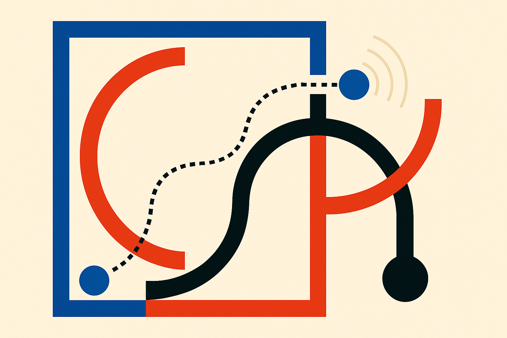

LLM confidence is usually treated like a receipt printed after checkout. Ask the model. Get the answer. Then ask, “How sure are you?”

That is convenient. It is also late.

The arXiv paper “Future Confidence Distillation in Large Language Models,” listed under both cs.AI and cs.CL, frames confidence as something that changes over the course of answering. The authors compare pre-solution Feeling-of-Knowing estimates with post-solution Judgement-of-Learning estimates across frontier and open-source models. Their main finding is practical: post-solution confidence is consistently better calibrated and more discriminative than pre-solution confidence.

No surprise there. A model has more evidence after it has worked through the problem. The useful part is what comes next.

## The model says less than its hidden states know

The paper reports that linear probes trained on hidden representations recover richer confidence-related information than models explicitly verbalize. In plain English: when the model says “I’m confident,” that statement may be a weak summary of a stronger internal signal.

That matters because most product systems use the verbal signal, if they use confidence at all. A support bot says it is unsure. A coding agent reports a confidence score. A RAG pipeline asks the model to self-grade its answer. These are cheap and easy to add, but they are also downstream of generation and wrapped in all the weird incentives of language: politeness, verbosity, hedging, prompt sensitivity, and style.

Hidden-state probes are a different bet. They treat confidence less like a sentence the model chooses and more like a pattern you can measure. The authors are not claiming magic truth detection. They are saying the representation contains useful reliability information that the model does not fully expose in words.

That distinction is important. “The model knows when it is wrong” is too strong. “The model’s internal activations can predict correctness better than its self-report in some settings” is closer to the claim, and much more useful.

## Teaching early signals with late judgments

The paper’s proposed method is future confidence distillation. The setup is clever: train predictors that operate on pre-solution hidden representations, but use teacher confidence estimates produced by post-solution correctness probes.

So during training, the system gets the benefit of “after the answer” judgment. During inference, it only needs the early representation. The authors report that these distilled predictors recover much of the calibration improvement from post-solution confidence, remain sample efficient, and transfer across datasets within the same domain.

That last phrase should slow us down. “Within the same domain” is not the same as “works anywhere.” A confidence probe trained on grade-school math may not tell you much about legal drafting, medical triage, or repo-scale code edits. Domain shift is where confidence systems tend to embarrass themselves.

Still, this is the right shape of idea for real systems. The expensive part of confidence-aware AI is often waiting too long. If you only know the model is shaky after it has produced a full answer, you have already spent tokens, time, and maybe user trust. Earlier confidence estimates can route hard questions to retrieval, stronger models, tools, or humans before the system commits.

## Confidence as a routing primitive

The near-term product use is not “make the model honest.” It is better routing.

A system that can estimate reliability before generation finishes can decide whether to fetch documents, run code, ask a clarifying question, allocate more compute, or refuse a risky task. That is especially relevant for agent loops, where one bad confident step can poison the next five.

The catch is access. Hidden representation probes are easiest when you control the model or have an API that exposes enough internals. Most closed model APIs do not. For many builders, the immediate version will still be approximations: smaller verifier models, logprob features where available, self-consistency checks, retrieval agreement, or post-answer grading. Useful, but not the same.

I would not rebuild a production stack around this paper tomorrow. I would run a small calibration study. Pick one narrow workflow, collect model answers with correctness labels, compare three signals: the model’s verbal confidence, a post-answer judge, and any early or cheap proxy you can access. If early confidence can reliably separate “answer now” from “spend more,” you have a routing feature, not a research trophy. The catch most teams miss: confidence is only valuable if it changes the system’s behavior.
