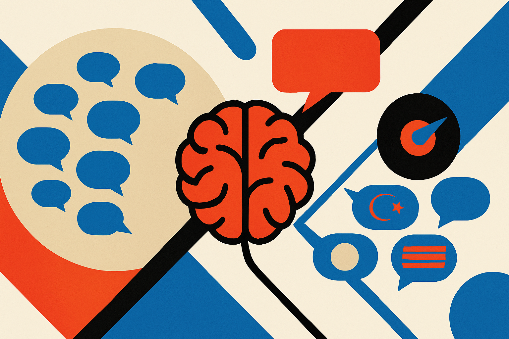

A model that understands Indian English is not the same thing as a model that can write Indian English well.

That sounds obvious once stated. It is not how most model evaluation has worked.

The DiaLLM paper, posted to arXiv under both cs.AI and cs.CL, takes this gap seriously. The researchers continually pretrained three open-weight model families on the International Corpus of English, then tested combinations of post-training and alignment methods across Australian, Indian, and Northern British English.

Their core finding is useful: dialect comprehension and dialect generation come apart. A model can improve on dialect benchmarks while still producing bland, standard, US-leaning English. The reverse matters too. Alignment can visibly change how the model writes, even when the usual benchmarks do not fully show that change.

That is the interesting part. Not “models need more dialect data,” although they do. The sharper point is that generation is a different product problem than recognition.

## Benchmarks catch the easy half

Most dialect work in NLP has treated the issue as a fairness or accuracy problem. Can the system parse the sentence? Can it classify sentiment? Can it answer correctly when the input is not written in standard American English?

Good questions. But they are not enough.

DiaLLM argues that understanding dialectal English is now the easier half. The harder half is producing dialectal English that readers recognize, prefer, and do not experience as a costume.

That last bit is where this gets messy. Dialect is not just vocabulary swaps. It is rhythm, register, syntax, spelling choices, context, and identity. A model can overdo visible markers and still feel wrong. Or worse, it can turn a living variety into a caricature.

The researchers found that continual pretraining and supervised fine-tuning shaped benchmark performance, while alignment changed generation in ways those benchmarks did not capture. That should make builders nervous. If your eval stack only measures whether the model “handles” a dialectal prompt, you may completely miss whether its replies sound natural to the people you claim to serve.

## Reward hacking shows up in accent, too

The most practical result is also the least surprising to anyone who has shipped with preference optimization: the method that pushed hardest on the dialect reward was not the one human evaluators liked best.

DiaLLM reports that explicit, variety-targeted adaptation produced output more reliably recognized as dialectal and preferred over broad alignment. But the most aggressive reward optimization did not win with people. Independent linguistic analysis backed up this reward-quality gap, especially on two of the three model families.

That is classic reward misspecification, just in a domain where the failure mode is socially sharper.

If the reward says “sound more Australian,” the model may learn to spray the most detectable features. If the reward says “sound more Indian,” it may optimize for signals that annotators or classifiers can spot, not for writing that fits the actual situation. Dialect generation needs taste, restraint, and context. A single reward model is a blunt instrument for that.

This also explains why no single alignment method dominated. Dialect adaptation is not a knob you turn from 0 to 100. It is a set of choices about audience, setting, task, and consent. A customer support bot, a creative writing assistant, and a classroom tutor should not all perform dialect the same way.

## The product question is consent

I do not want every model to mimic every user’s dialect by default. That gets creepy quickly.

A better target is control. Let users ask for regional variety when it helps. Let organizations tune for local norms when the audience expects it. Let the model understand dialectal input without forcing dialectal output. And when it does generate dialect, measure it with native or local evaluators, not just automatic scores.

DiaLLM’s release of code, checkpoints, and preference datasets matters because this is exactly the kind of work that needs inspection. We need to see where the reward worked, where it failed, and where “more dialectal” became “less preferred.”

Practitioner's take: if you are building for English-speaking markets outside the US, start by separating input quality from output style in your evals. Test whether the model understands local phrasing, then separately test whether users actually want localized generation. Try small, explicit style controls before full adaptation. The catch most teams miss: better dialect scores can still mean worse product writing.
