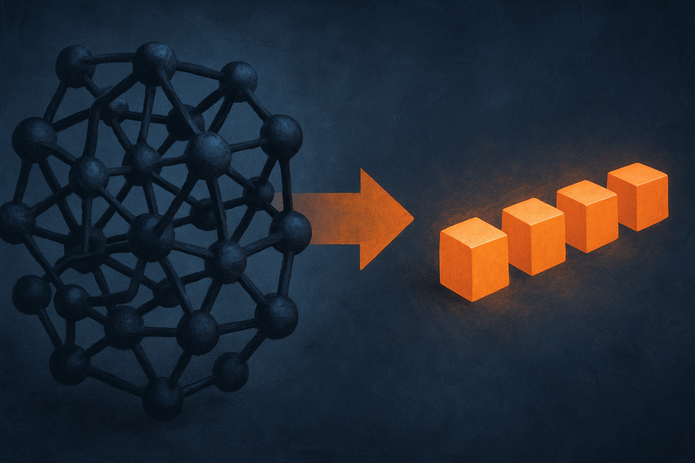

Most scientific ML models give you a number and a shrug. Predict the band gap, predict the binding affinity, predict the retrosynthesis route. The prediction lands, but the "why" stays locked inside a black box. For a working scientist, that gap is the whole problem. You cannot publish a result you cannot defend, and you cannot defend a number the model refuses to explain.

SciReasoner, introduced in a new arXiv paper cross-posted across cs.AI, cs.CL, and cs.LG, goes after that gap directly. It is a multimodal foundation model spanning three domains that rarely share a model: proteins, small molecules, and inorganic crystals. The pitch is not just accuracy. It is that the model reasons over structure the way a chemist or materials scientist would, and it shows that reasoning in traces you can read and check.

## The trick is making structure into tokens

The core idea is deceptively simple. SciReasoner discretizes coordinates, topologies, and periodic connectivities into what the authors call a unified structure-aware vocabulary. In plain terms: it turns the physical geometry of a molecule or crystal into tokens, the same kind of addressable units a language model uses for words.

That matters because it lets structure become "addressable evidence." When the model reasons about why a protein sits in a particular cellular compartment or why a synthesis route disconnects at a certain bond, it can point at specific structural tokens as the basis for that call. Structure stops being a preprocessing step that gets flattened into an embedding and disappears. It stays inspectable all the way through.

This is a real design choice with real tradeoffs. Discretizing continuous coordinates always loses something. A crystal's periodicity and a protein's fold are not naturally token sequences, and forcing them into one risks throwing away the exact spatial precision that structure-property relationships depend on. The paper's counterargument is empirical: if the representation were too lossy, the accuracy would collapse. It does not.

## The numbers, and where they actually move

Across 86 benchmarks, SciReasoner reports state-of-the-art performance on 67 of them. That is a strong headline, but the interesting part is where the gains cluster.

In homology-controlled Gene Ontology prediction, the model raises Cellular Component annotation F-max from 0.42 to 0.55 for low-homology and orphan-like proteins. Read that carefully. "Homology-controlled" means they stripped out the easy wins, the proteins that look similar to something already annotated. Orphan proteins are the hard cases, the ones where you cannot just copy a neighbor's label. A jump from 0.42 to 0.55 on exactly those proteins is more meaningful than a bigger jump on the easy set would be, because it suggests the model is reasoning from structure rather than pattern-matching against a lookup table.

In chemistry, single-step retrosynthesis accuracy climbs from 0.63 to 0.72, and the model generates fragment-level disconnection and precursor-verification traces along the way. In materials science, its learned representations separate elemental from compound phases and pull apart high- and low-band-gap regimes. These are the kinds of distinctions a domain expert would draw by hand.

None of these are moonshot numbers. A 0.09 bump in retrosynthesis accuracy is an improvement, not a revolution. What makes the result worth attention is the combination: competitive-to-leading accuracy plus reasoning you can audit. Historically you pick one. Interpretable models tend to be weaker, and the strong models tend to be opaque.

## The 98% claim deserves scrutiny

The most eye-catching number is not about accuracy at all. In double-blind expert evaluation, reviewers rated SciReasoner's reasoning traces as preferred or at least comparable to those of a frontier large language model in 98% of cases.

That is the claim I would push on hardest, and here is why. "Preferred or at least comparable" is a wide net. It bundles two very different outcomes into one percentage. A trace that is genuinely better and a trace that is merely not-worse both count as wins under that phrasing. I would want to see the split. If most of the 98% is "comparable" rather than "preferred," the story shifts from "SciReasoner reasons better" to "SciReasoner reasons about as well while also being grounded in structure." Still good. Different claim.

There is also the question of which frontier model, and whether it had access to the same structural tokens. A general-purpose LLM asked to explain a retrosynthesis route without native structural grounding is not really a fair baseline for reasoning quality. It is a baseline for what happens when you do not build structure in. The paper frames the comparison as a strength, and it probably is, but the honest reading is narrower than the headline number suggests.

Expert preference studies are also small by nature. Double-blind is the right call and I credit them for it. But "experts prefer it" is a judgment about trace readability and plausibility, not about correctness. A trace can read beautifully and still rest on a wrong intermediate. The paper's own accuracy numbers are the better evidence that the reasoning connects to reality.

## Why one model across three fields is the real bet

The quiet ambition here is interdisciplinary scope. Proteins, small molecules, and crystals usually live in separate modeling worlds with separate tools, separate representations, and separate communities. SciReasoner's claim is that a single structure-aware vocabulary can carry all three, and that the shared substrate is what enables the reasoning rather than getting in its way.

If that holds up under replication, it is the more durable contribution. Benchmark leads get beaten in a quarter. A representation that generalizes across scientific domains is the kind of thing other groups build on for years. The risk is that "unified" turns out to mean "adequate everywhere, best nowhere," and the 67-of-86 record hints the model is not universally dominant. That is fine. A model that is competitive across three fields and explains itself is more useful to more scientists than a specialist that wins one benchmark and stays mute.

If you work in computational chemistry, materials, or structural biology, the move is not to trust SciReasoner's predictions and ship. It is to use the reasoning traces as a hypothesis generator you then verify. Feed it a hard orphan protein or an unusual retrosynthesis target, read the trace, and check whether the structural evidence it cites actually holds under the physical constraints you know. The traces are the product, not the predictions. The catch most people will miss: a readable, confident-sounding trace is not a correct one, and a model that shows its work is also a model that can mislead you more persuasively when it is wrong. Treat the transparency as an invitation to audit, not a reason to stop.
