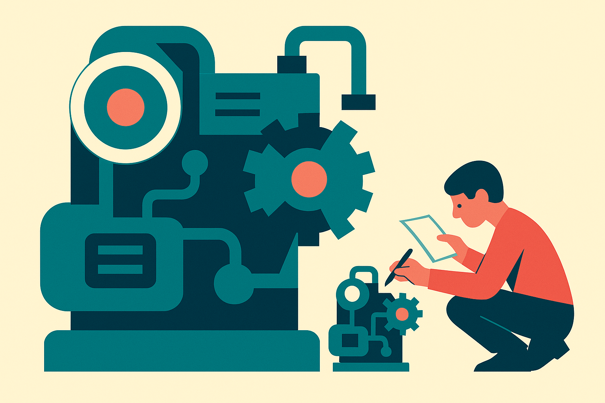

Five frontier labs shipped in about 24 hours. GPT-5.6 in three sizes (Soul, Terra, Luna), Grok 4.5, Meta Muse. The usual reflex is to open the leaderboard, find the top number, and declare a winner. That's the wrong reflex this week.

The number that actually matters isn't a score. It's a price tag. And OpenAI stapled a price tag to this release that reframes the whole race.

## The comparison labs don't want on the same slide

Here is the thing everyone raced past. Wes Roth flagged it cleanly: on Agents Last Exam, Claude Fable 5 scored 40.5% and cost $2,300 to run. GPT-5.6 Soul scored 53.6% and cost $763. Higher score, roughly a third of the price.

AI Explained ran the same comparison across the board and found the pattern holds: Soul versus Fable, Terra versus Opus, Luna versus Sonnet. Broadly, the OpenAI model lands around a third of the Anthropic Claude price. And not always worse for it. Sometimes better.

That's the story. Not "OpenAI beat Anthropic on a benchmark." Benchmarks trade leads every few weeks and nobody switches workflows over nine points. But performance-per-dollar cutting by 3x while quality holds or improves? That changes what you can actually put into production.

There's a reason for the reaction. AI Explained noted that when Anthropic posted about giving away more usage, the lead for OpenAI's super app replied "I smell fear." Read that however you want, but price cuts this aggressive don't happen in a comfortable market. When the marginal cost of a task drops by two-thirds, the question stops being "can the model do it" and becomes "why am I still doing it by hand."

## Why cost per task beats the top score

Wes Roth made the point that matters most for anyone building: watch the relationship between cost and capability, not capability alone. A model that scores brilliantly but costs $2,300 a task is only useful while a lab subsidizes your tokens through a subscription. Pay the real API price and it collapses. That's not a commercially viable model. That's a demo.

AI Explained tied this to something worth sitting with. We never crossed 90% on any coding benchmark before developers switched from hand-coding-first to AI-coding-first. There was no magic threshold. The switch happened when the economics tipped, when it got cheaper and good enough to draft first and review second.

So the question for the rest of white-collar work is whether we hit that same tipping point in 2026. AI Explained pointed to a Bloomberg report that Core is backlogged by tens of billions in demand from financial firms alone. If a finance analyst starts by having a model draft the analysis in the work tab, then reviews and tweaks, that's AI-first for finance. Same pattern that already happened in code.

I'd add the obvious caveat. Agents Last Exam is worth taking seriously precisely because it's hard to game. Dawn Song, who led it, said every task derives from a real project a human expert completed, no vibes, no human judges, fully reproducible, co-led by UC Berkeley across 55 industries with 300 experts. And it's new enough that its answers are unlikely to be sitting in GPT-5.6's training data. Same logic applies to Zapier's Automation Bench, where the OpenAI lead is real but thinner: AI Explained clocked it at a 7% score lead rather than a blowout. So don't overfit to one chart. But two contamination-resistant benchmarks pointing the same direction is more signal than one.

## The multi-day agent runs are the actual capability

Matthew Berman's tests are where the abstract "agentic" claims got concrete. He gave GPT-5.6 plus Codex an eight-word prompt: make an Excel clone, continue until feature parity. It ran for over five days before he manually stopped it. The result was a single-page HTML app with sorting, formulas, data validation, conditional formatting, pivot tables, find and replace. Rough edges, sure, and nowhere near done when he pulled the plug.

The mechanism is the interesting part. Berman said the model used computer use: it opened the actual Excel on his desktop, went back and forth between the real app and its clone, and rebuilt features by inspecting the original. A Minecraft clone ran seven days and reached something that looked like the real game inside one day, then kept going deeper into biomes and mobs.

I'd hold two things at once. Five and seven day autonomous runs are a genuine capability jump, and "I stopped it, it wasn't close to done" is honest about the ceiling. These aren't finished products. They're proof the model can hold a goal across days without falling apart, which is the harder problem than any single-turn benchmark. Berman also called Codex browser use his default driver for real tasks like DNS changes and inbox triage. That's the part that generalizes past demos.

## Models training models, out loud this time

The line from OpenAI's own stream, relayed by Wes Roth: "5.6 Soul actually autonomously post-trained Luna." The flagship kicked off a post-training job for the smaller model from an underspecified Codex prompt. Find the configs, find the GPUs, launch the script, make sure it works.

This is recursive self-improvement stated plainly, and it's worth being precise about what it is and isn't. It's a frontier model automating one production step in the training of a lesser model. It is not a runaway intelligence explosion. But the direction is real, and OpenAI isn't alone. Wes Roth connected it to Andrej Karpathy's open-source Auto Research project, the loop of let an agent run training experiments, keep what improves, discard what doesn't. Karpathy did it with a small model; OpenAI claims it with the frontier one. Anthropic reportedly hired Karpathy, plausibly for exactly this.

The honest read: one automated step is a long way from an automated researcher. But cost curves and automation curves compound. That's the thread connecting every piece of this week.

Here's how a builder actually uses this. Stop benchmark-shopping for the top score and start pricing your real workflow at API rates, not subsidized subscription rates. Take one repetitive task you currently pay a human or a pricey model to do, run it on the cheapest GPT-5.6 tier that clears your quality bar, and measure cost-per-completed-task against your current process. If Luna or Terra does 90% of the job at a third of the price, that's your AI-first tipping point, not some benchmark crossing 90%. The catch most readers miss: the five-day agent runs and computer-use demos are impressive but unfinished, so the win isn't autonomous completion, it's a good enough first draft you review and fix. Draft-first, verify-second. That's the loop that already ate coding, and it's coming for the next white-collar function that prices it out correctly.
