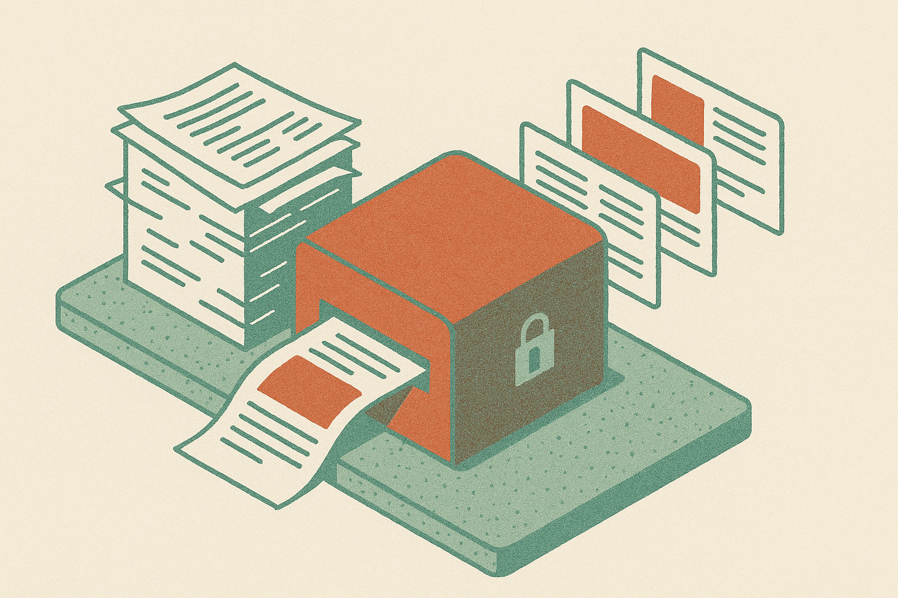

Mistral’s OCR 4 announcement is short on drama and heavy on the three things enterprise document teams actually ask for: language coverage, layout grounding, and deployment control.

Mistral says OCR 4 supports 170 languages, returns bounding boxes, and can be self-hosted. That is the whole story we have from the announcement. No public benchmark details in the supplied material. No pricing. No latency numbers. No accuracy breakdown by document type, scan quality, or language family.

Still, those three claims matter because OCR is not a toy category. It sits inside insurance claims, invoices, loan packets, medical records, customs forms, legal discovery, and government archives. If it fails quietly, downstream systems can make confident mistakes.

## OCR is becoming a system boundary

A lot of “document AI” has been sold as if the hard part is reading text from a page. That was never quite true.

The hard part is preserving enough context so the next step does not hallucinate structure. A PDF is not just text. It is coordinates, tables, stamps, signatures, margins, crossed-out fields, tiny footnotes, handwriting, and weird page order. Extracting the words is only step one.

That is why bounding boxes are important. Mistral’s claim here is not just “we can read the page.” It is closer to “we can tell you where we found the thing.” That changes the downstream workflow. A model can quote a number and point back to the region. A reviewer can inspect the source. A pipeline can split extraction from verification.

This is also where OCR starts to look less like a feature and more like infrastructure. Once documents become the raw material for agents, retrieval systems, compliance workflows, and back-office automation, the OCR layer becomes a trust boundary. Bad extraction poisons everything after it.

## Self-hosting is the enterprise tell

The self-hosted deployment claim is the most revealing part.

For many companies, document AI touches the files they least want to ship to an external API: contracts, patient records, payroll docs, customer IDs, acquisition memos, regulated correspondence. Some teams will use hosted APIs anyway, because speed wins. But plenty of serious buyers need a path to keep processing inside their own environment.

That does not make self-hosting easy. Running the model is only one piece. Teams still need ingestion, file normalization, queueing, retries, monitoring, access control, audit logs, redaction, human review, and integration with systems that were probably built before “AI agent” became a budget line. The model can be good and the project can still fail.

Mistral’s broader strategy has often appealed to buyers who want more control over deployment. OCR 4 fits that pattern. It gives Mistral a cleaner enterprise wedge than “we have another chat model.” Document workflows are boring, expensive, measurable, and everywhere.

## The missing evidence is still missing

I like this direction, but I would not treat the announcement as proof of category leadership.

The key questions are empirical. How does OCR 4 handle low-resolution scans? Mixed-language pages? Dense tables? Rotated receipts? Handwriting? Historical documents? Forms with checkboxes? PDFs that contain both embedded text and scanned images? What happens when a page has three columns and two footnotes? How stable are the bounding boxes across runs?

The 170-language claim is useful, but coverage is not the same as quality. Some languages and scripts are much harder in real enterprise data than in clean samples. The same goes for layout. Bounding boxes are valuable only if they are accurate enough to support review and automation.

I would test this with a nasty internal document set, not a polished demo folder. Pick 200 files that caused pain before. Include bad scans, edge cases, and documents from real workflows. Measure field-level accuracy, not vibes. Track whether bounding boxes reduce reviewer time. Compare hosted and self-hosted operations if both matter to your team.

For builders, the move is simple: treat OCR as a first-class component, not a preprocessing afterthought. Try OCR 4 where source-grounded extraction matters, especially if data control is blocking adoption. The catch most readers miss is that better OCR does not remove workflow design. It just gives you a cleaner substrate. You still need validation, review paths, and a clear answer for what happens when the model is unsure.
