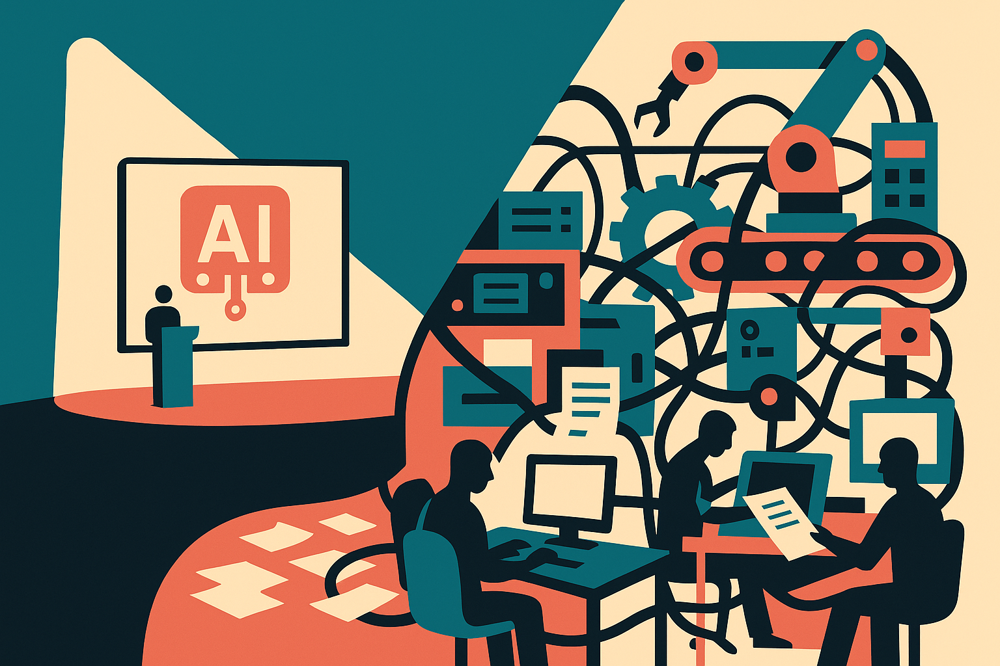

Mistral is teeing up AI Now Summit 2026 as an enterprise event aimed at “solving the world’s hardest problems.” That is the kind of line every AI company wants right now. Big customers. Global reach. Mission language. A room full of buyers who need something more concrete than another chatbot demo.

I do not read that as empty by default. Mistral has been one of the more serious European AI companies, and enterprise AI is where a lot of the real work is shifting. Not because the demos are better. Because the constraints are worse.

The question is whether the summit produces proof, or just posture.

## Enterprise AI is not one problem

“Global enterprises” sounds like a market segment. It is not. It is a pile of incompatible environments.

A bank trying to use AI for compliance review has different failure modes than a manufacturer using it for maintenance planning. A pharma company cares about audit trails and scientific confidence. A public sector buyer cares about sovereignty, vendor risk, and political exposure. A retailer cares about margin, support cost, and messy product data.

So the summit pitch only gets interesting if Mistral and its customers show the seams. What data was available. What could not leave the customer environment. How outputs were checked. Who stayed in the loop. What broke during rollout. What latency, cost, and accuracy tradeoffs were acceptable.

That is the difference between an AI conference and an enterprise AI conference.

The hard part is not convincing an executive that AI matters. That happened already. The hard part is turning model capability into repeatable workflow change without accidentally creating a new layer of unverifiable automation.

This is where enterprise buyers should push past model talk. Which systems did the AI touch? Was it read-only, recommendation-only, or allowed to act? How were errors caught? What happened to the humans doing the work before? Did the deployment replace a step, speed up a step, or just add another review queue?

Those distinctions sound boring. They are the whole game.

## The summit test: fewer slogans, more operating detail

Mistral’s framing, “innovations for global enterprises solving the world’s hardest problems,” invites a high bar. Hard problems are not solved by a model screenshot. They need integration, evaluation, permissions, change management, and a business owner willing to be measured after the pilot ends.

I would like to see three kinds of evidence from events like this.

First, customer stories with enough detail to be falsifiable. Not “improved productivity.” What task changed? How often does it run? Who signs off? What is the fallback when the system is uncertain?

Second, architecture choices. Enterprise AI buyers need to understand whether a system depends on hosted APIs, private deployment, retrieval over internal documents, fine-tuning, tool use, or some mix. Those choices shape cost, security, and maintenance. They also shape whether the project survives procurement.

Third, evaluation in the real workflow. Benchmarks are useful, but they rarely match the weird internal documents, exceptions, acronyms, permissions, and politics inside a large company. If a model works only on clean demo inputs, it is not an enterprise product yet.

The thinness of the public announcement matters here. Mistral has signaled ambition, not proof. That is fine for an event teaser. But the market is moving out of the “AI strategy” phase and into the “show me the operating model” phase.

Practitioner’s take: if you are building or buying around Mistral’s ecosystem, use this kind of summit as a due diligence map, not a hype feed. Pick one workflow with a known owner, existing data, measurable pain, and clear review rules. Ask vendors to show failure handling before success stories. The catch most teams miss: enterprise AI does not fail because the model is useless. It fails because nobody redesigned the surrounding process.
