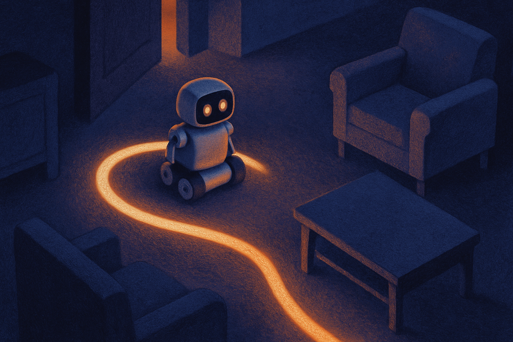

Mistral just put out Robostral Navigate, an 8B model that hits 76.6% on R2R-CE using a single RGB camera. No depth sensors. No LiDAR. No stereo rig. One ordinary camera feed, and the model figures out where to go.

That last part is the actual news. The benchmark number is fine. The sensor claim is the interesting bet.

## What the number actually measures

R2R stands for Room-to-Room. It is a vision-language navigation benchmark: an agent gets a natural-language instruction ("go down the hall, turn left at the kitchen, stop by the couch") and has to move through a 3D environment to reach the goal. The CE part means continuous environments, which is harder than the older discrete version. In discrete R2R the agent teleports between fixed nodes on a graph. In continuous R2R-CE it has to actually move through space with low-level actions, which introduces all the messy failure modes real robots hit: overshooting, getting stuck on geometry, drifting off the described path.

So 76.6% success on R2R-CE is a real result on a hard task, not the toy version. For context, this is the kind of benchmark where a few points of success rate separate papers, and the frontier has been climbing steadily for a couple of years.

Here is the honest framing though. Mistral gave us one number and one headline. We do not have the failure breakdown, the comparison table against other recent methods, the hardware they ran inference on, or whether 76.6% is validation-unseen or test. Those distinctions matter a lot in this literature. "Unseen" splits, environments the model never trained in, are the ones that tell you if it generalizes. Until Mistral shows the split, treat the headline as promising rather than settled.

## The camera claim is the real story

Strip away the benchmark and the pitch is this: you can do decent indoor navigation with the cheapest sensor on the shelf.

That is a bigger deal than it sounds. Most navigation stacks lean on depth. LiDAR gives you clean geometry but costs money, draws power, and adds a spinning part that breaks. Depth cameras are cheaper but choke on glass, dark surfaces, and sunlight. Stereo rigs need calibration and eat compute. Every one of those sensors is a line item and a failure point.

An RGB-only model that navigates well shifts the economics. A phone camera or a $30 webcam becomes the whole perception front-end. If the claim holds, you can put navigation into hardware that could never carry a LiDAR budget: cheap warehouse bots, home devices, toys, delivery carts.

The trade Mistral is making is compute for sensors. You throw an 8B vision-language model at the problem and let it infer geometry and spatial relationships from pixels and language, the way a person walking through an unfamiliar building does. We do not measure distances in meters. We see "the doorway is over there" and go.

The catch is that RGB-only means the model is inferring depth rather than measuring it. Inference is great until it isn't. A depth sensor fails predictably. A model that hallucinates the distance to a staircase fails in ways that are harder to bound. For a warehouse bot that is a scuff on a wall. For anything near stairs, kids, or pets, "usually right" is not the bar.

## 8B is a deliberate size

The parameter count is a choice, not an accident. 8B is small enough to run on a decent edge GPU or a beefy embedded board, which is exactly where a robot lives. You cannot ship a robot that phones home to a datacenter for every navigation decision. Latency kills you, connectivity kills you, and nobody wants their vacuum's pathfinding to depend on their WiFi.

So the combination is the point: small enough to run locally, cheap enough to pair with a single camera, capable enough to hit a respectable benchmark. That is a coherent product thesis, and it fits Mistral's broader pattern of shipping smaller models that punch above their weight rather than chasing the biggest number.

What we do not know is the inference cost in practice. 8B params is manageable, but vision-language models with video-rate input can be heavy. Frames per second, power draw, and the actual latency per action are the numbers that decide whether this runs on a robot or just on a bench. Mistral has not shown those yet.

## Where this fits in the robotics push

Everyone with a frontier model is now looking at physical action. The pattern across the field is the same: take a strong vision-language backbone, fine-tune it for embodied tasks, and see how far language-conditioned control goes. Robostral Navigate is Mistral's entry in that race, and the RGB-only angle is how they are trying to differentiate.

It is worth being clear about the gap between benchmark and product. R2R-CE runs in simulated environments. Sim-to-real is the swamp where a lot of impressive navigation results go to die. A model that reads a rendered hallway perfectly can fall apart on real camera noise, motion blur, lighting changes, and reflective floors. Mistral has shown a strong sim number. They have not shown a robot doing this in a real house. Those are different claims, and the distance between them is usually measured in years, not weeks.

## Practitioner's take

If you are building indoor navigation, the move is not to adopt Robostral Navigate on faith. It is to test the sensor thesis on your own hardware. Pull the model when weights are available, feed it your real camera stream in your actual environment, and measure two things: success rate on your task and, more importantly, how it fails. Watch specifically for depth-related errors, misjudged distances, overshoots near obstacles, confusion on reflective or transparent surfaces. That failure profile tells you whether RGB-only is safe for your use case or whether you still need a cheap depth sensor as a safety backstop.

The catch most people will miss: a 76.6% success rate means it fails roughly one run in four. For a demo that is fine. For a shipping product, the question is not the average success rate, it is what happens on the 23.4% where it is wrong, and whether your environment has stairs. Match the failure mode to the stakes before you match the model to the spec sheet.
