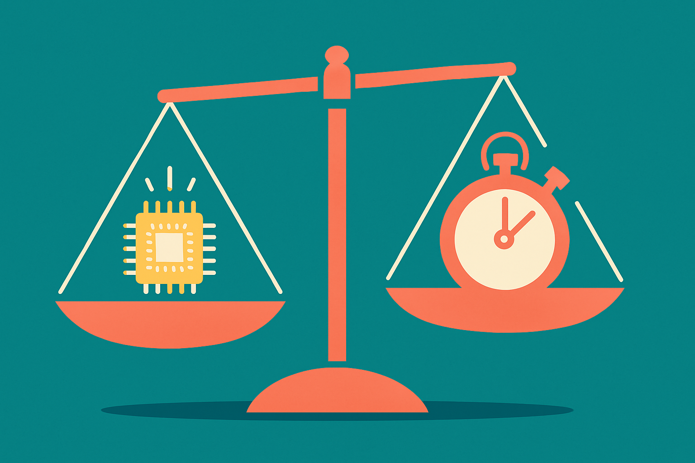

Google is late. That is the honest starting point for any conversation about Gemini 3.5 Pro, and the leak coverage tends to skip past it.

The AI Grid laid out a release cadence comparison that is worth sitting with: over the same window, OpenAI shipped several point releases in the GPT 5 line, and Anthropic pushed out Opus, a new Claude, and a Sonnet refresh. Google, by contrast, went Gemini 3 Flash in December, 3.1 Pro in February, and then a multimodal drop in May. Fewer shots on goal. Roughly half the shipping rate of its two closest rivals, by that framing.

I want to be careful here, because release velocity is not the same as quality, and a company can ship less and land harder. But cadence does tell you something about internal confidence and about where a lab thinks it can win. And when you pair Google's slower pace with *what* it has been shipping, a pattern shows up.

## The hole is coding, not visuals

Everyone agrees Gemini is strong at visual and world understanding. That has been true for a while and nobody is seriously contesting it. The problem, as one Reddit thread under the 3.5 Pro leaks pointed out, is that the leaked material shows almost nothing on agentic or coding benchmarks. That silence is the story.

Look at what actually landed with Gemini 3.5 Flash, the fast variant that came out ahead of the Pro model. On coding it came in below Opus 4.7 and below GPT 5.5, and only marginally ahead of the much older 3.1 Pro. So the trajectory on the exact capability that matters most for builders right now has been flat while competitors kept climbing. Grok 4.5 and the newer GPT 5.6 are, by these accounts, performant across a wide benchmark spread. Google is the one lab where you have to ask "but how does it code" and not get a confident answer.

This matters because coding and agentic reliability are where the money is going in 2026. The people paying for API tokens at volume are running agents, writing software, chaining tool calls. Pretty generative interfaces are nice. They do not move enterprise spend the way a model that can hold a coding task together across fifty steps does.

## The generative UI bet, and why it might be smart anyway

Here is where I part ways slightly with the "Google is just losing" reading.

The AI Grid noticed something in the current Gemini that most people have not clocked: generative UI. Ask Gemini a question and it will sometimes build a small interface on the fly to answer you, rather than just returning text. That is a genuinely different product direction, and it hints at what Google might actually be optimizing for.

My read: Gemini 3.5 Flash is not trying to beat Opus on a hard coding benchmark. It is being built as a cheap, fast sub-agent. A model you fire thousands of times inside a larger system to render UI, handle small tool calls, do the grunt work. That is a volume game, not a frontier-benchmark game. And if you are Google, with the cheapest inference infrastructure in the industry and the largest surface area of products to embed into, volume is a rational place to compete.

So the leaks might be misleading precisely because people are grading Flash on the wrong exam. If Flash exists to be a disposable, high-throughput worker, then its middling standalone coding score is not the point. The point is whether it is good enough, cheap enough, and fast enough to run at scale under a smarter orchestrator. That is a different question, and the leaked benchmarks do not answer it.

## What 3.5 Pro has to actually do

All of that is the charitable case for Flash. Pro is where Google cannot hide.

If Gemini 3.5 Pro ships next week as rumored and the coding and agentic numbers are still a step behind GPT 5.6 and the current Claude line, then the "we are playing a different game" story stops being strategy and starts being cope. Pro is the flagship. It is the one that competes head to head. And the pointed absence of agentic benchmarks in the leaks is either a deliberate hold-back for a big reveal or a tell that the numbers are not there yet.

I genuinely do not know which. Neither does anyone leaking. That uncertainty is the honest position, and I would treat anyone claiming Gemini 3.5 Pro "might shock the AI world" with the skepticism that headline deserves. Leaks reward confidence, not accuracy.

What I will say is that Google has the raw ingredients to close the gap: the TPU cost advantage, the research bench, the distribution through Search, Android, and Workspace. What it has not shown is that it can convert those into frontier coding performance on a release cadence that keeps pace. Two cycles of being second on the metric that matters is a trend. A third would be a verdict.

## What to watch when it drops

When 3.5 Pro lands, ignore the demo reels. Go straight to the agentic and coding evals: SWE-bench style tasks, long-horizon tool use, the stuff that breaks under real workloads. If Google leads with visuals and generative UI in the announcement and buries the coding numbers, that is your answer about where they landed. If they lead with coding, they are telling you they finally cleared the hurdle.

The Practitioner's Take: do not swap your coding agent stack over on launch day. Run your own eval harness on the tasks you actually ship, because your workflow is the only benchmark that pays your bills. But do pay attention to the sub-agent angle most people are missing. If Gemini 3.5 Flash is cheap, fast, and reliable enough as an orchestrated worker, the smart move is a hybrid: a stronger model from Anthropic or OpenAI as the planner, Flash as the high-volume executor underneath it. The cost math on that combination could beat running a single expensive model end to end, and almost nobody is testing it yet because everyone is still arguing about which single model wins. That framing is the trap. In agent systems, the winning model is rarely one model.
