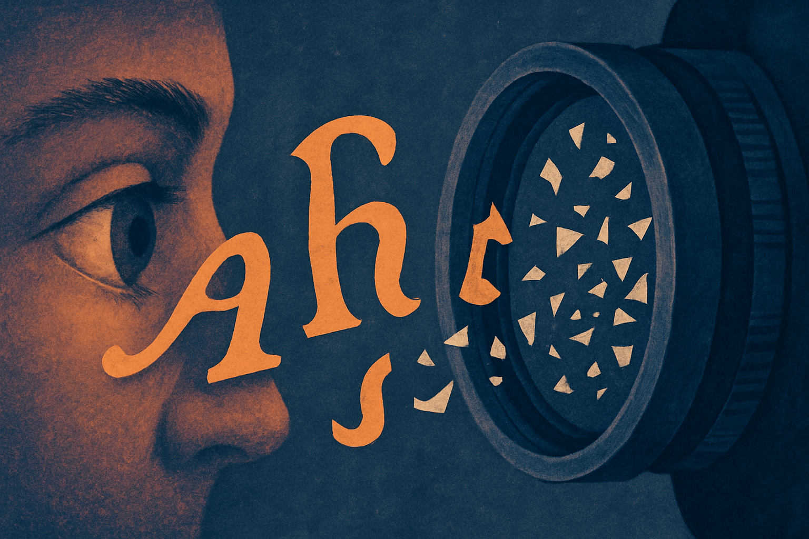

Ghost Font has the kind of premise that travels fast: a font humans can read, but AI cannot.

That is a great hook. It is also a claim that needs a lot of receipts.

The Ghost Font project, circulating on Hacker News, appears to be making a narrow visual-obfuscation bet. Shape letters so a person can still infer them, while machine vision or OCR systems fail. That is not crazy. OCR is full of edge cases. Fonts, kerning, ligatures, contrast, noise, compression, and layout can all throw off a reader that expects clean text.

But “AI cannot read it” is much stronger than “some OCR systems fail on it.” The second claim is plausible. The first one is where I get skeptical.

## The gap between OCR tricks and AI resistance

A font can attack a pipeline. It can make Tesseract stumble. It can confuse a document parser. It can cause a screenshot-to-text workflow to drop words or hallucinate characters.

That does not mean it defeats “AI.”

Modern multimodal models do not only read characters like old OCR. They can reason from context. If a line says “Please enter your passw_rd” and one letter is mangled, the model may infer it. If a page has repeated examples, the model may learn the mapping from nearby text. If the font is public, someone can generate a training set. If the text matters enough, a human can transcribe it and feed it back in.

This is the old CAPTCHA problem in a new jacket. Once the defense is visible, it becomes training data.

That does not make Ghost Font useless. It just changes the category. It is not a lock. It is friction.

## Where this could still be useful

There are practical cases where friction matters.

If you are publishing a web page and want to discourage low-effort scraping, a font like this might reduce automated extraction quality. If you are sharing a screenshot in public and want to keep casual model ingestion from cleanly reading an email address, it might help. If you are designing an internal tool where some fields should be visible to humans but less convenient for downstream automation, visual obfuscation may be one layer.

The key phrase is “one layer.”

I would not use this for secrets, contracts, credentials, medical records, legal privilege, or anything where the risk model includes a motivated attacker. If the text must remain private, do not display it. If it must be displayed, assume it can be captured. If it can be captured, assume it can eventually be read.

The more interesting product angle is not “AI-proof font.” It is “graduated readability.” Designers already use blur, redaction, masking, partial reveal, and watermarks. Ghost Font sits in that family. It says: can we make information accessible to the intended human in the moment, while making bulk machine reuse harder?

That is a reasonable goal.

## The benchmark I want to see

For this to move from clever demo to useful tool, I would want a simple public test.

Run the same passages through common OCR engines, browser accessibility extraction, PDF parsers, and several multimodal models. Test screenshots at different resolutions. Test mobile camera photos. Test compression. Test dark mode. Test short strings, long paragraphs, emails, codes, and names. Then compare human reading speed and error rate.

Without that, the claim is vibes. Fun vibes, but still vibes.

The worst version of this idea is a company selling “AI-safe documents” to people who then expose sensitive data. The best version is a small design primitive that raises the cost of casual extraction and makes builders think harder about what machines can see.

If you build with this, try it first on low-stakes text where scraping friction has value: public contact details, preview-only documents, internal dashboards, or screenshots meant for social sharing. Then test it against the actual tools your users or adversaries would use. The catch most readers miss: the font is only protecting pixels, not meaning. Context, repetition, and motivated retraining can turn those pixels back into text.
