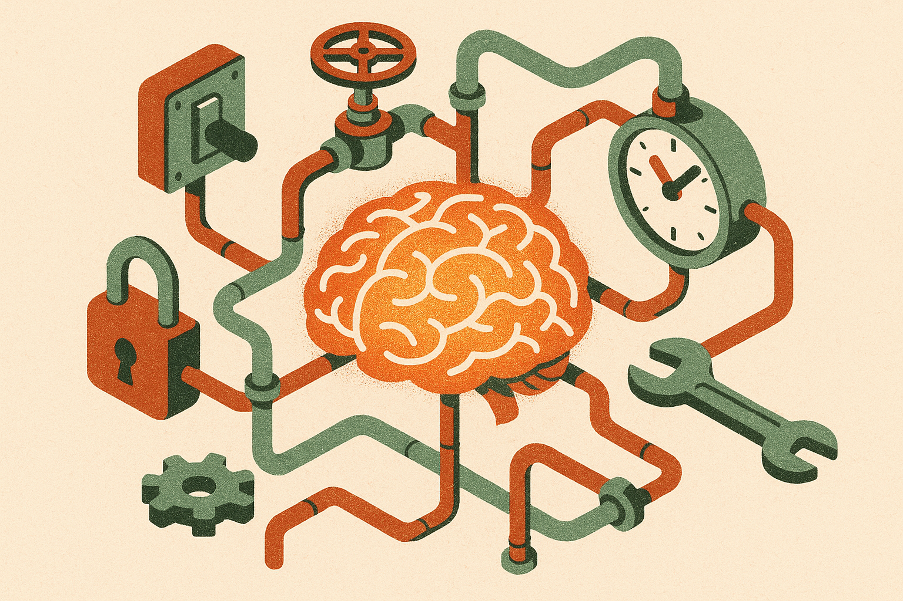

The Hacker News item titled “AI 2040 and the cult of intelligence” hits a nerve because it names the habit running through a lot of AI talk right now: put “intelligence” at the center, then let everything else orbit it.

I get the pull. Intelligence is clean. It sounds measurable. It lets people draw a straight line from better models to better everything. More reasoning, more autonomy, more substitution, more growth. Nice story.

But products do not ship on intelligence alone.

## The scalar trap

The problem with “intelligence” is not that it is fake. Current models can do real work. They write code, summarize messy inputs, answer questions, call tools, extract structured data, generate test cases, and help people move faster. Anyone still pretending this is just autocomplete has not used the tools seriously.

The trap is treating intelligence like a single number that explains the future.

A model can be brilliant in one setting and useless in another. It can solve a contest problem, then fail because the production database has weird field names. It can draft a great contract clause, then hallucinate a citation. It can plan a multi-step workflow, then break when an API returns an unexpected enum.

That is not a minor footnote. That is the product surface.

The cult version of intelligence wants a smooth curve: smarter model, smarter agent, smarter company, smarter economy. The operating version is jagged: permissions, retrieval, evals, latency, pricing, audit logs, exception handling, user trust, change management. Boring stuff. The stuff that decides whether anyone pays.

## 2040 is a bad place to hide weak assumptions

Long-horizon AI forecasts are useful when they force assumptions into the open. They are less useful when the date does the work.

2040 is far enough away that almost any claim can sound plausible. By then, models may be much better. Hardware may be cheaper. Agents may be normal. Regulation may be tighter. Labor markets may have shifted. All possible.

But if the argument depends on intelligence compounding in the abstract, I want receipts closer to the ground. What workflows are already changing? Where are humans still required? What is the error budget? Who owns liability? What does the cost curve look like at scale? How often does the system need escalation? What happens when the model is right 94% of the time, but the remaining 6% is where the business risk lives?

The useful 2040 question is not “how smart will AI be?” It is “what kinds of institutions can absorb machine intelligence without pretending it is magic?”

That framing changes the work. Instead of waiting for the one model that eats the company, you look for the seams where models already fit: support triage, internal search, sales research, analytics explanation, code maintenance, document review, QA, compliance prep. Then you measure the delta. Not vibes. Time saved, defects caught, tickets resolved, revenue protected, cycle time reduced.

## Intelligence needs a container

The best AI systems I see are not worshipping the model. They contain it.

They narrow the task. They give the model context. They constrain outputs. They check results. They route uncertain cases to people. They log decisions. They make failure visible. They accept that “agent” is not a personality type, it is a workflow with state, tools, policies, and fallbacks.

This is less glamorous than arguing about 2040. It is also where the compounding starts.

A slightly weaker model inside a well-designed system often beats a stronger model dropped into a vague prompt box. That should be obvious by now, but the industry keeps relearning it. Capability matters. Packaging matters too. Distribution, incentives, and trust matter a lot.

For builders, the practical move is to stop asking whether the model is “smart enough” in general. Pick one painful workflow and map the actual constraints: inputs, decisions, tools, approvals, failure modes, and cost. Build the smallest model-powered loop that improves one measurable step. The catch most readers miss is that the winning system may look less autonomous than the demo, and that is fine. Reliability usually beats theater.
