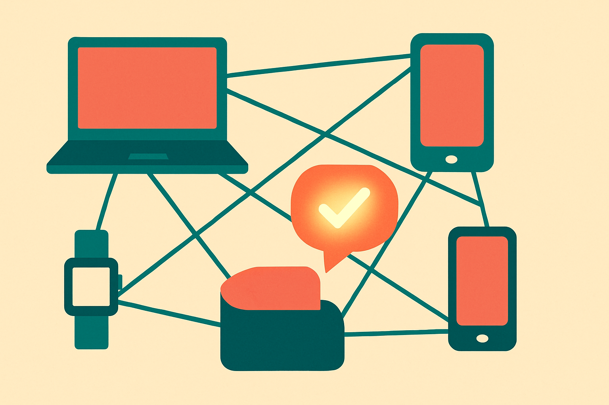

The Hacker News thread title is spare: “Mesh LLM: distributed AI computing on iroh.” That is enough to flag the real story.

This is not another “your laptop is secretly a data center” pitch. At least, it should not be. The hard part of distributed AI is rarely finding machines. It is making those machines useful together without drowning in coordination cost.

Iroh is the notable choice here. It sits in the peer-to-peer networking bucket, the kind of plumbing meant to help devices find each other, connect directly when they can, and route around the usual mess of consumer networks. For distributed inference, that matters. If your system depends on every node behaving like a clean cloud instance, you do not have a mesh. You have a fragile demo.

## The mesh pitch is strongest at the edges

The most believable version of Mesh LLM is not “replace NVIDIA clusters.” It is smaller and more interesting: local or semi-local inference across devices you already control.

A desktop with a GPU. A laptop nearby. A home server. Maybe a few team machines in an office. The model does not have to live entirely in one place if the system can split work, move tensors or tokens efficiently, and recover when one node disappears.

That last clause does a lot of work. LLM inference is not like rendering a pile of independent images where every worker can chew on its own task. Autoregressive generation is sequential. Each new token depends on the prior state. Some workloads can be parallelized. Some can be batched. Some model layers can be split. But every hop across a network adds latency, and consumer networks are weird.

So the builder question is not “can it run?” It is “what shape of workload wins?”

Embeddings may be easier. Batch jobs may be easier. Small specialist models may be easier. Multi-user local serving may be easier than one user trying to make a giant model feel interactive across three flaky devices.

## Distributed compute has three traps

The first trap is latency. Local VRAM is fast. Networked memory is not. Once a design starts shipping intermediate activations around, the network becomes part of the model runtime. That can be fine for some setups, but it is not free.

The second trap is heterogeneity. Real meshes contain mismatched hardware. Different GPUs, different memory sizes, different drivers, different thermals. A good scheduler needs to know which node should do what, then keep adapting as nodes come and go. That is product work, not just systems work.

The third trap is trust. If a mesh crosses beyond your own devices, you now care about bad nodes, data leakage, result verification, and incentives. That gets hard quickly. Crypto-style distributed compute markets have been trying versions of this for years. The limiting factor is often not imagination. It is verification, economics, and reliability.

This is where I would be careful with hype. “Distributed AI computing” sounds like a broad claim. The thinner, more useful claim is: iroh may make the networking layer less painful for experiments in peer-to-peer LLM inference. That is still worth watching.

## The useful benchmark is boring

If Mesh LLM wants to matter, the demo should not be a heroic one-off. It should show boring comparisons.

One machine alone. Two machines on the same LAN. Three mismatched machines. One node dropping mid-generation. A batch embedding job. A chat completion. A larger model split across devices. Same prompt, same model, same output target, with latency and setup pain visible.

Not because benchmarks settle everything. They do not. But distributed systems lie politely until they meet real networks.

For builders, I would treat Mesh LLM as an experiment in topology before treating it as an inference stack. Try it first with devices you own, on a local network, on workloads that tolerate delay: embeddings, offline summarization, batch classification, maybe local RAG preprocessing. The catch most readers miss is that “more devices” can make a system slower if the work is tightly coupled. The win comes when the workload matches the mesh, not when the mesh imitates a GPU cluster.
