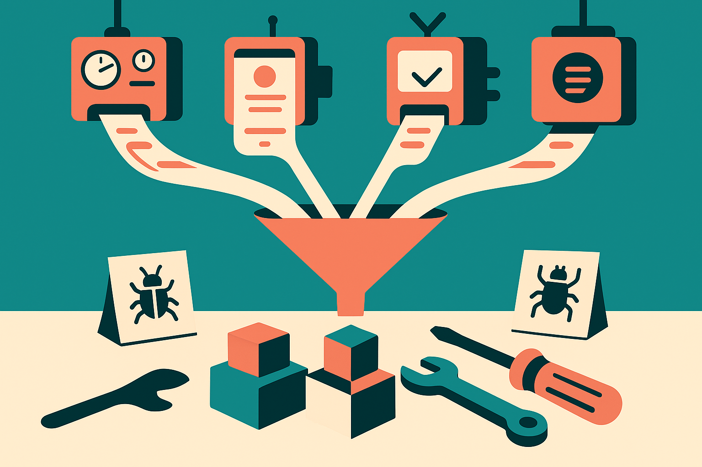

Hacker News surfaced a familiar kind of AI coding comparison: GPT-5.6, Grok 4.5, Claude, and Muse Spark all building the same four apps.

I like this format. It is closer to what builders actually do than another isolated benchmark score. A working app forces a model to make dozens of small choices: state management, layout, error handling, data shape, file organization, naming, and whether it remembers what the user asked for after the third turn.

But same-prompt app races can also fool us.

A model can look amazing on a demo-sized app and still be painful inside a real codebase. The reverse is true too. A model might produce a less flashy first pass, then be much better at incremental repair, test-driven edits, or staying inside an existing architecture. That difference matters more than the screenshot.

## The first build is the least interesting part

The app-build comparison format usually rewards the opening move. Paste prompt, wait, inspect output. That is useful, but incomplete.

Real work is mostly the second, fifth, and fifteenth move. “Make the auth state persist.” “This broke mobile.” “Don’t rewrite the whole file.” “Add tests for the edge case.” “Use the existing component system.” “Explain the migration risk before touching the database.”

That is where models separate.

The first pass measures synthesis and taste. The follow-up loop measures discipline. Does the model preserve intent? Does it delete working code? Does it invent APIs? Does it admit uncertainty? Does it ask for the missing env var instead of pretending? These are boring traits, which is exactly why they matter in production.

## Four apps are a start, not a verdict

The Hacker News framing, four models, four apps, is good because it reduces one common problem: comparing different prompts across different tools and calling it science.

Still, four apps is tiny. Prompt wording can swing results. The chosen app types can favor one model’s training distribution. A judge might reward polish over maintainability. If the test stops at “it runs,” it misses the cost of owning the code tomorrow.

A better version would keep the same spirit but add friction. Run each model through identical follow-up tasks. Include one ambiguous requirement. Include one bug seeded into the prompt. Add an existing codebase with conventions. Score not just completion, but diff size, test pass rate, dependency choices, accessibility basics, and how often the model needs human rescue.

I do not need a perfect academic eval here. I need a buying signal. If I am choosing a coding assistant, I want to know which model helps me ship without leaving a mess behind.

## The product layer may matter as much as the model

The list itself is interesting: GPT-5.6, Grok 4.5, Claude, and Muse Spark. Some are model brands. Muse Spark sounds more like a product surface or app-building wrapper. That distinction matters.

Builders often talk as if the base model is the whole story. It is not. The tool around the model changes the result: file access, preview loop, package installation, error capture, context packing, rollback, linting, and whether the agent can inspect its own work.

A weaker model inside a tighter build loop can beat a stronger model trapped in a chat box. The app-building race should test the full system, because that is what users actually touch.

Practitioner's take: try this yourself with your own boring app, not a toy clone from social media. Pick one workflow you understand well, run the same prompt through two or three tools, then force three repair turns and one constraint change. Save the diffs. The catch most readers miss is that the winner is not the prettiest first screen. It is the tool that stays predictable when the request gets annoying.
