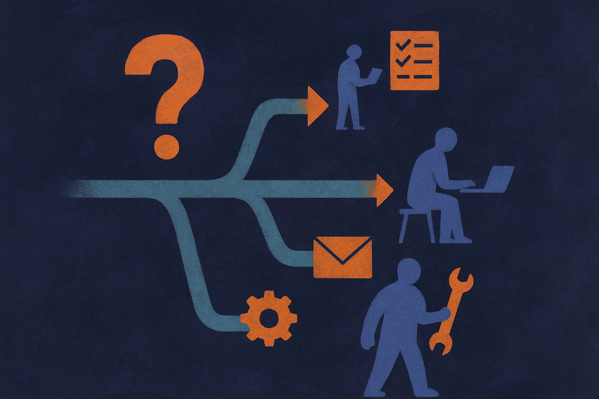

Most agent frameworks pick which model or tool handles a step by matching a task description against a function description. Coarse matching. Ask for math, get the model tagged "math." Ask for code, get the code tool. It works until you have three models that all claim they can do the thing, at three different price points and three different accuracy levels, and the framework has no principled way to choose between them.

That gap is what Agora goes after. The paper (posted to arXiv under both cs.AI and cs.CL, same authors, same abstract) proposes routing reasoning steps through an auction. Treat each step as an item up for bid. Let the candidate models and tools bid on it. Award the step to the winner. The framers call the mechanism "incentive-compatible," which is economics language, and the choice of that word is the whole story.

## The real problem is not routing, it is lying

Routing between models is a solved-ish problem in the boring case. You benchmark each model, you build a classifier, you send the query to whichever model scores best on that query type. RouteLLM and friends do a version of this. Cascades do another version: try the cheap model first, escalate if confidence is low.

The trouble is confidence. Every one of these approaches leans on a model's self-reported sense of whether it can handle the work, and language models are miscalibrated in a specific, annoying direction. They are overconfident. A model will happily report high confidence on a problem it gets wrong. So a naive auction, where each bidder bids its stated competence, hands the most important reasoning steps to the model that is most willing to overclaim. That is the opposite of what you want.

Agora's answer is what the authors call "rectified competence." Bids are not raw self-assessment. They are corrected against how the model actually performs, so critical logic routes to "the most capable solver rather than the most overconfident one," in their words. That single design decision is the difference between an auction that helps and an auction that amplifies the worst failure mode of the models it is coordinating.

I want to flag the honest limit here. The abstract does not tell us how rectification is computed. Is it a held-out calibration set per model? An online estimate that updates as the agent runs? A learned scorer? Those are very different engineering commitments with very different failure modes, and the summary leaves them open. When you read the full paper, that is the first section to scrutinize, because everything else rests on it.

## Why an auction and not just a better classifier

Fair question. If you can estimate rectified competence, why not skip the auction theater and just pick the highest-scoring model directly? A max operation is cheaper than a market.

The auction earns its keep when cost enters the picture. A classifier picks the best model. An auction lets you trade quality against price on every single step, using bids that encode both. Agora exposes this as "a controllable cost-quality trade-off through a single auction parameter." One knob. Turn it toward quality and expensive-but-accurate solvers win more steps. Turn it toward cost and cheaper solvers win the steps where the quality gap is small.

That single-parameter framing is the practical selling point. Anyone who has run a multi-model agent in production knows the cost-quality dial is usually a mess of per-route overrides and manual thresholds. If Agora genuinely collapses that into one interpretable parameter, that is worth something even if the accuracy gains were modest.

## What "improves over baselines" does and does not tell us

The paper reports gains across five benchmarks against three baseline families: matched single-model, routing, and cascade. Note the word "matched." They held the candidate pool comparable across methods, which is the right way to run this. It is easy to make a router look good by giving it access to a better model than the baseline got. Comparing under the same pool isolates the allocation mechanism itself, which is the thing being tested.

What the abstract does not give us is magnitude. "Improves over" could mean two points or twenty. It does not say whether the gains are uniform across the five benchmarks or driven by one or two where the auction happens to shine. It does not report the overhead cost of running the auction itself, which matters, because every bid is presumably a call or a computation, and if soliciting bids costs as much as just doing the work, the economics collapse. These are not gotchas. They are the numbers that decide whether this is a lab result or a deployable pattern, and you cannot tell from the summary alone.

I would also want to see how the rectification holds up out of distribution. Calibration estimated on benchmark A is a shaky basis for bidding on benchmark B. Overconfidence is not a fixed offset you subtract; it varies by task type. If rectified competence is stale or mismatched, the auction quietly reverts to rewarding overclaimers, and you would not notice until quality drifts.

## Where this sits in the agent stack

Zoom out. There is a slow move in agent design from hardcoded control flow toward learned or market-based coordination. Agora is a data point in that move, on the coordination-between-models axis specifically. It is not about a single model reasoning better. It is about a pool of unequal models and tools deciding, per step, who does what.

That framing is more useful than the auction gimmick. The insight worth keeping, even if you never implement an auction, is that per-step allocation beats per-task allocation, and self-reported confidence is a trap you have to correct for explicitly. Those two ideas transfer to any multi-model setup.

The practitioner's take: if you run an agent that already fans work out to multiple models or tools, you do not need to adopt Agora wholesale to get value from it. Start smaller. Build a rectified-competence table by logging, per route, what your models claim versus what they actually deliver on your own traffic, then bias routing away from the overclaimers. That is a weekend project and it captures most of the benefit. The auction and the single-knob cost dial are the payoff once you have that calibration layer working. The catch most readers will miss: the whole thing lives or dies on the quality of that rectification, and calibration estimated offline goes stale the moment your traffic or your models change. Treat it as something you re-measure, not something you set once. An auction fed bad bids is just a slower way to pick the wrong model.
